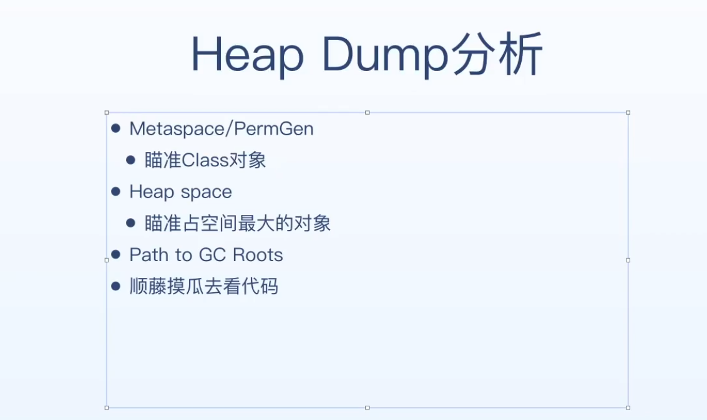
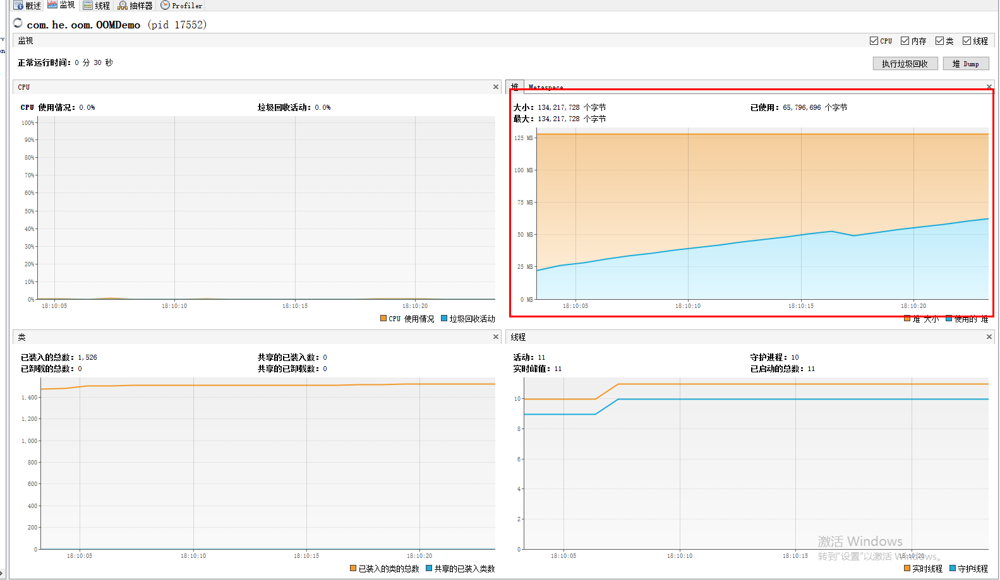
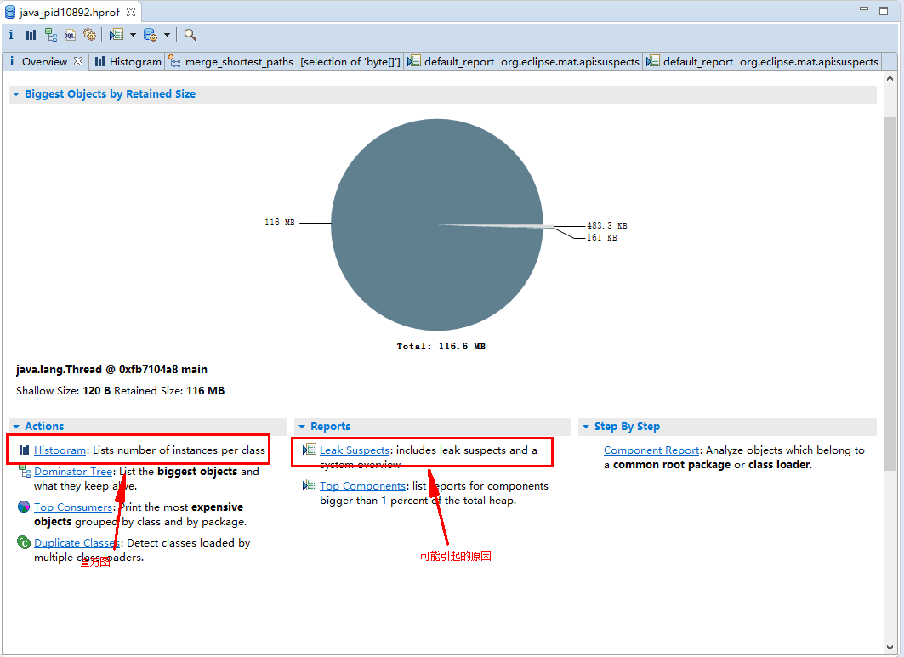
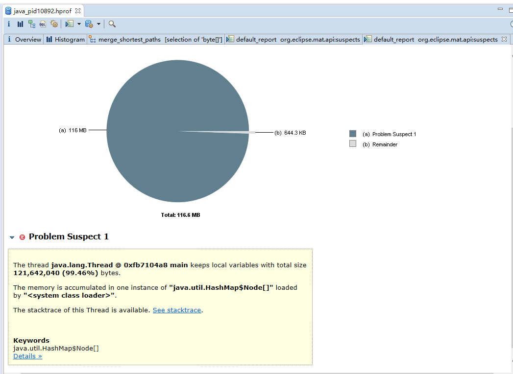

# OOM排查问题思路


## Heap Dump 分析思路



## Visual VM

创建一个demo模拟oom异常

```java
package com.he.oom;

import java.util.HashMap;
import java.util.Map;

/**
 * oom demo
 */
public class OOMDemo {
    public static void main(String[] args) throws InterruptedException {
        Map cache = new HashMap();
        for (int i = 0; i<128;i++){
            Thread.sleep(500);
            cache.put(i,new byte[1024*1024]);
        }
        System.out.println("put cache finsh");
    }
}

```



### shallow Heap

将自己释放后，可以释放出来的空间的大小


### RetainSize Heap

指的是将这个对象释放后，可以释放出来的空间大小


## Eclipse MAT

导入 .hprof文件，分析oom异常的原因



