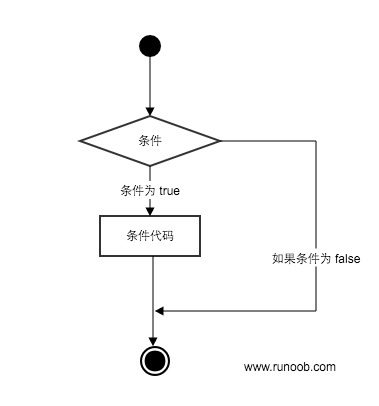
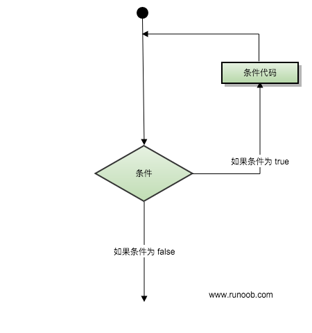

# python 入门

## 基础语法

### 注释

```python
#!/usr/bin/python3
 
# 第一个注释
# 第二个注释
 
'''
第三注释
第四注释
'''
 
"""
第五注释
第六注释
"""
print ("Hello, Python!")
```

### 多行语句

Python 通常是一行写完一条语句，但如果语句很长，我们可以使用反斜杠 **\\** 来实现多行语句

```python
total = item_one + \
        item_two + \
        item_three
```

### 数字类型 Number

python中数字有四种类型：整数、布尔型、浮点数和复数。

- **int** (整数), 如 1, 只有一种整数类型 int，表示为长整型，没有 python2 中的 Long。
- **bool** (布尔), 如 True。
- **float** (浮点数), 如 1.23、3E-2
- **complex** (复数), 如 1 + 2j、 1.1 + 2.2j


## 基本数据类型

### 变量

Python 中的变量不需要声明。每个变量在使用前都必须赋值，变量赋值以后该变量才会被创建。

在 Python 中，变量就是变量，它没有类型，我们所说的"类型"是变量所指的内存中对象的类型。

等号（=）用来给变量赋值。

等号（=）运算符左边是一个变量名,等号（=）运算符右边是存储在变量中的值

```python
#!/usr/bin/python3

counter = 100  # 整型变量
miles = 1000.0  # 浮点型变量
name = "runoob"  # 字符串

print(counter)
print(miles)
print(name)

```

###  多变量赋值

```python
#!/usr/bin/python3

a = b = c =1
d, e, f = 1, 2, '123'

print(a)
print(b)
print(c)
print(d)
print(e)
print(f)
```


### 标准数据类型

Python3 中有六个标准的数据类型：

- Number（数字）
- String（字符串）
- List（列表）
- Tuple（元组）
- Set（集合）
- Dictionary（字典）

Python3 的六个标准数据类型中：

- **不可变数据（3 个）：**Number（数字）、String（字符串）、Tuple（元组）；
- **可变数据（3 个）：**List（列表）、Dictionary（字典）、Set（集合）。


https://www.runoob.com/python3/python3-data-type.html


### List

List（列表） 是 Python 中使用最频繁的数据类型。

列表可以完成大多数集合类的数据结构实现。列表中元素的类型可以不相同，它支持数字，字符串甚至可以包含列表（所谓嵌套）。

列表是写在方括号 **[]** 之间、用逗号分隔开的元素列表。

和字符串一样，列表同样可以被索引和截取，列表被截取后返回一个包含所需元素的新列表。

列表截取的语法格式如下：

```
变量[头下标:尾下标]
```


```python
#!/usr/bin/python3

list = [ 'abcd', 786 , 2.23, 'runoob', 70.2 ]
tinylist = [123, 'runoob']

print (list)            # 输出完整列表
print (list[0])         # 输出列表第一个元素
print (list[1:3])       # 从第二个开始输出到第三个元素
print (list[2:])        # 输出从第三个元素开始的所有元素
print (tinylist * 2)    # 输出两次列表
print (list + tinylist) # 连接列表
```

List 是可变的

```python
#!/usr/bin/python3

list = ['abcd', 786 , 2.23, 'runoob', 70.2 ]
tinylist = [123, 'runoob']

print (list)            # 输出完整列表
print (list[0])         # 输出列表第一个元素
print (list[1:3])       # 从第二个开始输出到第三个元素
print (list[2:])        # 输出从第三个元素开始的所有元素
print (tinylist * 2)    # 输出两次列表
print (list + tinylist) # 连接列表

list[0] = 0
print(list) # [0, 786 , 2.23, 'runoob', 70.2 ]
```

### 元祖

## Tuple（元组）

元组（tuple）与列表类似，不同之处在于元组的元素不能修改。元组写在小括号 **()** 里，元素之间用逗号隔开。

元组中的元素类型也可以不相同：

```python
#!/usr/bin/python3

tuple = ( 'abcd', 786 , 2.23, 'runoob', 70.2  )
tinytuple = (123, 'runoob')

print (tuple)             # 输出完整元组
print (tuple[0])          # 输出元组的第一个元素
print (tuple[1:3])        # 输出从第二个元素开始到第三个元素
print (tuple[2:])         # 输出从第三个元素开始的所有元素
print (tinytuple * 2)     # 输出两次元组
print (tuple + tinytuple) # 连接元组
```

### Set 集合

集合（set）是由一个或数个形态各异的大小整体组成的，构成集合的事物或对象称作元素或是成员。

基本功能是进行成员关系测试和删除重复元素。

可以使用大括号 **{ }** 或者 **set()** 函数创建集合，注意：创建一个空集合必须用 **set()** 而不是 **{ }**，因为 **{ }** 是用来创建一个空字典。

创建格式：

```
parame = {value01,value02,...}
或者
set(value)

# Python 集合
set1 = {1, 2, 3, 4}            # 直接使用大括号创建集合
set2 = set([4, 5, 6, 7])      # 使用 set() 函数从列表创建集合
```

```python
#!/usr/bin/python3

sites = {'Google', 'Taobao', 'Runoob', 'Facebook', 'Zhihu', 'Baidu'}

print(sites)   # 输出集合，重复的元素被自动去掉

# 成员测试
if 'Runoob' in sites :
    print('Runoob 在集合中')
else :
    print('Runoob 不在集合中')


# set可以进行集合运算
a = set('abracadabra')
b = set('alacazam')

print(a)

print(a - b)     # a 和 b 的差集

print(a | b)     # a 和 b 的并集

print(a & b)     # a 和 b 的交集

print(a ^ b)     # a 和 b 中不同时存在的元素
```

集合推导式

```py
# 集合推导式
a = { x for x in 'abcdefg' if x not in 'abcefg'}
print(a)
```


### 字典 Dictionary

## Dictionary（字典）

字典（dictionary）是Python中另一个非常有用的内置数据类型。

列表是有序的对象集合，字典是无序的对象集合。两者之间的区别在于：字典当中的元素是通过键来存取的，而不是通过偏移存取。

字典是一种映射类型，字典用 **{ }** 标识，它是一个无序的 **键(key) : 值(value)** 的集合。

键(key)必须使用不可变类型。

在同一个字典中，键(key)必须是唯一的。

```python
#!/usr/bin/python3

dict = {}
dict['one'] = "1 - 菜鸟教程"
dict[2]     = "2 - 菜鸟工具"

tinydict = {'name': 'runoob','code':1, 'site': 'www.runoob.com'}


print (dict['one'])       # 输出键为 'one' 的值
print (dict[2])           # 输出键为 2 的值
print (tinydict)          # 输出完整的字典
print (tinydict.keys())   # 输出所有键
print (tinydict.values()) # 输出所有值

# 删除字典
del dict1["sex"]
print(dict1)

```

## Type

```py
a, b, c, d = 20, 5.5, True, 4+3j
print(type(a), type(b), type(c), type(d))

<class 'int'> <class 'float'> <class 'bool'> <class 'complex'>

print(isinstance(a, int))
True

```


## 运算符


## 条件控制



```py
if condition_1:
    statement_block_1
elif condition_2: # 区别于else if  py中使用elif
    statement_block_2
else:
    statement_block_3
```


## 循环语句



while 循环

```py
# 循环语句
a =1
num =5
while a <= num :
    print(a)
    a=a+1

print('done')


```

for循环

```py
list1 = ['hening', 'duhan', 'lin']
for item in list1:
    print(item)

# range 遍历
for i in range(len(list1)):
    print(i, list1[i])

```

## 列表、集合、元组、字典的区别

列表：使用中括号`[]`表示

集合：set，使用大括号`{}`表示，但是不能用`{}`创建空集合，创建一个空集合必须用 **set()** 而不是 **{ }**，因为 **{ }** 是用来创建一个空字典

元组：tuple，使用小括号`（）`表示

字典：dict，使用`{}`表示


## 推导式

Python 推导式是一种独特的数据处理方式，可以从一个数据序列构建另一个新的数据序列的结构体。

Python 支持各种数据结构的推导式：

- 列表(list)推导式

```py
# 列表推导式
names =['hening', 'duhan', '123', 'heninghhhh', 'duhanhhhhhh']
new_names = [name.upper() for name in names if len(name) > 4]
print(new_names)
```

- 字典(dict)推导式

```py
# 字典推导式
# 使用new_names 名称作为key，长度作为value
dicts = {key : len(key) for key in new_names}
print(dicts)

# 使用数字，数字的平方构建字典
dicts2 = {x : x**2 for x in [2, 4, 6]}
print(dicts2)
```

- 集合(set)推导式

```py
# 集合推导式
set1 = {x**2 for x in [2, 4, 6]}
print(set1)

set2 = {x for x  in 'abcdefghikj' if x not in 'abc'}
print(set2)
```


- 元组(tuple)推导式

```py
# 元组推导式（元组生成器）
tup = (x for x in range(1 , 10))
print(tup)
print(tuple(tup))
```


## 迭代器与生成器

### 迭代器

迭代是 Python 最强大的功能之一，是访问集合元素的一种方式。

迭代器是一个可以记住遍历的位置的对象。

迭代器对象从集合的第一个元素开始访问，直到所有的元素被访问完结束。迭代器只能往前不会后退。

迭代器有两个基本的方法：**iter()** 和 **next()**。

```py
# 迭代器
list1 = ['hening', 1, 2, 3, 'duhan']
iter = iter(list1)
print(next(iter))
print(next(iter))

for x in iter:
    print(x, end= " ")

list2 = ['hening', 1, 2, 3, 'duhan']
iter2 = iter(list2)
while True:
    try:
        print(next(iter2))
    except StopIteration:
        sys.exit()
```


### 生成器

在 Python 中，使用了 **yield** 的函数被称为生成器（generator）。

**yield** 是一个关键字，用于定义生成器函数，生成器函数是一种特殊的函数，可以在迭代过程中逐步产生值，而不是一次性返回所有结果。

跟普通函数不同的是，生成器是一个返回迭代器的函数，只能用于迭代操作，更简单点理解生成器就是一个迭代器。

当在生成器函数中使用 **yield** 语句时，函数的执行将会暂停，并将 **yield** 后面的表达式作为当前迭代的值返回。

然后，每次调用生成器的 **next()** 方法或使用 **for** 循环进行迭代时，函数会从上次暂停的地方继续执行，直到再次遇到 **yield** 语句。这样，生成器函数可以逐步产生值，而不需要一次性计算并返回所有结果。

调用一个生成器函数，返回的是一个迭代器对象。


## 函数

函数是组织好的，可重复使用的，用来实现单一，或相关联功能的代码段。

函数能提高应用的模块性，和代码的重复利用率。你已经知道Python提供了许多内建函数，比如print()。但你也可以自己创建函数，这被叫做用户自定义函数。

你可以定义一个由自己想要功能的函数，以下是简单的规则：

- 函数代码块以 **def** 关键词开头，后接函数标识符名称和圆括号 **()**。
- 任何传入参数和自变量必须放在圆括号中间，圆括号之间可以用于定义参数。
- 函数的第一行语句可以选择性地使用文档字符串—用于存放函数说明。
- 函数内容以冒号 **:** 起始，并且缩进。
- **return [表达式]** 结束函数，选择性地返回一个值给调用方，不带表达式的 return 相当于返回 None。

```py
def 函数名（参数列表）:
    函数体
```


### 自定义函数

```py
# py 函数
def myfunc(a, b):
    return a+b

print(myfunc(10, 10))
```

### 匿名函数

```py
# 匿名函数
a = lambda a :a +5
print(a(10))

b = lambda a,b ,c : a+b+c
print(b(1,2,3))
```

