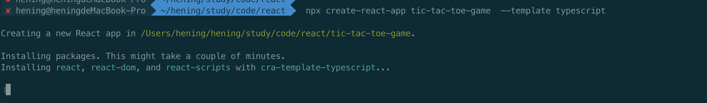

# 相关文档

React文档：https://react.dev/learn/thinking-in-react

React中文文档：https://zh-hans.react.dev/learn


# 创建一个React项目

```shell
npx create-react-app my-app --template typescript
```

- npx 是npm中的一个组件名称，固定使用
- create-react-app 固定组件名称，用于创建react项目
- my-app 你的app名称
- --template 使用模板
- typescript 使用ts语言




