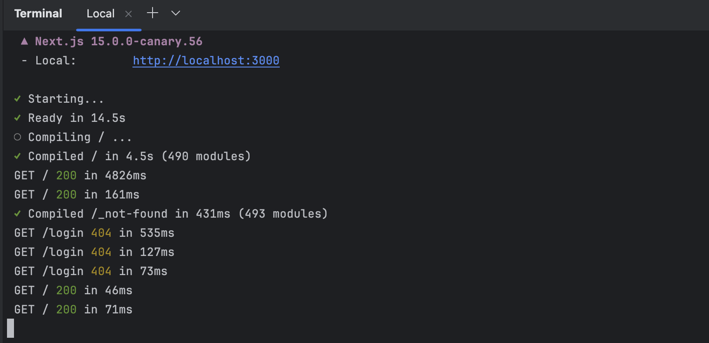
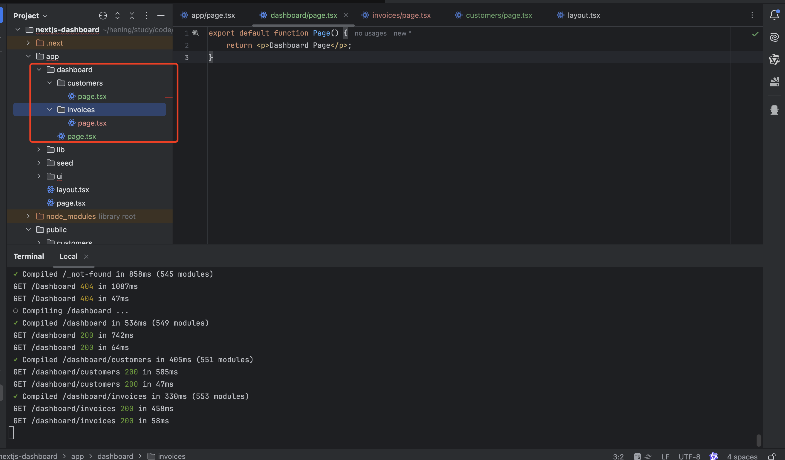
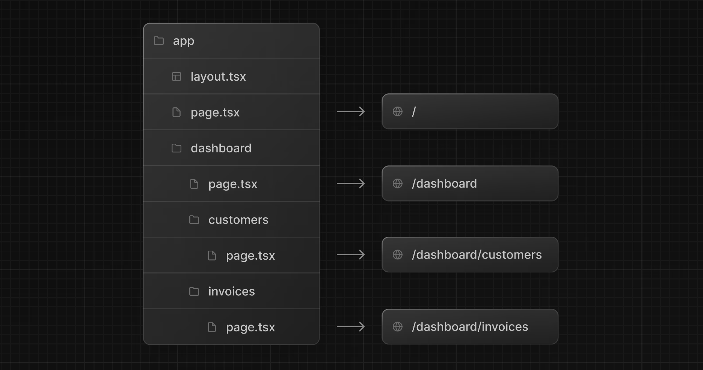
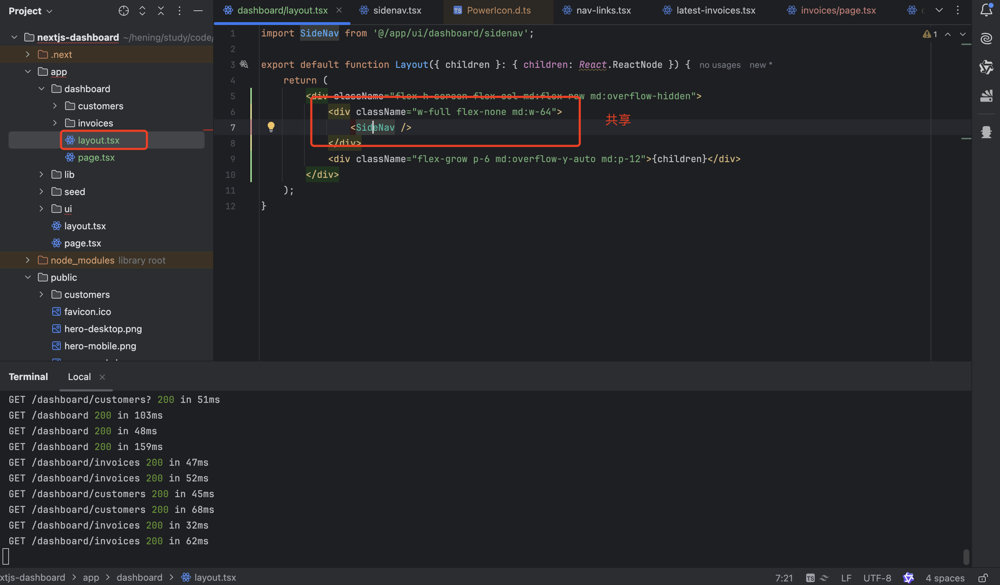
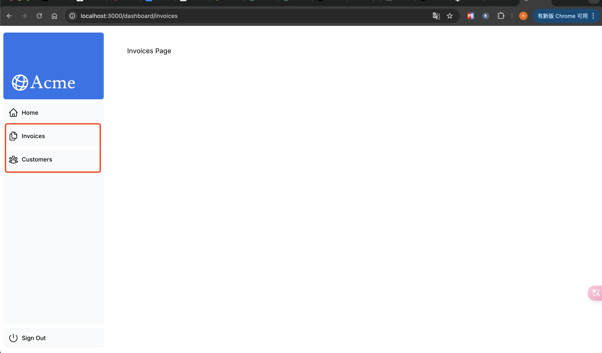
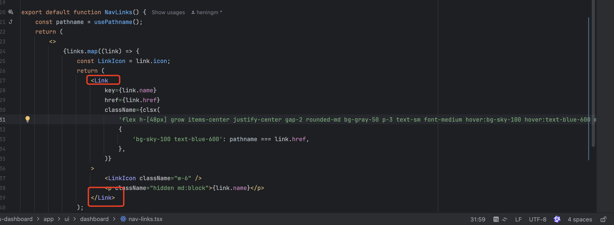

# Learn Next.js

Learn Next.js:https://nextjs.org/learn/dashboard-app#what-well-be-building


# Demo

创建一个nextjs项目

注意需要使用pnpm

```shell
npm install -g pnpm
```

```shell
npx create-next-app@latest nextjs-dashboard --example "https://github.com/vercel/next-learn/tree/main/dashboard/starter-example" --use-pnpm
```




# 创建布局和页面

简单理解：

layout.tsx:固定的文件名，用于创建布局，与该文件一个目录下的路由文件夹都会自动归属到该布局下

page.tsx:固定的文件名，next只会渲染page页面


在app目录下的文件夹名称 默认就是路由的名称，可以在文件夹内在创建page.tsx 就是一个新的页面(使用文件夹创建新的路由段)






添加布局，用于多个页面之间的UI共享






##  在页面之间导航

正常情况下使用导航 会使用<a>标签 ，但是会用a标签会发现整个页面都会进行刷新

在Next中提供了next/Link 标签进行页面间的导航




通过**clsx** 动态添加css类型

```js
className={clsx(
    'flex h-[48px] grow items-center justify-center gap-2 rounded-md bg-gray-50 p-3 text-sm font-medium hover:bg-sky-100 hover:text-blue-600 md:flex-none md:justify-start md:p-2 md:px-3',
    {
        'bg-sky-100 text-blue-600': pathname === link.href,
    },
)}
```


# 流媒体传输

**第一种：**

直接在需要流传输的页面同级别目录下创建一个loading.tsx

```js
import DashboardSkeleton from '@/app/ui/skeletons'

export default function Loading() {
    return <DashboardSkeleton />;
}
```

该页面会先行直接返回到浏览器，知道需要显示的页面加载完毕。

（loading.tsx是一个基于 Suspense 构建的特殊 Next.js 文件，它允许您创建后备 UI 以在页面内容加载时显示为替换。）

可以在哎loading.tsx 中添加不同的组件用来渲染加载骨架


**第二种：**
使用<Suspense>组件

```js
import { Suspense } from 'react';
```

组件用法：

然后，从 React 导入`<Suspense>` ，并将其包装在`<RevenueChart />`周围。您可以向其传递一个名为`<RevenueChartSkeleton>`的后备组件。

```js
<Suspense fallback={<RevenueChartSkeleton/>}>
   <RevenueChart/>
</Suspense>
```

