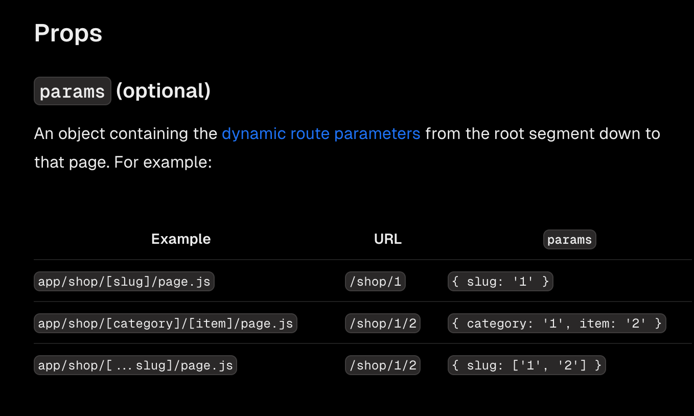

# Learn Next.js

Learn Next.js:https://nextjs.org/learn/dashboard-app#what-well-be-building


# Demo

创建一个nextjs项目

注意需要使用pnpm

```shell
npm install -g pnpm
```

```shell
npx create-next-app@latest nextjs-dashboard --example "https://github.com/vercel/next-learn/tree/main/dashboard/starter-example" --use-pnpm
```


# 创建布局和页面

简单理解：

layout.tsx:固定的文件名，用于创建布局，与该文件一个目录下的路由文件夹都会自动归属到该布局下

page.tsx:固定的文件名，next只会渲染page页面


在app目录下的文件夹名称 默认就是路由的名称，可以在文件夹内在创建page.tsx 就是一个新的页面(使用文件夹创建新的路由段)


添加布局，用于多个页面之间的UI共享


##  在页面之间导航

正常情况下使用导航 会使用<a>标签 ，但是会用a标签会发现整个页面都会进行刷新

在Next中提供了next/Link 标签进行页面间的导航


通过**clsx** 动态添加css类型

```js
className={clsx(
    'flex h-[48px] grow items-center justify-center gap-2 rounded-md bg-gray-50 p-3 text-sm font-medium hover:bg-sky-100 hover:text-blue-600 md:flex-none md:justify-start md:p-2 md:px-3',
    {
        'bg-sky-100 text-blue-600': pathname === link.href,
    },
)}
```


# 流媒体传输

**第一种：**

直接在需要流传输的页面同级别目录下创建一个loading.tsx

```js
import DashboardSkeleton from '@/app/ui/skeletons'

export default function Loading() {
    return <DashboardSkeleton />;
}
```

该页面会先行直接返回到浏览器，知道需要显示的页面加载完毕。

（loading.tsx是一个基于 Suspense 构建的特殊 Next.js 文件，它允许您创建后备 UI 以在页面内容加载时显示为替换。）

可以在哎loading.tsx 中添加不同的组件用来渲染加载骨架


**第二种：**
使用<Suspense>组件

```js
import { Suspense } from 'react';
```

组件用法：

然后，从 React 导入`<Suspense>` ，并将其包装在`<RevenueChart />`周围。您可以向其传递一个名为`<RevenueChartSkeleton>`的后备组件。

```js
<Suspense fallback={<RevenueChartSkeleton/>}>
   <RevenueChart/>
</Suspense>
```


# 条件查询

使用URL搜索参数的好处：

- **可添加书签和可共享的 URL** ：由于搜索参数位于 URL 中，因此用户可以为应用程序的当前状态（包括其搜索查询和过滤器）添加书签，以供将来参考或共享
- **服务器端渲染和初始加载**：可以在服务器上直接使用URL参数来渲染初始状态，从而更容易处理服务器渲染。
- **分析和跟踪**：直接在 URL 中进行搜索查询和过滤器可以更轻松地跟踪用户行为，而无需额外的客户端逻辑。


NextJS提供的几个钩子函数：

**`useSearchParams`** - 允许您访问当前 URL 的参数。例如，此 URL 的搜索参数 `/dashboard/invoices?page=1&query=pending` 看起来像这样： `{page: '1', query: 'pending'}` 

**`usePathname`** - 让您读取当前 URL 的路径名。例如，对于路由`/dashboard/invoices` ， `usePathname`将返回`'/dashboard/invoices'` 

**`useRouter`** - 以编程方式启用客户端组件内的路由之间的导航。您可以使用[多种方法](https://nextjs.org/docs/app/api-reference/functions/use-router#userouter)。


**实现条件查询的步骤：**

1、捕获用户的输入。

2、使用搜索参数更新 URL。（前面讲了使用URL参数的好处，也可以直接获取参数进行查询）

3、保持 URL 与输入字段同步。

4、更新表以反映搜索查询。


- `"use client"` - 这是一个客户端组件，这意味着您可以使用事件侦听器和挂钩。


```js
'use client';

import { MagnifyingGlassIcon } from '@heroicons/react/24/outline';

export default function Search({ placeholder }: { placeholder: string }) {
  return (
    <div className="relative flex flex-1 flex-shrink-0">
      <label htmlFor="search" className="sr-only">
        Search
      </label>
      <input
        className="peer block w-full rounded-md border border-gray-200 py-[9px] pl-10 text-sm outline-2 placeholder:text-gray-500"
        placeholder={placeholder}
      />
      <MagnifyingGlassIcon className="absolute left-3 top-1/2 h-[18px] w-[18px] -translate-y-1/2 text-gray-500 peer-focus:text-gray-900" />
    </div>
  );
}

```

钩子函数的使用方法

如果调用方法后返回的是一个常量则直接定义

**如果返回的是一个方法 则需要使用{}框起来**

 比如`const {replace} = useRouter();`

```js
import {useSearchParams, usePathname, useRouter} from "next/navigation";
const params = new URLSearchParams(searchParams);
const pathname = usePathname();
const {replace} = useRouter();
```

使用如下方法进行导航

```js
replace(`${pathname}?${params.toString()}`);
```

该函数执行以下操作：
将pathname与参数查询字符串组合：${pathname}?${params.toString()}。
使用replace方法导航至新的路径。此函数用于客户端路由跳转。


**注意**在：

钩子函数只能在Hooks必须在函数组件的顶层调用，不能在任何其他位置调用。


Page页面默认可以接受的参数：

params：接受URL路径的参数



searchParams：接受URL参数


## 去抖

如果每次Onchange都会监听并查询 那么可能会导致大量的查询，此时需要进行去抖

可以自行通过计时器实现，也可以引入第三方包实现

使用debounce 实现去抖

```js
pnpm i use-debounce
```

```js
// ...
import { useDebouncedCallback } from 'use-debounce';
 
// Inside the Search Component...
const handleSearch = useDebouncedCallback((term) => {
  console.log(`Searching... ${term}`);
 
  const params = new URLSearchParams(searchParams);
  if (term) {
    params.set('query', term);
  } else {
    params.delete('query');
  }
  replace(`${pathname}?${params.toString()}`);
}, 300);
```

300 ms内用户没有键停，那么不会发起请求


# 分页查询

查看分页组件： [pagination.tsx](../../../../code/react/nextjs-dashboard/app/ui/invoices/pagination.tsx) 

在Page 页面默认可以接收到URL传参

**注意：格式必须正确才能接收到参数**

```js
export default async function Page(
    {searchParams}: {
        searchParams?: {
            query?: string;
            page?: string;
        }
    }
)
```

以后的分页组件可以参考该例子，有比较全面的分页组件设计

```tsx
'use client';

import {ArrowLeftIcon, ArrowRightIcon} from '@heroicons/react/24/outline';
import clsx from 'clsx';
import Link from 'next/link';
import {generatePagination} from '@/app/lib/utils';
import {usePathname, useSearchParams} from "next/navigation";

export default function Pagination({totalPages}: { totalPages: number }) {
    // NOTE: Uncomment this code in Chapter 11

    const pathname = usePathname();
    const searchParams = useSearchParams();
    const currentPage = Number(searchParams.get("page")) || 1;
    const createPageURL = (page: number | string) => {
        const params = new URLSearchParams(searchParams);
        params.set("page", page.toString());
        return `${pathname}?${params.toString()}`;
    };

    const allPages = generatePagination(currentPage, totalPages);

    return (
        <>
            {/*  NOTE: Uncomment this code in Chapter 11 */}

            <div className="inline-flex">
                <PaginationArrow
                    direction="left"
                    href={createPageURL(currentPage - 1)}
                    isDisabled={currentPage <= 1}
                />

                <div className="flex -space-x-px">
                    {allPages.map((page, index) => {
                        let position: 'first' | 'last' | 'single' | 'middle' | undefined;

                        if (index === 0) position = 'first';
                        if (index === allPages.length - 1) position = 'last';
                        if (allPages.length === 1) position = 'single';
                        if (page === '...') position = 'middle';

                        return (
                            <PaginationNumber
                                key={page}
                                href={createPageURL(page)}
                                page={page}
                                position={position}
                                isActive={currentPage === page}
                            />
                        );
                    })}
                </div>

                <PaginationArrow
                    direction="right"
                    href={createPageURL(currentPage + 1)}
                    isDisabled={currentPage >= totalPages}
                />
            </div>
        </>
    );
}

function PaginationNumber({
                              page,
                              href,
                              isActive,
                              position,
                          }: {
    page: number | string;
    href: string;
    position?: 'first' | 'last' | 'middle' | 'single';
    isActive: boolean;
}) {
    const className = clsx(
        'flex h-10 w-10 items-center justify-center text-sm border',
        {
            'rounded-l-md': position === 'first' || position === 'single',
            'rounded-r-md': position === 'last' || position === 'single',
            'z-10 bg-blue-600 border-blue-600 text-white': isActive,
            'hover:bg-gray-100': !isActive && position !== 'middle',
            'text-gray-300': position === 'middle',
        },
    );

    return isActive || position === 'middle' ? (
        <div className={className}>{page}</div>
    ) : (
        <Link href={href} className={className}>
            {page}
        </Link>
    );
}

function PaginationArrow({
                             href,
                             direction,
                             isDisabled,
                         }: {
    href: string;
    direction: 'left' | 'right';
    isDisabled?: boolean;
}) {
    const className = clsx(
        'flex h-10 w-10 items-center justify-center rounded-md border',
        {
            'pointer-events-none text-gray-300': isDisabled,
            'hover:bg-gray-100': !isDisabled,
            'mr-2 md:mr-4': direction === 'left',
            'ml-2 md:ml-4': direction === 'right',
        },
    );

    const icon =
        direction === 'left' ? (
            <ArrowLeftIcon className="w-4"/>
        ) : (
            <ArrowRightIcon className="w-4"/>
        );

    return isDisabled ? (
        <div className={className}>{icon}</div>
    ) : (
        <Link className={className} href={href}>
            {icon}
        </Link>
    );
}

```


# 操作数据

## 服务器操作

React Server Actions 允许您直接在服务器上运行异步代码。它们消除了创建 API 端点来改变数据的需要。相反，您可以编写在服务器上执行的异步函数，并且可以从客户端或服务器组件调用。

## 表单与服务器操作结合

在 React 中，您可以使用`<form>`元素中的`action`属性来调用操作。该操作将自动接收本机[FormData](https://developer.mozilla.org/en-US/docs/Web/API/FormData)对象，包含捕获的数据。

```js
// Server Component
export default function Page() {
  // Action 自动接受参数
  async function create(formData: FormData) {
    'use server';
 
    // Logic to mutate data...
  }
 
  // Invoke the action using the "action" attribute
  // 自动接受参数，不用手动传参
  return <form action={create}>...</form>;
}
```


## 服务器运行声明

```js
'use server';
```

通过添加`'use server'` ，您可以将文件中的所有导出函数标记为服务器操作。然后可以在客户端和服务器组件中导入和使用这些服务器功能。

您还可以通过在操作中添加`"use server"`来直接在服务器组件中编写服务器操作。但对于本课程，我们会将它们全部组织在一个单独的文件中。


由于action属性会自动传递FormData数据到指定的方法中，因此直接在方法中直接获取属性即可

```js
'use server';
 
export async function createInvoice(formData: FormData) {
  const rawFormData = {
    customerId: formData.get('customerId'),
    amount: formData.get('amount'),
    status: formData.get('status'),
  };
  // Test it out:
  console.log(rawFormData);
}
```


## 参数类型验证

引用第三方库进行验证

```js
import { z } from 'zod';
```

```js
'use server';
 
import { z } from 'zod';
 
// 表单约束
const FormSchema = z.object({
  id: z.string(),
  customerId: z.string(),
  amount: z.coerce.number(),
  status: z.enum(['pending', 'paid']),
  date: z.string(),
});
 
const CreateInvoice = FormSchema.omit({ id: true, date: true });
 
export async function createInvoice(formData: FormData) {
  const {customerId, amount, status } = CreateInvoice.parse({
        customerId: formData.get('customerId'),
        amount: formData.get('amount'),
        status: formData.get('status'),
    });
}
```


创建新日期，获取格式为YYYY-DD-MM的日期字符串

```js
  const date = new Date().toISOString().split('T')[0];
```

##  重新验证和重定向

Next.js 有一个客户端路由器缓存，可将路由段存储在用户浏览器中一段时间。与预取一起，此缓存可确保用户可以在路由之间快速导航，同时减少向服务器发出的请求数量。

因此如果存在在某个页面更新数据的情况，需要清除缓存，您可以使用 Next.js 中的[`revalidatePath`](https://nextjs.org/docs/app/api-reference/functions/revalidatePath)函数来执行此操作：

```js
// 清除缓存，重新验证
revalidatePath('/dashboard/invoices');
```

重定向到指定的路径

```js
redirect('/dashboard/invoices');
```


# 更新数据

当您不知道确切的路段名称并希望根据数据创建路线时，Next.js 允许您创建[动态路线段](https://nextjs.org/docs/app/building-your-application/routing/dynamic-routes)。这可以是博客文章标题、产品页面等。您可以通过将文件夹名称括在方括号中来创建动态路由段。例如， `[id]` 、 `[post]`或`[slug]` 


## 动态路由路径

在href中接受id属性。您可以使用模板文字链接到动态路线段：

```js
import { PencilIcon, PlusIcon, TrashIcon } from '@heroicons/react/24/outline';
import Link from 'next/link';
 
// ...
 
export function UpdateInvoice({ id }: { id: string }) {
  return (
    <Link
    
      href={`/dashboard/invoices/${id}/edit`}
      className="rounded-md border p-2 hover:bg-gray-100"
    >
      <PencilIcon className="w-5" />
    </Link>
  );
}
```


## 页面Param参数

除了searchParams之外，页面组件还接受一个名为**params**属性，您可以使用它来访问id 。更新您的<Page>组件以接收该属性：

见上文，**params** 属性可以接受路径中的参数


## bind 传递参数

在Aciton 属性中使用 JS bind将id传递给服务器操作。这将确保传递给服务器操作的任何值都经过编码。

```js
// ...
import { updateInvoice } from '@/app/lib/actions';
 
export default function EditInvoiceForm({
  invoice,
  customers,
}: {
  invoice: InvoiceForm;
  customers: CustomerField[];
}) {
  //bind 方法的第一个参数是 null，这意味着新创建的函数 updateInvoiceWithId 在调用时，其内部的 this 关键字将会是 null。在这种情况下，this 的值通常用于指定函数内部需要的上下文，但由于这里传递了 null，所以 updateInvoice 函数内部不会引用任何对象的实例。

// invoice.id 是一个参数，它被预先绑定到新函数 updateInvoiceWithId 上。这意味着无论何时调用 updateInvoiceWithId，它都会自动将 invoice.id 作为第一个参数传递给
  const updateInvoiceWithId = updateInvoice.bind(null, invoice.id);
 
  return (
    <form action={updateInvoiceWithId}>
      <input type="hidden" name="id" value={invoice.id} />
    </form>
  );
}
```

**注意：**在表单中使用隐藏的输入字段也可以（例如 `<input type="hidden" name="id" value={invoice.id} />` ）。但是，这些值将在 HTML 源中显示为全文，这对于 ID 等敏感数据来说并不理想。


## 异常处理

`error.tsx`文件可用于定义路线段的 UI 边界。它可以**捕获**意外错误，并允许您向用户显示后备 UI。

定义一个error.tsx 可以进行全局异常处理

```tsx
'use client';
 
import { useEffect } from 'react';
 
export default function Error({
  error,
  reset,
}: {
  error: Error & { digest?: string };
  reset: () => void;
}) {
  useEffect(() => {
    // Optionally log the error to an error reporting service
    console.error(error);
  }, [error]);
 
  return (
    <main className="flex h-full flex-col items-center justify-center">
      <h2 className="text-center">Something went wrong!</h2>
      <button
        className="mt-4 rounded-md bg-blue-500 px-4 py-2 text-sm text-white transition-colors hover:bg-blue-400"
        onClick={
          // Attempt to recover by trying to re-render the invoices route
          () => reset()
        }
      >
        Try again
      </button>
    </main>
  );
}
```


notFound 页面

