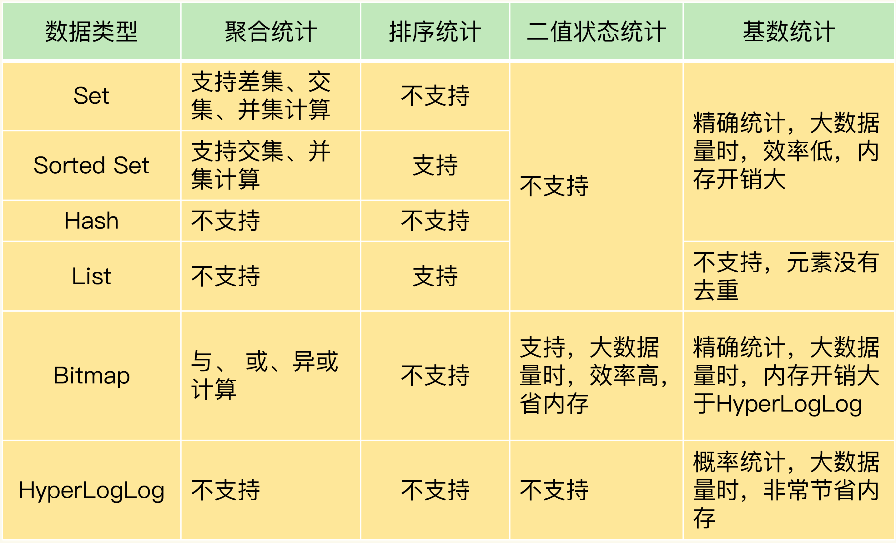

# 一亿个key要统计怎么做

## 数值统计

常见的统计场景

- 在移动应用中，需要统计每天的新增用户数和第二天的留存用户数；Set 去交集、并集、差集
- 在电商网站的商品评论中，需要统计评论列表中的最新评论；Sort Set 保证有序
- 在签到打卡中，需要统计一个月内连续打卡的用户数； Bitmap 二值统计
- 在网页访问记录中，需要统计独立访客（Unique Visitor，UV）量。Hyperloglog 统计


## 聚合统计

所谓的聚合统计，就是指统计多个集合元素的聚合结果，包括：统计多个集合的共有元素（交集统计）；把两个集合相比，统计其中一个集合独有的元素（差集统计）；统计多个集合的所有元素（并集统计）。

```
// 将user:id user:id20200803 的并集存到user：id中
SUNIONSTORE  user:id  user:id  user:id:20200803 
```

```
// 差集 存在user:new 中
SDIFFSTORE  user:new  user:id:20200804 user:id  
```

```
//交集
SINTERSTORE user:id:rem user:id:20200803 user:id:20200804
```


## 排序统计

List  使用 LPUSH添加到队头

在分页场景下无法满足


使用Sorted Set

**ZRANGEBYSCORE** 命令就可以按权重排序后返回元素

```
// 获取最新的10条  最新的权重为N的情况下
ZRANGEBYSCORE comments N-9 N
```

## 二值统计排序

Bitmap 本身是用 String 类型作为底层数据结构实现的一种统计二值状态的数据类型。String 类型是会保存为二进制的字节数组，所以，Redis 就把字节数组的每个 bit 位利用起来，用来表示一个元素的二值状态。bit数组。

```
// 将uid:sign:3000:202008 第三位设置为1（用户id=3000 的员工在 202008月3日打卡）
SETBIT uid:sign:3000:202008 2 1 
```

```
// 检查 0803日是否签到
GETBIT uid:sign:3000:202008 2 
```

```
// 统计1的个数 （签到的次数）
BITCOUNT uid:sign:3000:202008
```

## 基数统计

记录页面的UV

可以使用Set 去重  获取Hash

但是占空间太大。

HyperLogLog 是一种用于统计基数的数据集合类型，它的最大优势就在于，当集合元素数量非常多时，它计算基数所需的空间总是固定的，而且还很小。在 Redis 中，每个 HyperLogLog 只需要花费 12 KB 内存，就可以计算接近 2^64 个元素的基数。

**使用方法：**

```
//添加数据
PFADD page1:uv user1 user2 user3 user4 user5
```

```
// 获取个数
PFCOUNT page1:uv
```

## 统计使用类型对照表

