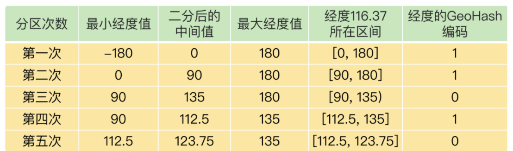
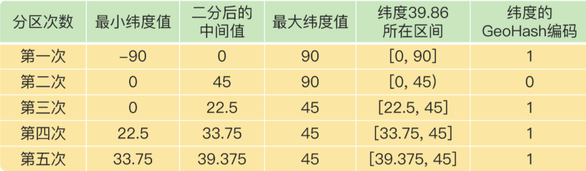

# GEO数据结构

https://time.geekbang.org/column/article/281745

太硬核，看不太懂

## 面向 LBS 应用的 GEO 数据类型

Location-Based Service，LBS ： 位置信息服务

## GEO底层数据结构

Sorted Set ： key value sorce

问题在于如何将 经纬度两个值，转换为一个浮点数存到 sorce中去

### GEOHASH编码

基本原理就是“二分区间，区间编码”。

对一组经纬度进行 GeoHash 编码时，我们要先对经度和纬度分别编码，然后再把经纬度各自的编码组合成一个最终编码。

**编码过程：**





编码完成后进行组合

**组合的规则是：最终编码值的偶数位上依次是经度的编码值，奇数位上依次是纬度的编码值，其中，偶数位从 0 开始，奇数位从 1 开始。**

通过编码存入sorce，相邻的sorce 就是位置相邻的位置

所以，我们使用 Sorted Set 范围查询得到的相近编码值，在实际的地理空间上，也是相邻的方格，这就可以实现 LBS 应用“搜索附近的人或物”的功能了。

## GEO操作命令

- GEOADD 命令：用于把一组经纬度信息和相对应的一个 ID 记录到 GEO 类型集合中；
- GEORADIUS 命令：会根据输入的经纬度位置，查找以这个经纬度为中心的一定范围内的其他元素。当然，我们可以自己定义这个范围。

```
// 添加车辆的位置
GEOADD cars:locations 116.034579 39.030452 33

// 查询给定经纬度 方圆5km的车，以ASC排序，返回10个（ASC 近到远，升序）
GEORADIUS cars:locations 116.054579 39.030452 5 km ASC COUNT 10
```


## Redis基本数据结构

RedisObject 的内部组成包括了 type、encoding、lru 和 refcount 4 个元数据，以及 1 个*ptr指针。

- type：表示值的类型，涵盖了我们前面学习的五大基本类型；
- encoding：是值的编码方式，用来表示 Redis 中实现各个基本类型的底层数据结构，例如 SDS、压缩列表、哈希表、跳表等；
- lru：记录了这个对象最后一次被访问的时间，用于淘汰过期的键值对；
- refcount：记录了对象的引用计数；
- *ptr：是指向数据的指针。


