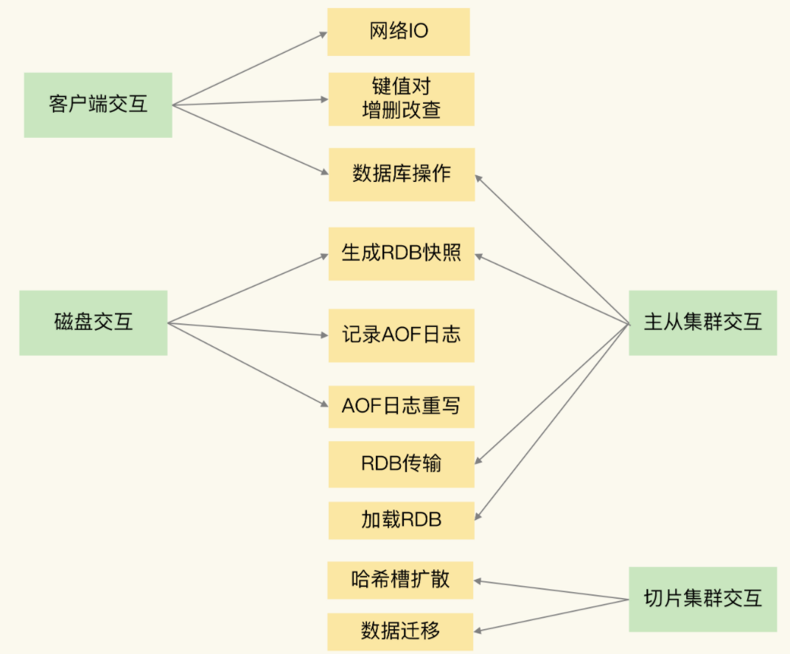
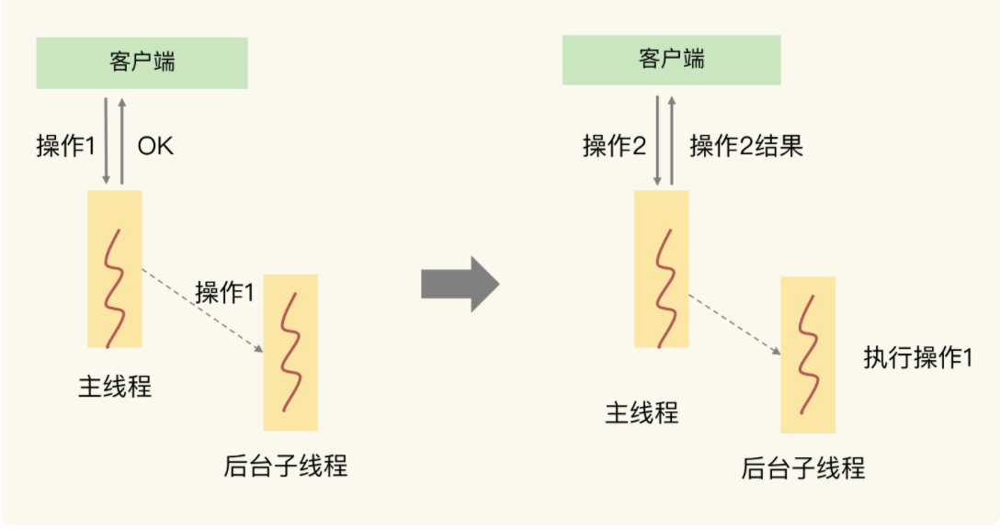
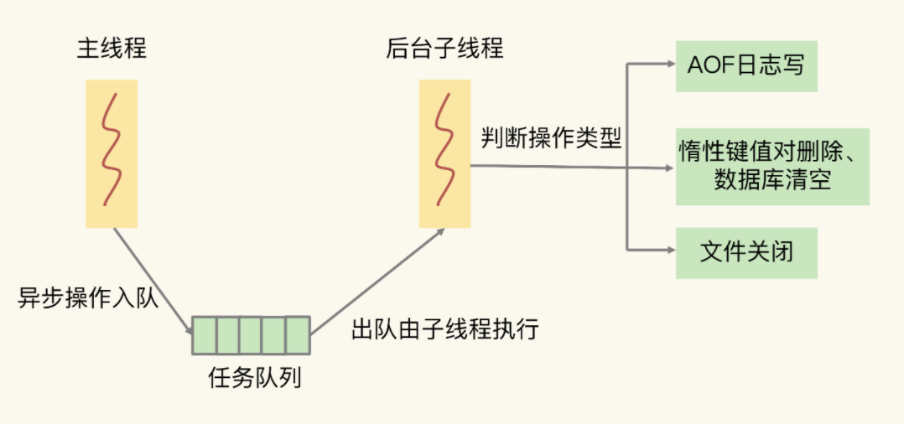

# 异步机制

通过异步机制防止Redis主线程的阻塞，提高更性能的访问方式。

## Redis的交互对象和行为

Redis运行过程中的交互对象：

- 客户端
- 磁盘
- Redis主从实例
- 集群分片

## Redis阻塞点

- 集合全量查询 、聚合操作
- bigkey的删除操作（涉及内存的释放和内存空闲表的读写）
- 清空数据库（原理同上）
- AOF文件同步写
- 从库加载RDB文件，阻塞的是从库，主库不受影响

## 异步执行

对于不是关键路径的操作，即客户端不在意返回结果的操作。

### 可以异步执行的操作

- 删除bigkey
- 同步写AOF文件
- 清空数据库

### 不可以异步执行的操作

- 全量查询 、聚合操作
- 从库RDB文件加载

## 异步子线程机制

Redis 主线程启动后，会使用**操作系统提供的 pthread_create** 函数创建 3 个子线程，分别由它们负责 AOF 日志写操作、键值对删除以及文件关闭的异步执行

任务会被主线程封装为一个任务，加入到任务队列中，有后台子进程进行消费

## 触发异步机制

如果使用传统的Redis操作命令还是进行的同步操作。

需要使用特殊的命令进行触发。

- 键值对删除：UNLINK命令
- 清空数据库：FLUSHDB 和 FLUSHALL 命令后加上 ASYNC 选项，触发异步机制

## 不适用异步机制，如何避免阻塞

- 删除bigkey：分批分次删除，使用scan命令读取部分，然后分批删除，将删除时间分摊到多次操作中，避免一次阻塞。
- 全量查询&聚合操作：分批分次，客户端聚合操作，不影响其他客户端的操作。
- 加载RDB文件：控制文件大小（2-4G），保证RDB文件加载快速

