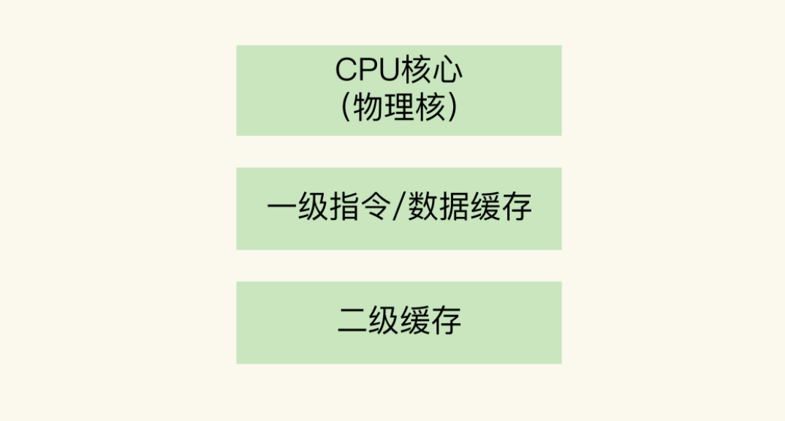
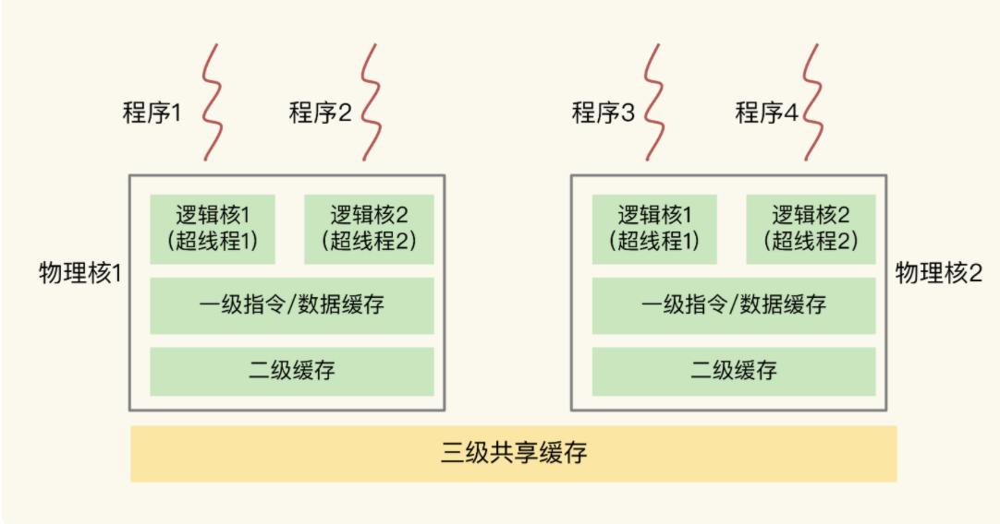

# CPU的结构影响Redis

太过深奥看不懂。。

记录下现阶段的收获

## CPU架构

一个 CPU 处理器中一般有多个运行核心，我们把一个运行核心称为一个物理核，每个物理核都可以运行应用程序。每个物理核都拥有私有的一级缓存（Level 1 cache，简称 L1 cache），包括一级指令缓存和一级数据缓存，以及私有的二级缓存（Level 2 cache，简称 L2 cache）。**一二级缓存时每个CPU核心私有的**。



不同的物理核还会共享一个共同的**三级缓存（Level 3 cache，简称为 L3 cache）**。L3 缓存能够使用的存储资源比较多，所以一般比较大，能达到几 MB 到几十 MB，这就能让应用程序缓存更多的数据。当 L1、L2 缓存中没有数据缓存时，可以访问 L3，尽可能避免访问内存。另外，现在主流的 CPU 处理器中，**每个物理核通常都会运行两个超线程，也叫作逻辑核**。同一个物理核的逻辑核会共享使用 L1、L2 缓存。



## CPU对Redis运行的影响


Redis是单线程运行，对内存的要求占大部分，但是如果存在CPU多次上下文切换也会造成性能影响，主要是redis线程切换到不同的CPU核后，L1、L2缓存不能共享，需要从三级缓存甚至内存读取，存在性能影响。

所以可以通过将Redis服务绑定到某个指定的CPU核来提升效率。

```shell
// “-c”选项用于设置要绑定的核编号。
taskset -c 0 ./redis-server
```

