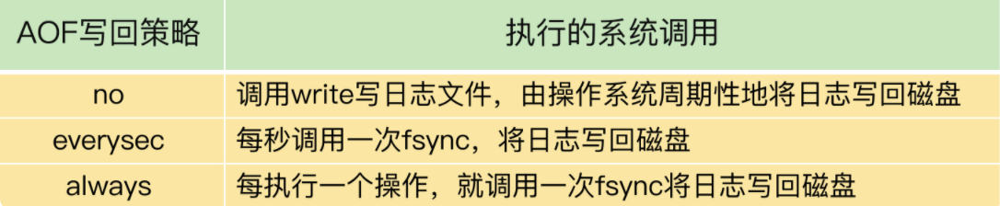

# 如何应对Redis变慢了

如果Redis变慢了，可能会影响其他操作。带来严重的后果。

## 确定Redis是否真的变慢了

查看 Redis 的响应延迟

在不同的机器上，Redis服务的响应速度是不同的，需要根据不同的情况进行判断，**一般来说虚拟机里运行由于本身虚拟机就会消耗部分CPU资源，导致响应比物理机要慢一些。**

### Redis基线性能

从 2.8.7 版本开始，redis-cli 命令提供了–intrinsic-latency 选项，可以用来监测和统计测试期间内的最大延迟，这个延迟可以作为 Redis 的基线性能。其中，测试时长可以用–intrinsic-latency 选项的参数来指定。

```shell
./redis-cli --intrinsic-latency 120
Max latency so far: 17 microseconds.
Max latency so far: 44 microseconds.
Max latency so far: 94 microseconds.
Max latency so far: 110 microseconds.
Max latency so far: 119 microseconds.

36481658 total runs (avg latency: 3.2893 microseconds / 3289.32 nanoseconds per run).
Worst run took 36x longer than the average latency.
```

基线性能和当前的操作系统、硬件配置相关。因此，我们可以把它和 **Redis 运行时的真正延迟**结合起来，再进一步判断 Redis 性能是否变慢了

**如果你观察到的 Redis 运行时延迟是其基线性能的 2 倍及以上，就可以认定 Redis 变慢了**

### 网络影响

基线性能，只是基于机器的软硬件影响进行的测试，但是实际使用中是通过网络进行客户端服务器交互的，网络传输速度也是响应慢的影响点之一。

**测试从客户端到服务端的网络延迟。**判断是否是当前网络环境中有其他大流量在占用，考虑从网络运维方面进行优化。


## 如何应对Redis变慢

如果确定真的是Redis变慢了，那么可以从以下几个方面进行排查

### Redis自身特性

#### 慢查询命令

Value 类型为 String 时，GET/SET 操作主要就是操作 Redis 的哈希表索引。这个操作复杂度基本是固定的，即 O(1)，这是很快的。

Value 类型为 Set 时，SORT、SUNION/SMEMBERS 操作复杂度分别为 O(N+M*log(M)) 和 O(N)。其中，N 为 Set 中的元素个数，M 为 SORT 操作返回的元素个数。这个复杂度就增加了很多.

**生成环境不要使用 keys 命令**

解决方案：

- 使用高效命令代替（smembers -》sscan）
- 不要使用Redis的聚合操作，而是查询出到客户端自行统计
- 统计key使用scan代替（可能会出现重复的key，需要业务方做去重）**原因：使用命令时正好在扩容，redis扩容是渐进式hash，扩容后可能已经扫描过的位置，又进行了扫描。**


#### 过期key操作

我们来看过期 key 的自动删除机制。它是 Redis 用来回收内存空间的常用机制，应用广泛，本身就会引起 Redis 操作阻塞，导致性能变慢

默认情况下，Redis 每 100 毫秒会删除一些过期 key，具体的算法如下：

- 采样 ACTIVE_EXPIRE_CYCLE_LOOKUPS_PER_LOOP （可设置的采样客户数，默认是20个）个数的 key，并将其中过期的 key 全部删除；
- 如果超过 25% 的 key 过期了，则重复删除的过程，直到过期 key 的比例降至 25% 以下。

**如果有大量的key同一时间过期，那么自动删除机制会触发第二条不停的去删除key**

解决方案：

- 避免设置设置同一秒进行过期，加上一个随机数，保证在相邻的时间内过期


## 文件系统

### AOF 模式

为了保证数据可靠性，Redis 会采用 AOF 日志或 RDB 快照。其中，AOF 日志提供了三种日志写回策略：no、everysec、always。这三种写回策略依赖文件系统的两个系统调用完成，也就是 write 和 fsync



erversec  和 always 是调用fsync的操作也不相同

- eversec：Redis 会使用后台的子线程异步完成 fsync 的操作。
- always ：always 策略并不使用后台子线程来执行

**为了AOF文件大小不要太大，后台会起子线程进行AOF重写。**可能造成磁盘资源的占用

AOF 重写会对磁盘进行大量 IO 操作，同时，fsync 又需要等到数据写到磁盘后才能返回，所以，当 AOF 重写的压力比较大时，就会导致 fsync 被阻塞。虽然 fsync 是由后台子线程负责执行的，但是，主线程会监控 fsync 的执行进度。

**当主线程使用后台子线程执行了一次 fsync，需要再次把新接收的操作记录写回磁盘时，如果主线程发现上一次的 fsync 还没有执行完，那么它就会阻塞**


**优化：**

- 参数no-appendfsync-on-rewrite:  yes  AOF 重写时，不进行 fsync 操作   no：同时进行
- 采用SDD存储

## 操作系统

### Swap


### 内存大页

Linux 内核从 2.6.38 开始支持内存大页机制，该机制支持 2MB 大小的内存页分配，而常规的内存页分配是按 4KB 的粒度来执行的。

**影响点：**

当出现进行RDB 内存快照时，如果存在正在写的请求，那么会开启**写时复制技术**，导致复制大页，造成大量的拷贝，造成性能的影响。

## 总结

Redis变慢时的检查点

- 获取 Redis 实例在当前环境下的基线性能。
- 是否用了慢查询命令？如果是的话，就使用其他命令替代慢查询命令，或者把聚合计算命令放在客户端做。
- 是否对过期 key 设置了相同的过期时间？对于批量删除的 key，可以在每个 key 的过期时间上加一个随机数，避免同时删除。
- 是否存在 bigkey？ 对于 bigkey 的删除操作，如果你的 Redis 是 4.0 及以上的版本，可以直接利用异步线程机制减少主线程阻塞；如果是 Redis 4.0 以前的版本，可以使用 SCAN 命令迭代删除；对于 bigkey 的集合查询和聚合操作，可以使用 SCAN 命令在客户端完成。
- Redis AOF 配置级别是什么？业务层面是否的确需要这一可靠性级别？如果我们需要高性能，同时也允许数据丢失，可以将配置项 no-appendfsync-on-rewrite 设置为 yes，避免 AOF 重写和 fsync 竞争磁盘 IO 资源，导致 Redis 延迟增加。当然， 如果既需要高性能又需要高可靠性，最好使用高速固态盘作为 AOF 日志的写入盘。
- Redis 实例的内存使用是否过大？发生 swap 了吗？如果是的话，就增加机器内存，或者是使用 Redis 集群，分摊单机 Redis 的键值对数量和内存压力。同时，要避免出现 Redis 和其他内存需求大的应用共享机器的情况。
- 在 Redis 实例的运行环境中，是否启用了透明大页机制？如果是的话，直接关闭内存大页机制就行了。
- 是否运行了 Redis 主从集群？如果是的话，把主库实例的数据量大小控制在 2~4GB，以免主从复制时，从库因加载大的 RDB 文件而阻塞。
- 是否使用了多核 CPU 或 NUMA 架构的机器运行 Redis 实例？使用多核 CPU 时，可以给 Redis 实例绑定物理核；使用 NUMA 架构时，注意把 Redis 实例和网络中断处理程序运行在同一个 CPU Socket 上。