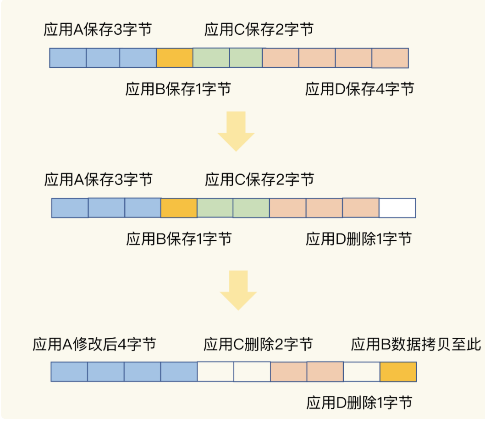
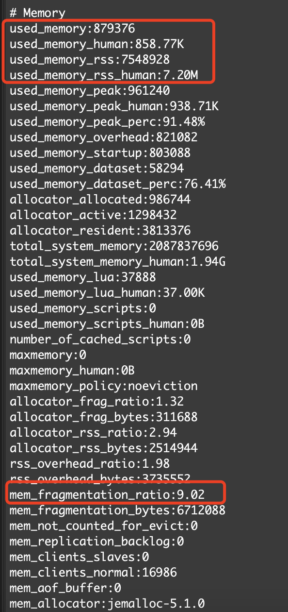
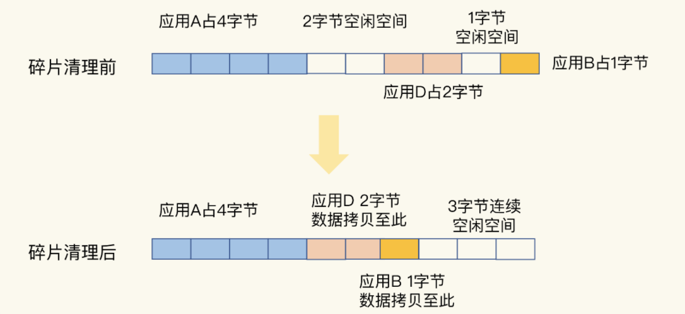

# 删除数据后，内存占用还是很高

## 内存碎片

操作系统的剩余内存空间总量足够，但是，应用申请的是一块连续地址空间的 N 字节，但在剩余的内存空间中，没有大小为 N 字节的连续空间了，那么，这些剩余空间就是内存碎片。

**即无法分配一段连续的内存空间。**

## 内存碎片的形成

### 操作系统机制

内存分配器的分配策略就决定了操作系统无法做到“按需分配”。这是因为，内存分配器一般是按固定大小来分配内存，而不是完全按照应用程序申请的内存空间大小给程序分配。

为了避免多次分配，比如申请20kb的内存，直接分配32kb，如果继续写入10kb，那么内存大小也是足够的，不需要重新分配。

### Redis机制

键值对大小不一：Redis 通常作为共用的缓存系统或键值数据库对外提供服务，所以，不同业务应用的数据都可能保存在 Redis 中，这就会带来不同大小的键值对。这样一来，Redis 申请内存空间分配时，本身就会有大小不一的空间需求。

键值对更新&删除：键值对会被修改和删除，这会导致空间的扩容和释放。

以上操作都会形成内存碎片

## 判断Redis是否有内存碎片

Redis 自身提供了 INFO 命令，可以用来查询内存使用的详细信息

信息解析：

mem_fragmentation_ratio ：它表示的就是 Redis 当前的内存碎片率

used_memory_rss ：是操作系统实际分配给 Redis 的物理内存空间，里面就包含了碎片；

 used_memory ：是 Redis 为了保存数据实际申请使用的空间

**mem_fragmentation_ratio = used_memory_rss/ used_memory**

内存碎片率的阈值经验：

- mem_fragmentation_ratio 大于 1 但小于 1.5。这种情况是合理的。这是因为，刚才我介绍的那些因素是难以避免的。毕竟，内因的内存分配器是一定要使用的，分配策略都是通用的，不会轻易修改；而外因由 Redis 负载决定，也无法限制。所以，存在内存碎片也是正常的。
- mem_fragmentation_ratio 大于 1.5 。这表明内存碎片率已经超过了 50%。一般情况下，这个时候，我们就需要采取一些措施来降低内存碎片率了。

## 清理内存碎片

**重启 Redis 实例**

影响点：

- 如果 Redis 中的数据没有持久化，那么，数据就会丢失；
- 即使 Redis 数据持久化了，我们还需要通过 AOF 或 RDB 进行恢复，恢复时长取决于 AOF 或 RDB 的大小，如果只有一个 Redis 实例，恢复阶段无法提供服务。

### 内存自动整理

4.0-RC3 版本以后，Redis 自身提供了一种内存碎片自动清理

### 自动清理注意点

操作系统需要把多份数据拷贝到新位置，把原有空间释放出来，这会带来时间开销。因为 Redis 是单线程，在数据拷贝时，Redis 只能等着，这就导致 Redis 无法及时处理请求，性能就会降低。同时还需要注意拷贝的顺序。

### 自动清理参数设置

**开启自动清理**

config set activedefrag yes

**什么时候出发碎片清理**

- active-defrag-ignore-bytes 100mb：表示内存碎片的字节数达到 100MB 时，开始清理；
- active-defrag-threshold-lower 10：表示内存碎片空间占操作系统分配给 Redis 的总空间比例达到 10% 时，开始清理。（比如分配了100M，碎片已经占用了10M了，那么开始清理）

**控制清理操作占用的 CPU 时间比例的上、下限**

控制占用CPU的时间的比例，防止影响Redis主线程的性能

- active-defrag-cycle-min 25： 表示自动清理过程所用 CPU 时间的比例不低于 25%，保证清理能正常开展；
- active-defrag-cycle-max 75：表示自动清理过程所用 CPU 时间的比例不高于 75%，一旦超过，就停止清理，从而避免在清理时，大量的内存拷贝阻塞 Redis，导致响应延迟升高。

**如果一旦超过占用max的CPU比例，那么会立即停止内存碎片整理，服务客户端的请求。**

## 备注

**如果 mem_fragmentation_ratio 小于 1 了，Redis 的内存使用是什么情况呢？**

说明分配给Redis内存大小，小于了Redis使用的内存大小，会触发操作系统得Swap，严重影响Redis整体性能，包括读取Swap区域的数据。**也就是说Redis没有足够的物理内存可以使用了**，这会导致Redis一部分内存数据会被换到Swap中，之后当Redis访问Swap中的数据时，延迟会变大，性能下降。

