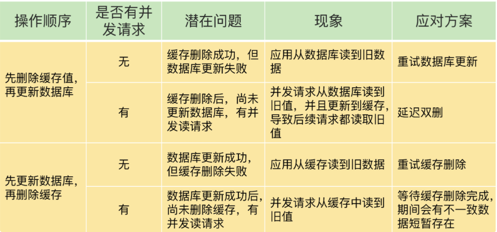
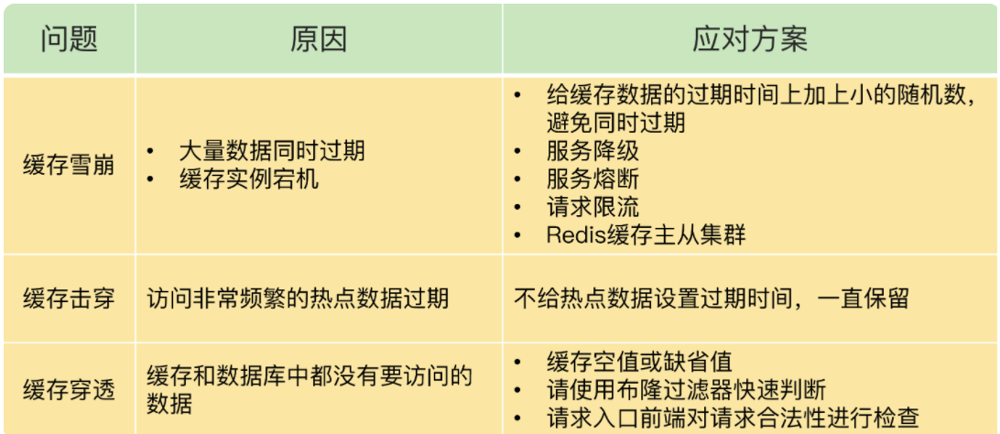

# 缓存一致性问题

使用缓存就一定会出现缓存一致性问题，如果需要强一致性，那么就直接使用数据库。

## Redis写回策略

三种

### 旁路写回

### 穿透

### 异步

## 解决方案

总结：

一般采用先更新数据库在删除缓存操作，保证数据最终一致性。

- 对于存在删除数据库 or 删除缓存失败的情况，使用消息队列 + 重试机制保证删除成功，如果一直删除失败，那么就进行业务报警，人为干预。或者加缓存过期时间，保证数据的最终一致性。
- 对于只读的缓存，保证数据最终一致性。
- 对于有并发写的场景，加分布式锁保证一个线程更新数据，其他线程进行阻塞等待。

## 缓存雪崩

大量的应用请求无法在 Redis 缓存中进行处理，紧接着，应用将大量请求发送到数据库层，导致数据库层的压力激增。

**原因一 大量key同时过期**

**解决**

- 避免设置同一时间过期，获取在同一时间中加一定随机数，业务也可以接受。
- 使用localcache 承受部分缓存，避免全部打到数据库
- 服务降级，非核心应用暂停访问数据库，保证核心服务的正常运行。

**原因二 redis实例宕机**

**解决**

- 预防为主，主从 哨兵 集群方案
- localcache支撑
- 服务熔断，限流，避免异常蔓延，拖垮其他服务，方案对业务有损

## 缓存击穿

指一个热点key无法在缓存中进行处理，导致全部打到数据库的情况

**解决**

- 设置key永不过期
- 需要更新时，特殊处理，先更新缓存，在更新数据库，保证缓存一直有值
- 在每个服务节点localcache进行热点数据支撑

## 缓存穿透

指要访问的数据既不在 Redis 缓存中，也不在数据库中，导致请求在访问缓存时，发生缓存缺失，再去访问数据库时，发现数据库中也没有要访问的数据。

**出现原因：**

- 业务层误删数据导致
- 恶意请求，故意请求不存在的数据

**解决**

- 对于不存在的key，缓存空值 or 缺省值，设置过期时间，保护数据库
- 布隆过滤器，单据redis节点保存，写数据时也写到过滤器中，请求时先判断是否存在key，过滤掉不存在的key
- 过滤恶意请求，包括ip、黑名单、限流等
- 报警机制，检测redis实例状态，及时报警处理

**备注:**

服务熔断、服务降级、请求限流的作用是，当系统内部发生故障或潜在问题时，为了防止系统内部的问题进一步恶化，所以会采用这些方式对系统增加保护，待系统内部故障恢复后，可以依旧继续对外提供服务，这些方法属于服务治理的范畴。

熔断、降级、限流，本质上是为了解决Redis实例没有起到缓存层作用这种情况；在损失业务吞吐量的代价下，在时间的作用下，随着过期key慢慢填充，Redis实例可以自行恢复缓存层作用。

而缓存穿透的场景，是因为用户要让Redis和数据库提供一个它没有的东西。这种场景下，如果没有人工介入，不论时间过去多久，都不太可能会自然恢复。

最好的办法是事前拦截，降低这种类型的请求打到系统上的可能。布隆过滤器虽然判别数据存在可能有误判的情况，但判别数据不存在不会误判。可以降低数据库无效的访问。

 