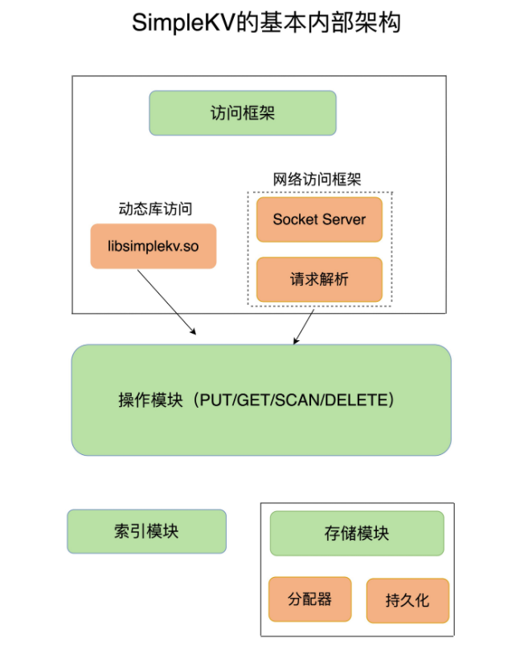
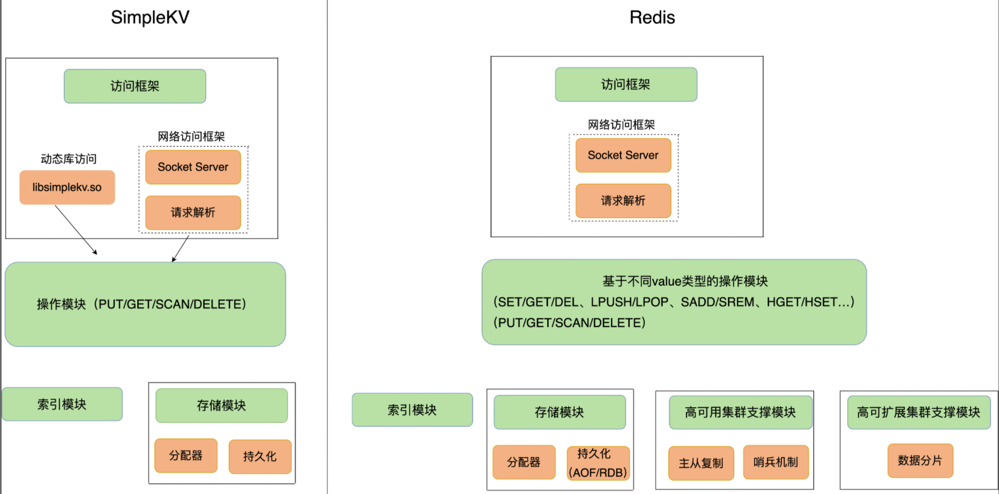

# 如何设计一个键值数据库？

## 一个键值数据库应该包含什么？

### 可以存哪些数据？

键值数据库最基本的模型就是 key-value，value能保存什么值呢？

Redis 能够在实际业务场景中得到广泛的应用，就是得益于支持多样化类型的 value。

使用的角度来说，不同 value 类型的实现，不仅可以支撑不同业务的数据需求，而且也隐含着不同数据结构在性能、空间效率等方面的差异，从而导致不同的 value 操作之间存在着差异。


### 可以对数据做什么操作？

最基本的操作

- PUT：新写入或更新一个 key-value 对；
- GET：根据一个 key 读取相应的 value 值；
- DELETE：根据一个 key 删除整个 key-value 对。

**Redis可以进行操作就多得多了，对每个数据结构都存在不同的操作命令。**


### 保存在内存还是外存？

保存在内存的好处是读写很快，毕竟内存的访问速度一般都在百 ns 级别。但是，潜在的风险是一旦掉电，所有的数据都会丢失。

保存在外存，虽然可以避免数据丢失，但是受限于磁盘的慢速读写（通常在几 ms 级别），键值数据库的整体性能会被拉低。

如何进行设计选择，我们通常需要考虑键值数据库的主要应用场景。比如，缓存场景下的数据需要能快速访问但允许丢失，那么，用于此场景的键值数据库通常采用内存保存键值数据。Memcached 和 Redis 都是属于内存键值数据库。对于 Redis 而言，缓存是非常重要的一个应用场景

## 主要模块

- 访问框架
- 索引模块
- 操作模块
- 存储模块

一个简单地键值数据库内部架构




### 什么方式访问？

- 通过函数库调用的方式供外部应用使用
- 通过网络框架以 Socket 通信的形式对外提供键值对操作，这种形式可以提供广泛的键值存储服务

访问数据库，就必然涉及到服务器与客户端交互的协议。必须要了解和掌握键值数据库的通信协议，这样才能开发出兼容的客户端。

当发出如下命令时：

```
PUT hello world
```

键值数据库网络框架接收到网络包，并按照相应的协议进行解析之后，就可以知道，客户端想写入一个键值对，并开始实际的写入流程.


### 如何定位键值位置

解析了客户端发来的请求，知道了要进行的键值对操作。需要查找所要操作的键值对是否存在，这依赖于键值数据库的索引模块。**索引的作用是让键值数据库根据 key 找到相应 value 的存储位置，进而执行操作。**

索引的类型有很多，常见的有**哈希表、B+ 树、字典树**等。不同的索引结构在性能、空间消耗、并发控制等方面具有不同的特征。

一般而言，内存键值数据库（例如 Redis）采用哈希表作为索引，很大一部分原因在于，其键值数据基本都是保存在内存中的，而内存的高性能随机访问特性可以很好地与哈希表 **O(1)** 的操作复杂度相匹配


Redis通过索引找到value后，由于复杂的数据结构，仍然需要从 value 的复杂结构（例如集合和列表）中进一步找到我们实际需要的数据，这个操作的效率本身就依赖于它们的实现结构。

**Redis 采用一些常见的高效索引结构作为某些 value 类型的底层数据结构，这一技术路线为 Redis 实现高性能访问提供了良好的支撑**


### 不同操作的具体逻辑

对于不同的操作来说，找到存储位置之后，需要进一步执行的操作的具体逻辑会有所差异

- 对于 GET/SCAN 操作而言，此时根据 value 的存储位置返回 value 值即可
- 对于 PUT 一个新的键值对数据而言，SimpleKV 需要为该键值对分配内存空间
- 对于 DELETE 操作，SimpleKV 需要删除键值对，并释放相应的内存空间，这个过程由分配器完成


### 如何实现重启后快速对外服务

增加持久化功能。

磁盘管理要比内存管理复杂，可以考虑直接使用文件系统，将键值数据通过调用本地文件系统的操作接口保存在磁盘上。此时，SimpleKV 只需要考虑何时将内存中的键值数据保存到文件中，就可以了。

一种方式是，对于每一个键值对，SimpleKV 都对其进行落盘保存，这虽然让 SimpleKV 的数据更加可靠，但是，因为每次都要写盘，SimpleKV 的性能会受到很大影响。（**影响性能**）

另一种方式是，SimpleKV 只是周期性地把内存中的键值数据保存到文件中，这样可以避免频繁写盘操作的性能影响。但是，一个潜在的代价是 SimpleKV 的数据仍然有丢失的风险。（**数据丢失风险**）


### Redis模块与简单键值数据库差异




- Redis 主要通过网络框架进行访问，而不再是动态库了，这也使得 Redis 可以作为一个基础性的网络服务进行访问，扩大了 Redis 的应用范围
- Redis 数据模型中的 value 类型很丰富，因此也带来了更多的操作接口
- Redis 的持久化模块能支持两种方式：日志（AOF）和快照（RDB），这两种持久化方式具有不同的优劣势，影响到 Redis 的访问性能和可靠性。
- Redis 支持高可靠集群和高可扩展集群

