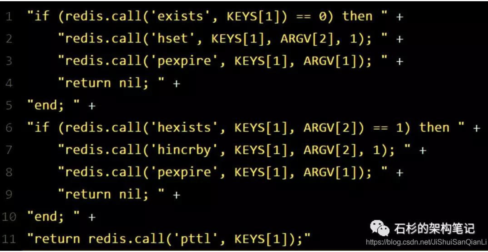

# Redis实现分布式锁


## 单机Redis实现

重点是保证 命令的原子性

使用redis提供的单命令 or  lua脚本实现


setnx命令：如果key不存在就创建并设置value，如果存在就返回失败

**存在的问题：**

在del命令删除key 没有执行的情况，会一直持有锁

**解决：**
设置过期时间，使用setnx + ex

```
// 加锁, unique_value作为客户端唯一性的标识
SET lock_key unique_value NX PX 10000
```

**问题2：**

key的误删，A节点加锁，B服务del 删除key

**解决：**

在分布式锁的value中设置一个有意义的数字，标识为当前节点。避免误删。

一般情况下不会出现，释放锁的前提下，是已经拿到了锁，都没拿到锁，怎么执行释放锁操作？

## Redssion实现

redssion框架采用的lua脚本实现的加锁。

并且使用的hash 数据结构，来实现可重入锁的功能。




## 多节点实现

RedLock

在多个reid节点上加锁

需要满足两个条件

- 超过一半以上的节点获取到锁
- 没有超过获取锁的超时时间

