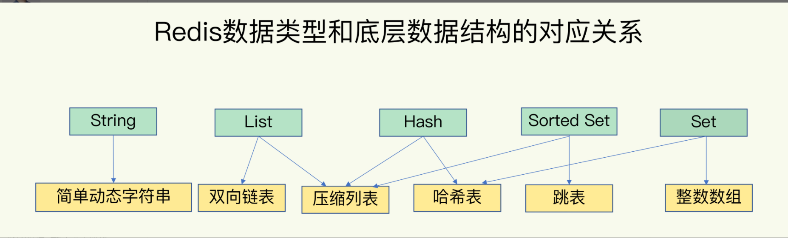
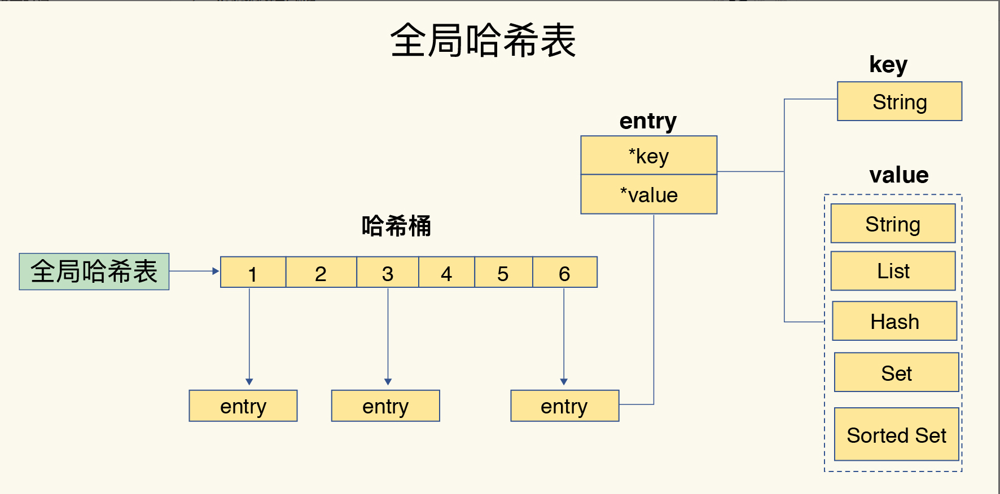
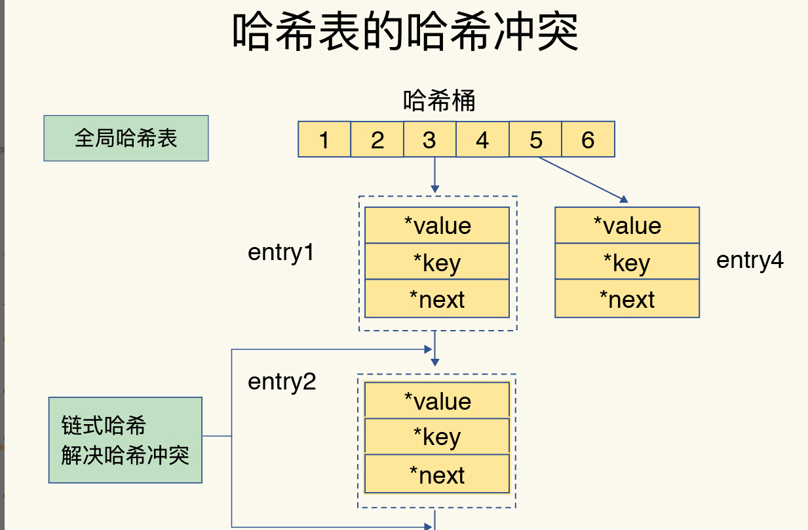
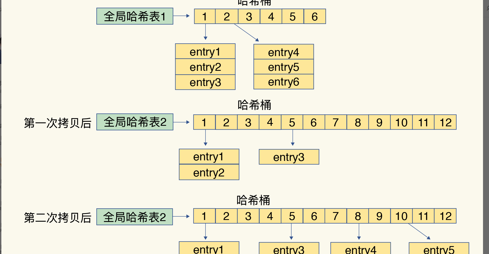
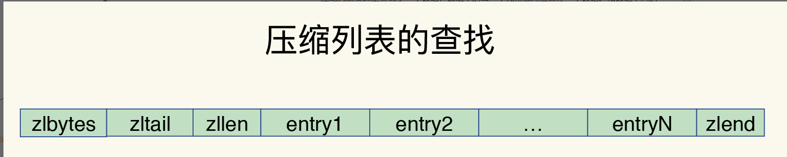
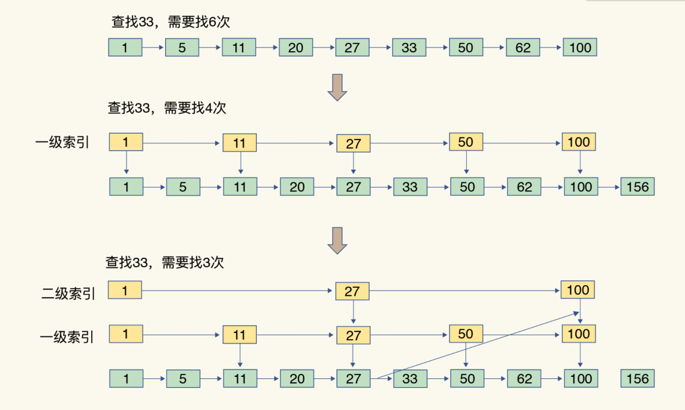
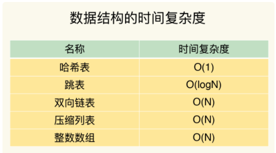

# 快速的Redis具有哪些慢操作

## 底层数据结构



## 查看数据结构

命令：object encoding

当超过 512个元素时，有压缩列表，转换为双向链表

```
127.0.0.1:6379> rpush listkey e1 e2 e3
(integer) 3
127.0.0.1:6379> object encoding listkey
"ziplist"


127.0.0.1:6379> rpush listkey e4 e5 ... e512 e513
(integer) 513
127.0.0.1:6379> object encoding listkey
"linkedlist"
```


## 键和值用什么结构组织？

为了实现从键到值的快速访问，Redis 使用了一个哈希表来保存所有键值对。一个哈希表，其实就是一个数组，数组的每个元素称为一个哈希桶。所以，我们常说，一个哈希表是由多个哈希桶组成的，每个哈希桶中保存了键值对数据。

**哈希桶中的元素保存的并不是值本身，而是指向具体值的指针。这也就是说，不管值是 String，还是集合类型，哈希桶中的元素都是指向它们的指针**



哈希表的最大好处很明显，就是让我们可以用 O(1) 的时间复杂度来快速查找到键值对——我们只需要计算键的哈希值，就可以知道它所对应的哈希桶位置，然后就可以访问相应的 entry 元素


## 为什么哈希表操作变慢了？

当你往哈希表中写入更多数据时，哈希冲突是不可避免的问题。这里的哈希冲突，也就是指，两个 key 的哈希值和哈希桶计算对应关系时，正好落在了同一个哈希桶中。

**Redis 解决哈希冲突的方式，就是链式哈希。链式哈希也很容易理解，就是指同一个哈希桶中的多个元素用一个链表来保存，它们之间依次用指针连接。**（和Java中的Hash冲突有点类似）



为了使 rehash 操作更高效，Redis 默认使用了两个全局哈希表：哈希表 1 和哈希表 2。一开始，当你刚插入数据时，默认使用哈希表 1，此时的哈希表 2 并没有被分配空间。随着数据逐步增多，Redis 开始执行 rehash，这个过程分为三步：

给哈希表 2 分配更大的空间，例如是当前哈希表 1 大小的两倍；

把哈希表 1 中的数据重新映射并拷贝到哈希表 2 中；

释放哈希表 1 的空间。

**存在的问题**

**这个过程看似简单，但是第二步涉及大量的数据拷贝，如果一次性把哈希表 1 中的数据都迁移完，会造成 Redis 线程阻塞，无法服务其他请求。此时，Redis 就无法快速访问数据了。**

**如何解决？**

## 渐进式Hash

Redis 采用了**渐进式 rehash**

第二步拷贝数据时，Redis 仍然正常处理客户端请求，每处理一个请求时，从哈希表 1 中的第一个索引位置开始，顺带着将这个索引位置上的所有 entries 拷贝到哈希表 2 中；等处理下一个请求时，再顺带拷贝哈希表 1 中的下一个索引位置的 entries。如下图所示：



这样可以将一次性大量的拷贝分散不到多次不同的请求操作上。避免了耗时操作，保证了数据的快速访问。


## 集合数据操作效率

和 String 类型不同，一个集合类型的值，第一步是通过全局哈希表找到对应的哈希桶位置，第二步是在集合中再增删改查

**这主要与集合使用的底层数据结构有关系。**

### 有哪些底层数据结构？

集合类型的底层数据结构主要有 5 种：**整数数组、双向链表、哈希表、压缩列表和跳表。**

压缩列表实际上类似于一个数组，数组中的每一个元素都对应保存一个数据。和数组不同的是，压缩列表在表头有三个字段 zlbytes、zltail 和 zllen，分别表示列表长度、列表尾的偏移量和列表中的 entry 个数；压缩列表在表尾还有一个 zlend，表示列表结束。



**如果我们要查找定位第一个元素和最后一个元素，可以通过表头三个字段的长度直接定位，复杂度是 O(1)。而查找其他元素时，就没有这么高效了，只能逐个查找，此时的复杂度就是 O(N) 了**


### 跳表

有序链表只能逐一查找元素，导致操作起来非常缓慢，于是就出现了跳表。**具体来说，跳表在链表的基础上，增加了多级索引，通过索引位置的几个跳转，实现数据的快速定位，如下图所示：**




## Redis底层数据结构的时间复杂度



## Redis不同数据结构不同操作对应的复杂度

### 单元素操作

例如，Hash 类型的 HGET、HSET 和 HDEL，Set 类型的 SADD、SREM、SRANDMEMBER

都是对Hash表做操作，所有时间复杂度都为O（1）

集合类型一般支持多元素操作，比如HMGET 和 HMSET，Set 类型的 SADD 也支持同时增加多个元素。

这是时间复杂度有操作元素的个数决定。比如**HMSET 增加 M 个元素时，复杂度就从 O(1) 变成 O(M) 了。**


### 范围操作，是指集合类型中的遍历操作，可以返回集合中的所有数据

Hash 类型的 HGETALL 和 Set 类型的 SMEMBERS，或者返回一个范围内的部分数据，比如 List 类型的 LRANGE 和 ZSet 类型的 ZRANGE。这类操作的复杂度一般是 O(N)，比较耗时，我们应该尽量避免。

edis 从 2.8 版本开始提供了 SCAN 系列操作（包括 HSCAN，SSCAN 和 ZSCAN），这类操作实现了渐进式遍历，每次只返回有限数量的数据。这样一来，相比于 HGETALL、SMEMBERS 这类操作来说，**就避免了一次性返回所有元素而导致的 Redis 阻塞**。

### 统计操作

集合类型对集合中所有元素个数的记录，例如 LLEN 和 SCARD。这类操作复杂度只有 O(1)，这是因为当集合类型采用**压缩列表、双向链表、整数数组**这些数据结构时，这些**结构中专门记录了元素的个数统计**，因此可以高效地完成相关操作

### 例外情况

是指某些数据结构的特殊记录，例如压缩列表和双向链表都会记录表头和表尾的偏移量。这样一来，对于 List 类型的 LPOP、RPOP、LPUSH、RPUSH 这四个操作来说，它们是在列表的头尾增删元素，这就可以通过偏移量直接定位，所以它们的复杂度也只有 O(1)，可以实现快速操作


