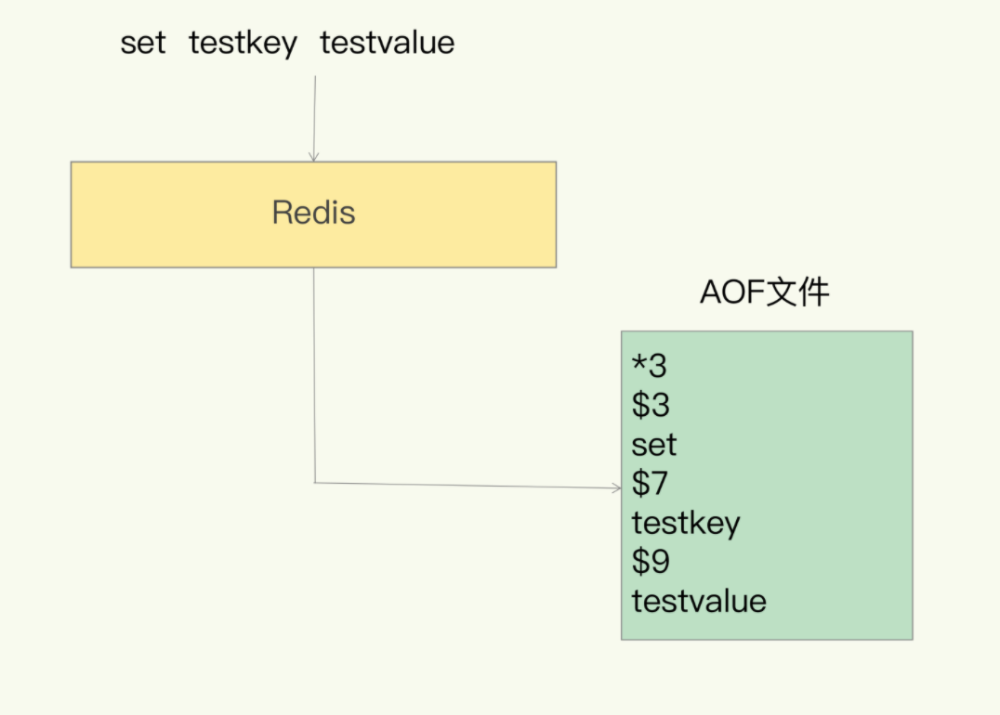
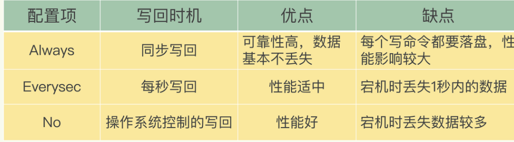

# AOF日志

## AOF格式

aof是 写后日志，即先写到缓存中，在写日志

**好处：**避免记录错误的命令、不会阻塞当前写操作。

aof存储的是一条条执行的命令

## AOF存在的问题

- 数据丢失风险，还没写完就宕机了
- 在主线程中执行，可能阻塞下一个操作命令

## AOF写回策略

- Always，同步写回：每个写命令执行完，立马同步地将日志写回磁盘；
- Everysec，每秒写回：每个写命令执行完，只是先把日志写到 AOF 文件的内存缓冲区，每隔一秒把缓冲区中的内容写入磁盘；
- No，操作系统控制的写回：每个写命令执行完，只是先把日志写到 AOF 文件的内存缓冲区，由操作系统决定何时将缓冲区内容写回磁盘。

## AOF文件过大

AOF文件过大会造成部分性能问题

- 文件太大，每次追加会消耗性能
- 恢复数据时，恢复缓慢

## AOF重写

AOF文件过大后，redis会进行重写，减小AOF文件大小。

**比如对同一个key的多次操作，可以通过分析减少为一条命令即可。**

### 是否阻塞主线程

和 AOF 日志由主线程写回不同，重写过程是由后台子进程 bgrewriteaof 来完成的，这也是为了避免阻塞主线程，导致数据库性能下降。我把重写的过程总结为**“一个拷贝，两处日志”。**

**一次拷贝：**

子线程会拷贝一份主线程的内存，将内存中的数据写入新的AOF文件中

**两处日志：**

由于重写不会阻塞主线程，新的操作会记录的老的AOF日志及新的AOF日志中，保证数据的一致性。

