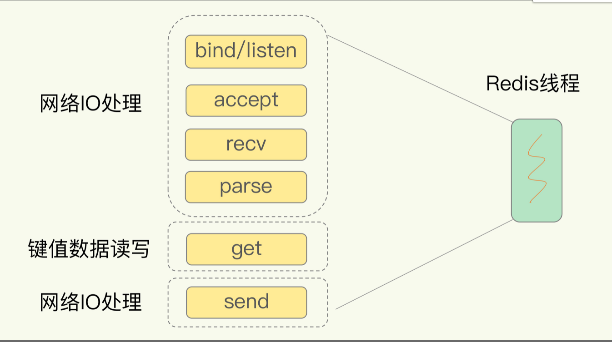
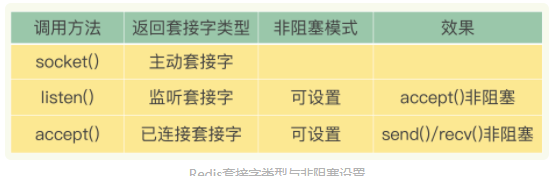
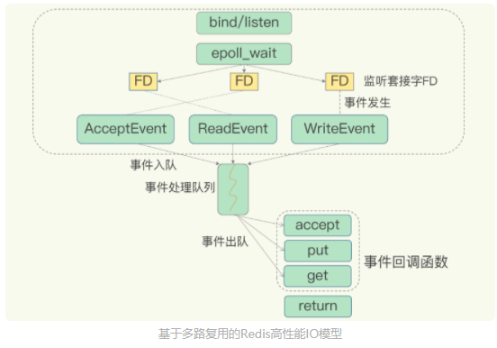

# 单线程Redis为什么这么快

## Redis真的是单线程吗？

**Redis 是单线程，主要是指 Redis 的网络 IO 和键值对读写是由一个线程来完成的，这也是 Redis 对外提供键值存储服务的主要流程**

但 Redis 的其他功能，比如持久化、异步删除、集群数据同步等，其实是由额外的线程执行的。

## Redis为什么用单线程

### 多线程的开销

系统中通常会存在被多线程同时访问的共享资源，比如一个共享的数据结构。当有多个线程要修改这个共享资源时，为了保证共享资源的正确性，就需要有额外的机制进行保证，而这个额外的机制，就会带来额外的开销（**访问共享资源**）

**在多线程编程中，经常遇到这种问题**

**这就是多线程编程模式面临的共享资源的并发访问控制问题。**

**还有一个原因就是，线程会进行频繁上下文切换**

## 单线程为什么这么快？

一方面，Redis 的大部分操作在内存上完成，再加上它采用了高效的数据结构，例如哈希表和跳表，这是它实现高性能的一个重要原因。**线程数并不是Redis的瓶颈**

另一方面，就是 Redis 采用了**多路复用机制**，使其在网络 IO 操作中能并发处理大量的客户端请求，实现高吞吐率

## 基本 IO 模型与阻塞点

以 Get 请求为例，键值数据库为了处理一个 Get 请求，需要监听客户端请求（bind/listen），和客户端建立连接（accept），从 socket 中读取请求（recv），解析客户端发送请求（parse），根据请求类型读取键值数据（get），最后给客户端返回结果，即向 socket 中写回数据（send）

**除了get操作，其他全是IO操作**

既然Redis是单线程的，那么一个请求对应的这些操作，Redis都将进行串行操作。

但是，在这里的网络 IO 操作中，有潜在的阻塞点，分别是 accept() 和 recv()。当 Redis 监听到一个客户端有连接请求，但一直未能成功建立起连接时，会阻塞在 accept() 函数这里，导致其他客户端无法和 Redis 建立连接。类似的，当 Redis 通过 recv() 从一个客户端读取数据时，如果数据一直没有到达，Redis 也会一直阻塞在 recv()。

### 非阻塞模式

Socket 网络模型的非阻塞模式设置，主要体现在三个关键的函数调用上，如果想要使用 socket 非阻塞模式，就必须要了解这三个函数的调用返回类型和设置模式

在 socket 模型中，不同操作调用后会返回不同的套接字类型。socket() 方法会返回主动套接字，然后调用 listen() 方法，将主动套接字转化为监听套接字，此时，可以监听来自客户端的连接请求。最后，调用 accept() 方法接收到达的客户端连接，并返回已连接套接字

## 基于多路复用的高性能 I/O 模型（基于Liunx内核实现）

Linux 中的 IO 多路复用机制是指一个线程处理多个 IO 流，就是我们经常听到的 select/epoll 机制。简单来说，在 Redis 只运行单线程的情况下，该机制允许内核中，同时存在多个监听套接字和已连接套接字。内核会一直监听这些套接字上的连接请求或数据请求。一旦有请求到达，就会交给 Redis 线程处理，这就实现了一个 Redis 线程处理多个 IO 流的效果。

为了在请求到达时能通知到 Redis 线程，select/epoll 提供了基于事件的回调机制，即针对不同事件的发生，调用相应的处理函数。

select/epoll 一旦监测到 FD 上有请求到达时，就会触发相应的事件

**这些事件会被放进一个事件队列，Redis 单线程对该事件队列不断进行处理。这样一来，Redis 无需一直轮询是否有请求实际发生，这就可以避免造成 CPU 资源浪费**

假如此时有两个请求到达，分别为**连接请求和读数据请求**

这两个请求分别对应 Accept 事件和 Read 事件

Redis 分别对这两个事件注册 accept 和 get 回调函数。当 Linux 内核监听到有连接请求或读数据请求时，就会触发 Accept 事件和 Read 事件，此时，内核就会回调 Redis 相应的 accept 和 get 函数进行处理。

