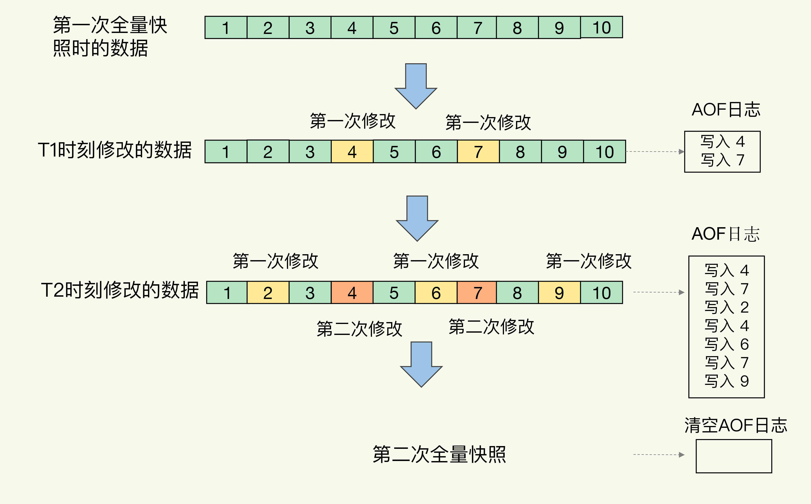

# Redis如何实现快速恢复

AOF能够避免数据丢失，如果设置为了alway会对性能有较大的影响。

## RDB

内存快照

Redis 的数据都在内存中，为了提供所有数据的可靠性保证，它执行的是全量快照，也就是说，把内存中的所有数据都记录到磁盘中

Redis 提供了两个命令来生成 RDB 文件，分别是 save 和 bgsave。

- save：在主线程中执行，会导致阻塞；
- bgsave：创建一个子进程，专门用于写入 RDB 文件，避免了主线程的阻塞，这也是 Redis RDB 文件生成的默认配置。（生成子进程的过程也是阻塞的，如果数据太大，也会阻塞一段时间）

## 快照时数据修改吗

Redis 就会借助操作系统提供的写时复制技术（Copy-On-Write, COW），在执行快照的同时，正常处理写操作

bgsave 子进程是由主线程 fork 生成的，可以共享主线程的所有内存数据。bgsave 子进程运行后，开始读取主线程的内存数据，并把它们写入 RDB 文件。此时，如果主线程对这些数据也都是读操作（例如图中的键值对 A），那么，主线程和 bgsave 子进程相互不影响。但是，如果主线程要修改一块数据（例如图中的键值对 C），那么，这块数据就会被复制一份，生成该数据的副本。然后，bgsave 子进程会把这个**副本数据写入 RDB 文件**，而在这个过程中，**主线程仍然可以直接修改原来的数据**（新修改的数据在下次快照时保存）

## 频繁快照可以吗？

频繁地执行全量快照，也会带来两方面的开销。

- 一方面，频繁将全量数据写入磁盘，会给磁盘带来很大压力，多个快照竞争有限的磁盘带宽，前一个快照还没有做完，后一个又开始做了，容易造成恶性循环。
- 另一方面，bgsave 子进程需要通过 fork 操作从主线程创建出来。虽然，子进程在创建后不会再阻塞主线程，但是，fork 这个创建过程本身会阻塞主线程，而且主线程的内存越大，阻塞时间越长。如果频繁 fork 出 bgsave 子进程，这就会频繁阻塞主线程了

## 增量快照

混合使用 AOF 日志和内存快照的方法。简单来说，内存快照以一定的频率执行，在两次快照之间，使用 AOF 日志记录这期间的所有命令操作。

在下次全量快照之后，可以清空AOF文件，因为数据都保存在这次快照了

## 总结

关于 AOF 和 RDB 的选择问题，我想再给你提三点建议：

- 数据不能丢失时，内存快照和 AOF 的混合使用是一个很好的选择；
- 如果允许分钟级别的数据丢失，可以只使用 RDB；
- 如果只用 AOF，优先使用 everysec 的配置选项，因为它在可靠性和性能之间取了一个平衡。