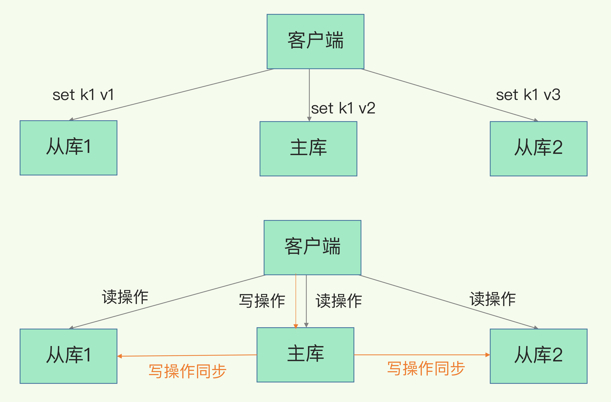

# Redis实现主从一致

Redis实现高可用 一般分为两点

- 数据不丢失（RDB+AOF）
- 服务高可用（主从同步，数据冗余）

## 主从分离架构

## 主从第一次同步

在从库上执行命令

replicaof  172.16.19.3  6379

从库给主库发送 psync 命令，表示要进行数据同步，主库根据这个命令的参数来启动复制。psync 命令包含了主库的 runID 和复制进度 offset 两个参数。

- runID，是每个 Redis 实例启动时都会自动生成的一个随机 ID，用来唯一标记这个实例。当从库和主库第一次复制时，因为不知道主库的 runID，所以将 runID 设为“？”
- offset，此时设为 -1，表示第一次复制。

同步步骤：

- 主从库间建立连接、协商同步的过程，传递runid，offset
- 主库生成RDB文件，发送给从库，从库清空内存，同步数据
- 同步RDB文件不会阻塞主库的写，发送RDB文件的过程中，会将新的写命令写入replication buffer，记录 RDB 文件生成后收到的所有写操作。
- RDB同步完成后Buffer中的写命令也发送给从库

## 主从连接断了怎么办？

在 Redis 2.8 之前，如果主从库在命令传播时出现了网络闪断，那么，从库就会和主库重新进行一次全量复制，开销非常大

当主从库断连后，主库会把断连期间收到的写操作命令，写入 replication buffer，同时也会把这些操作命令也写入 repl_backlog_buffer 这个缓冲区。repl_backlog_buffer 是一个环形缓冲区，**主库会记录自己写到的位置，从库则会记录自己已经读到的位置。**

主从库的连接恢复之后，从库首先会给主库发送 psync 命令，并把自己当前的 slave_repl_offset 发给主库，主库会判断自己的 master_repl_offset 和 slave_repl_offset 之间的差距。在网络断连阶段，主库可能会收到新的写操作命令，所以，一般来说，master_repl_offset 会大于 slave_repl_offset。此时，主库只用把 master_repl_offset 和 slave_repl_offset 之间的命令操作同步给从库就行。

## 注意

注意blocking_buffer的大小，如果太小，那么主库的offer追上了从库的offset就会覆盖掉，导致不得不得进行全量同步。

