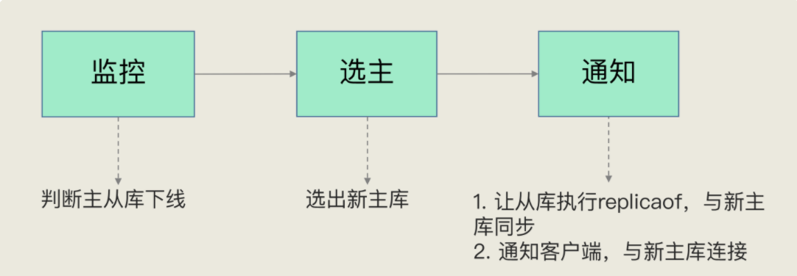
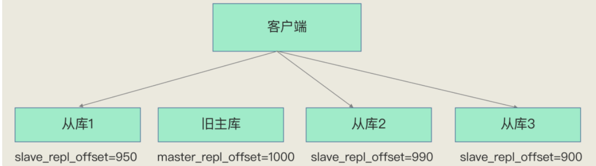

# 哨兵机制

防止主库挂了，客户端无法完成写请求

哨兵其实就是一个运行在特殊模式下的 Redis 进程，主从库实例运行的同时，它也在运行。哨兵主要负责的就是三个任务：**监控、选主（选择主库）和通知**

监控：监控是指哨兵进程在运行时，周期性地给所有的主从库发送 PING 命令，检测它们是否仍然在线运行。如果从库没有在规定时间内响应哨兵的 PING 命令，哨兵就会把它标记为“下线状态”；同样，如果主库也没有在规定时间内响应哨兵的 PING 命令，哨兵就会判定主库下线，然后开始自动切换主库的流程。

选主：主库挂了以后，哨兵就需要从很多个从库里，按照一定的规则选择一个从库实例，把它作为新的主库

通知：哨兵会把新主库的连接信息发给其他从库，让它们执行 replicaof 命令，和新主库建立连接，并进行数据复制。同时，哨兵会把新主库的连接信息通知给客户端，让它们把请求操作发到新主库上

## 主观下线 客观下线

主观下线：一个哨兵节点ping命令没有收到回复就标记为主观下线，但是有可能发生误判，所以一般使用哨兵集群。

**down-after-milliseconds**：哨兵检测主库多久没有响应就判断为主观下线（各哨兵实例需配置一致）

客观下线：多个哨兵节点都认为下线，那么就是主观下线，需要进行选主

## 选主

筛选：通过一定规则筛选调部分从节点（比如主观下线的，网络连接不好，经常发生重连的）都可以pass掉。

打分：

分为三轮，只要在一轮中有一个从库选出来了，就设置为主库，不必进行下面流程。

### 优先级

通过配置设置从库的优先级，比如内存大的优先级设置高一点，就会优先选为主库。

### 同步偏移量

选择和旧主库同步最接近的那个从库作为主库，那么，这个新主库上就有最新的数据。

slave_repl_offset：复制进度，选择最接近master_repl_offset 的库

### 从库ID号

在优先级和复制进度都相同的情况下，ID 号最小的从库得分最高，会被选为新主库。

## 选主要点

哨兵会按照在线状态、网络状态，筛选过滤掉一部分不符合要求的从库，然后，依次按照优先级、复制进度、ID 号大小再对剩余的从库进行打分，只要有得分最高的从库出现，就把它选为新主库。

