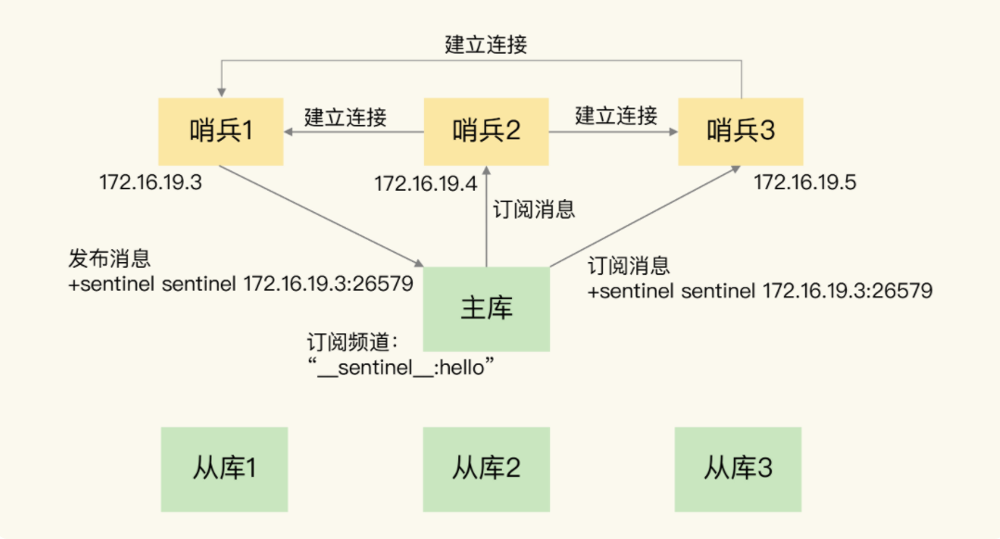
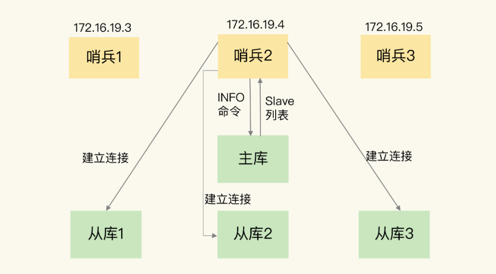
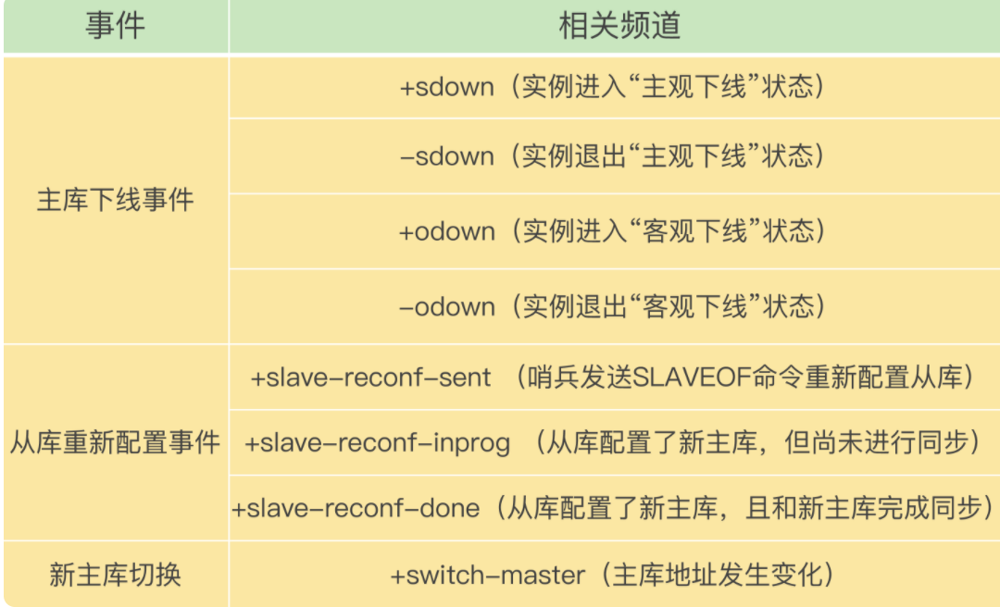
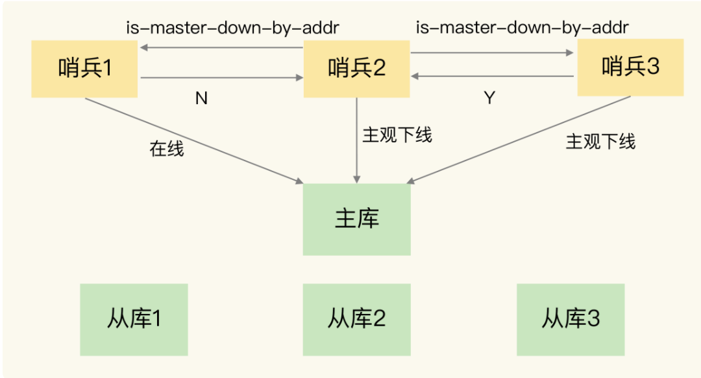

# 哨兵集群

## 哨兵集群组成

通过Redis的pub/sub 机制，也就是发布 / 订阅机制。

部署时，哨兵只需要和主库配置连接信息即可。

主库上有一个名为“__sentinel__:hello”的频道，不同哨兵就是通过它来相互发现，实现互相通信的。

一个哨兵自己**发布到该频道**，其他哨兵就能订阅获得它的信息。



## 哨兵与从库连接

向主库发送 INFO 命令来完成的，返回slave 列表，然后与从库建立连接（连接后，通过心跳检测机制，判断是否下线）



## 哨兵通知客户端

哨兵就是一个运行在特定模式下的 Redis 实例，只不过它并不服务请求操作，只是完成监控、选主和通知的任务。所以，每个哨兵实例也提供 pub/sub 机制，**客户端可以从哨兵订阅消息**。哨兵提供的消息订阅频道有很多，不同频道包含了主从库切换过程中的不同关键事件。

**哨兵频道及事件**



栗子：

```
// 订阅进入客观下线的事件 （内容包括那台实例，ip port等信息）
SUBSCRIBE +odown
```


当主库选择完成后，客户端就可以通过+switch-master 频道获取到事件

```
// 新主库相关信息
switch-master <master name> <oldip> <oldport> <newip> <newport>
```


## 由那个哨兵进行切换

判断主库节点下线的过程

哨兵通过is-master-down-by-addr 命令向其他哨兵确认是否下线。如果认为下线就返回Y，如果反对就N



标记为客观下线需要一个条件：赞成数超过配置文件中的 quorum（比如哨兵有5个，quorum= 3 ，必须有3个赞成才下线）

**选择执行切换的哨兵，选Leader**

- 第一，拿到半数以上的赞成票；
- 第二，拿到的票数同时还需要大于等于哨兵配置文件中的 quorum 值。

**选出的Leader执行主从的切换，并告诉其他从库连接 到新的主库，然后通知客户端新主库的连接信息。**


