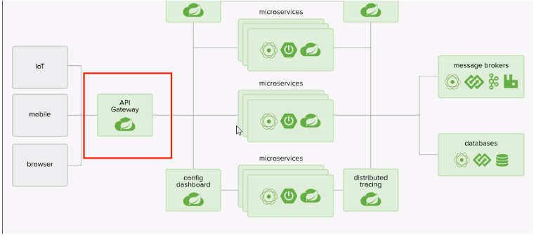
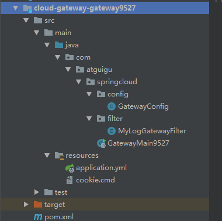

# 服务网关Zuul&Gateway


## Gateway

### 网关概述

为什么存在网关？

不同的微服务一般会有不同的网络地址，而外部的客户端可能需要调用多个微服务的接口才能完成一个业务的需求，如果让客 户端和多个微服务直接通信，会产生很多问题： a、客户端多次请求不同的微服务，增加客户端的复杂性 b、存在跨域请求，在一定场景下处理困难 c、认证复杂，每个微服务都需要独立的认证 d、难以重构，随着项目的迭代，可能需要重新划分微服务。 例如：可能会将多个微服务合并成一个或者将一个微服务拆分成多个微服务。这是如果客户端直接与各微服务间通信，增加重构的难度。 e、某些微服务可能使用了防火墙或者浏览器的不友好协议，直接访问会有一定的困难。


什么是服务网关？

网关是介于客户端和服务端之间的中间层。所有的外部请求都会经过网关这一层。也就是说API实现方面更多的考虑业务逻辑。而安全、性能、监控可以交由网关来做。这样既提高了业务的灵活性又不失安全性。


### 网关的优点

- a、安全，只有网关系统对外进行暴露，微服务可以隐藏在内网，通过防火墙保护。 
- b、易于监控，可以在网关收集监控数据推送到外部系统进行监控。 
- c、易与认证，可以在网关上进行认证，然后再将请求转发到后端的微服务，无需再每个微服务上进行认证。
-  d、减少了客户端和各微服务之间的交互次数。
-  e、易于统一鉴权。验证用户是否具有访问各微服务的权利。


### GateWay简介

一句话：gateway是zuul1.x版的替代。 springcloud gateway旨在为微服务架构提供一种简单有效的统一的API路由管理方式。并且基于filter链的方式提供网关的基本功能：安全、监控、熔断、限流、重试等。

### 能干什么？

反向代理、鉴权、流量控制、熔断、日志监控等，**GateWay在Nginx之后在各个微服务之前。**


### Nginx配置网关集群


### GateWay架构



### GateWay与Zuul的区别

zuul1.x是基于servlet之上的一个阻塞式处理模型。 

**gateway**是异步非阻塞式的。采用了WebFlux框架，底层采用了 Netty框架，所以是异步非阻塞式，效率更高。


### GateWay核心概念

- a、**断言predicate**： 参考java8的predicate，开发人员可以匹配http请求中的所有内容。如果请求和路由相匹配则进行路由。 
- b、**过滤Filter:** 指的是spring框架中springGateway的实例，可以对请求在路由前或之后进行修改。 
- c、**路由Route**: 路由是构建网关的基本模块，它由ID、目标URI、一系列断言predicate和过滤器filter组成。如果断言为true则匹配该路由。  web请求通过一些匹配条件，定位到真正的服务节点，并在这个转发的过程前后进行一系列的精细化控制。 predicate就是我们的匹配条件，而filter，就可以理解为一个无所不能的拦截器，有了这两个元素再加上一个uri就可以实现一个具体的路由了。

### GateWay工作流程

**核心：路由转发+执行过滤器链**

客户端向springcloud gateway发出请求，然后在gateway handler mapping中找到与请求相匹配的路由，将其发送到gateway web handler. handler再通过指定的过滤器链来将请求发送到实际服务执行业务逻辑，然后返回。 过滤器可能会在发送请求之前pre或者之后post执行业务逻辑。

 pre：（之前进行）参数校验、权限校验、流量监控、日志输出、协议转换等。

 post：（之后进行）相应内容和响应头的修改，日志输出、流量监控等。


## Gateway案例


新建Gateway工程



pom依赖

```xml
<?xml version="1.0" encoding="UTF-8"?>
<project xmlns="http://maven.apache.org/POM/4.0.0"
         xmlns:xsi="http://www.w3.org/2001/XMLSchema-instance"
         xsi:schemaLocation="http://maven.apache.org/POM/4.0.0 http://maven.apache.org/xsd/maven-4.0.0.xsd">
    <parent>
        <artifactId>cloud2020</artifactId>
        <groupId>com.atguigu.springcloud</groupId>
        <version>1.0-SNAPSHOT</version>
    </parent>
    <modelVersion>4.0.0</modelVersion>

    <artifactId>cloud-gateway-gateway9527</artifactId>

    <dependencies>
        <dependency>
            <groupId>org.springframework.cloud</groupId>
            <artifactId>spring-cloud-starter-gateway</artifactId>
        </dependency>
        <!--gateway无需web和actuator-->
        <dependency>
            <groupId>org.springframework.cloud</groupId>
            <artifactId>spring-cloud-starter-netflix-eureka-client</artifactId>
        </dependency>
        <dependency>
            <groupId>org.projectlombok</groupId>
            <artifactId>lombok</artifactId>
            <optional>true</optional>
        </dependency>
        <dependency>
            <groupId>org.springframework.boot</groupId>
            <artifactId>spring-boot-starter-test</artifactId>
            <scope>test</scope>
        </dependency>
        <dependency>
            <groupId>com.atguigu.springcloud</groupId>
            <artifactId>cloud-api-common</artifactId>
            <version>${project.version}</version>
        </dependency>
    </dependencies>

</project>
```


配置文件

```yaml
server:
  port: 9527

spring:
  application:
    name: cloud-gateway #服务名
  cloud:
    gateway:
      discovery:
        locator:
          enabled: true # 开启从注册中心动态创建路由的功能，利用微服务名称j进行路由
      routes:
        - id: payment_route # 路由的id,没有规定规则但要求唯一,建议配合服务名
          #匹配后提供服务的路由地址
          uri: http://localhost:8001
          predicates:
            - Path=/payment/get/** # 断言，路径相匹配的进行路由
            #- After=2017-01-20T17:42:47.789-07:00[America/Denver]
            #- Before=2017-01-20T17:42:47.789-07:00[America/Denver]
            #- Cookie=username,zzyy
            #- Header=X-Request-Id, \d+ #请求头要有X-Request-Id属性，并且值为正数
            #- Host=**.atguigu.com
            #- Method=GET
            #- Query=username, \d+ # 要有参数名username并且值还要是正整数才能路由
          # 过滤
          #filters:
          #  - AddRequestHeader=X-Request-red, blue
        - id: payment_route2
          uri: http://localhost:8001
          predicates:
            Path=/payment/lb/** #断言,路径相匹配的进行路由

eureka:
  instance:
    hostname: cloud-gateway-service #主机名
  client:
    fetch-registry: true
    register-with-eureka: true
    service-url:
      defaultZone: http://eureka7001.com:7001/eureka/

```

**假如不想暴露服务的端口如8001，那么就可以在8001服务外包一层9527网关。通过网关服务将请求转发到实际的业务服务。**

**关键配置**


**备注**

**Gateway服务不需要因为Web和actuator依赖**


### 通过GateWay访问

启动Eureka服务，GateWay服务，Payment8001服务后

以前使用**localhost:8081/payment/get/{id}**进行访问

现在通过网关 **localhost:9527/payment/get/{id}** 路由到8001进行访问


### GateWay路由的两种方式

1、yaml文件中进行配置

```yaml
spring:
  application:
    name: cloud-gateway #服务名
  cloud:
    gateway:
      discovery:
        locator:
          enabled: true # 开启从注册中心动态创建路由的功能，利用微服务名称j进行路由
      routes:
        - id: payment_route # 路由的id,没有规定规则但要求唯一,建议配合服务名
          #匹配后提供服务的路由地址
          uri: http://localhost:8001
          predicates:
            - Path=/payment/get/** # 断言，路径相匹配的进行路由
            #- After=2017-01-20T17:42:47.789-07:00[America/Denver]
            #- Before=2017-01-20T17:42:47.789-07:00[America/Denver]
            #- Cookie=username,zzyy
            #- Header=X-Request-Id, \d+ #请求头要有X-Request-Id属性，并且值为正数
            #- Host=**.atguigu.com
            #- Method=GET
            #- Query=username, \d+ # 要有参数名username并且值还要是正整数才能路由
          # 过滤
          #filters:
          #  - AddRequestHeader=X-Request-red, blue
        - id: payment_route2
          uri: http://localhost:8001
          predicates:
            Path=/payment/lb/** #断言,路径相匹配的进行路由
```


2、在代码中添加配置Bean，RouteLocator类

新建配置类GatewayConfig

主要是定义一个**RouteLocator**，路由定位器，可以配置多个。

```java
@Configuration
public class GatewayConfig {

    /**
     * 配置了一个id为route-name的路由规则
     * 当访问localhost:9527/guonei的时候，将会转发至https://news.baidu.com/guonei
     *
     * @param routeLocatorBuilder
     * @return
     */
    @Bean
    public RouteLocator customRouteLocator(RouteLocatorBuilder routeLocatorBuilder) {
        RouteLocatorBuilder.Builder routes = routeLocatorBuilder.routes();
        //访问路径中/guonei的url会被路由到https://news.baidu.com/guonei
        return routes.route("path_route_atguigu", r -> r.path("/guonei").uri("https://news.baidu.com/guonei")).build();
    }

    @Bean
    public RouteLocator customRouteLocator2(RouteLocatorBuilder routeLocatorBuilder) {
        RouteLocatorBuilder.Builder routes = routeLocatorBuilder.routes();
        return routes.route("path_route_atguigu2", r -> r.path("/guoji").uri("https://news.baidu.com/guoji")).build();
    }
}
```

#### 备注

**发现routes.route中配置的uri 在.com后面的路径没有卵用，会将前面匹配到的path 直接加到https://news.baidu.com后面，**因此无论https://news.baidu.com后面什加什么路径没有用，都会被替换为匹配到的path。

这里将uri随便写一个后缀

```java
 return routes.route("path_route_atguigu2", r -> r.path("/guoji").uri("https://news.baidu.com/guoji/hehehe")).build();
```

**页面上访问时仍然能正常路由到https://news.baidu.com/guoji**


### 配置动态路由

默认情况下GateWay会根据注册中心的服务列表，以注册中心上的**微服务 名称为路径创建动态路由进行转发，从而实现动态路由的功能**

修改配置文件

- 注册中心动态创建路由的功能，利用微服务名称j进行路由
- 将uri中写死的路径，替换为**lb 负载均衡通过服务名访问**

```yaml
spring:
  application:
    name: cloud-gateway #服务名
  cloud:
    gateway:
      discovery:
        locator:
          enabled: true # 开启从注册中心动态创建路由的功能，利用微服务名称j进行路由
      routes:
        - id: payment_route # 路由的id,没有规定规则但要求唯一,建议配合服务名
          #匹配后提供服务的路由地址
          #uri: http://localhost:8001
          uri : lb://cloud-payment-service
          predicates:
            - Path=/payment/get/** # 断言，路径相匹配的进行路由
            #- After=2017-01-20T17:42:47.789-07:00[America/Denver]
            #- Before=2017-01-20T17:42:47.789-07:00[America/Denver]
            #- Cookie=username,zzyy
            #- Header=X-Request-Id, \d+ #请求头要有X-Request-Id属性，并且值为正数
            #- Host=**.atguigu.com
            #- Method=GET
            #- Query=username, \d+ # 要有参数名username并且值还要是正整数才能路由
          # 过滤
          #filters:
          #  - AddRequestHeader=X-Request-red, blue
        - id: payment_route2
          #uri: http://localhost:8001
          uri : lb://cloud-payment-service
          predicates:
            Path=/payment/lb/** #断言,路径相匹配的进行路由
```

### 配置类实现动态路由

和配置文件一致，同样使用**lb://cloud-payment-service**

**在路由地址中使用lb负载均衡，使用服务名进行访问,并指定自定义过滤器。**

```java
@Configuration
public class GatewayConfig {

    @Bean
    public RouteLocator routeLocator(RouteLocatorBuilder routeLocatorBuilder){
        RouteLocatorBuilder.Builder myLogGatewayFilterBuilder = routeLocatorBuilder.routes().route("myLogGatewayFilter",
                r -> r.path("/payment/get/**")
                        .uri("lb://cloud-payment-service")
                        .filter(new MyLogGatewayFilter()));

        return myLogGatewayFilterBuilder.build();
    }
}
```


### Predicate使用

Predicate 断言，用于进行判断。在配置文件配置spring.cloud.gateway.routes.predicates -Path  -After -Before

Predicate就是为了实现一组匹配规则，让请求过来找到对应的Route进行处理

可以配置多个

-Path 断言，如果路径匹配给定的格式，那么才会进行转发

-After 请求必须在给定的时间之后访问才会进行转发

-Before 请求必须在给定时间之后访问才会转发

-Cookie 必须携带给定的Cookie，才进行转发

-Method 必须是规定的请求方法 GET POST

-Query 必须携带某个查询参数


配置文件如下

```yaml
spring:
  application:
    name: cloud-gateway #服务名
  cloud:
    gateway:
      discovery:
        locator:
          enabled: true # 开启从注册中心动态创建路由的功能，利用微服务名称j进行路由
      routes:
        - id: payment_route # 路由的id,没有规定规则但要求唯一,建议配合服务名
          #匹配后提供服务的路由地址
          #uri: http://localhost:8001
          uri : lb://cloud-payment-service
          predicates:
            - Path=/payment/** # 断言，路径相匹配的进行路由
            #- After=2017-01-20T17:42:47.789-07:00[America/Denver]
            #- Before=2017-01-20T17:42:47.789-07:00[America/Denver]
            #- Cookie=username,zzyy
            #- Header=X-Request-Id, \d+ #请求头要有X-Request-Id属性，并且值为正数
            #- Host=**.atguigu.com
            #- Method=GET
            #- Query=username, \d+ # 要有参数名username并且值还要是正整数才能路由
          # 过滤
          #filters:
          #  - AddRequestHeader=X-Request-red, blue
        #- id: payment_route2
          #uri: http://localhost:8001
          #uri : lb://cloud-payment-service
         # predicates:
            #Path=/payment/lb/** #断言,路径相匹配的进行路由
            #Path=/payment/**
```


### Filter使用


**配置文件配置Filter**

同上面断言一样也是进行同样的配置，和predicates同级

spring.cloud.gateway.routes.filters -AddRequestHeader 

网关经常需要对路由请求进行过滤，进行一些操作，如鉴权之后构造头部之类的，过滤的种类很多，如增加请求头、增加请求 参数 、增加响应头和断路器等等功能，这就用到了Spring Cloud Gateway 的 Filter。

当我们有很多个服务时，比如下图中的user-service、goods-service、sales-service等服务，客户端请求各个服务的Api时，每个服务都需要做相同的事情，比如鉴权、限流、日志输出等。


对于这样重复的工作，可以在微服务的上一层加一个全局的权限控制、限流、日志输出的Api Gateway服务，然后再将请求转发到具体的业务服务层。这个Api Gateway服务就是起到一个服务边界的作用，外接的请求访问系统，必须先通过网关层。

Spring Cloud Gateway 的 Filter 的生命周期不像 Zuul 的那么丰富，它只有两个：“pre” 和 “post”。

- PRE： 这种过滤器在请求被路由之前调用。我们可利用这种过滤器实现身份验证、在集群中选择请求的微服务、记录调试信息等。 

- POST：这种过滤器在路由到微服务以后执行。这种过滤器可用来为响应添加标准的 HTTP Header、收集统计信息和指标、将响应从微服务发送给客户端等

**Spring Cloud Gateway 的 Filter 从作用范围可分为另外两种GatewayFilter 与 GlobalFilter。**

GatewayFilter：应用到单个路由或者一个分组的路由上。 （在配置文件为每一个路由分组进行单独配置）

GlobalFilter：应用到所有的路由上。（全局配置，所有路由都生效）

**一般使用全局路由配置。**


**定义一个全局Filter**

创建一个类**MyLogGatewayFilter**,作用是拦截每一个请求，如果没有设置对应的参数，那么就不放行，返回错误信息，并记录下日志。（如果请求没有携带uname查询参数，那么就记录下日志，用户名为null，非法用户）

```java
@Component
@Slf4j
public class MyLogGatewayFilter implements GlobalFilter, Ordered {
    
    @Override
    public Mono<Void> filter(ServerWebExchange exchange, GatewayFilterChain chain) {
        log.info("come in global filter: {}", new Date());

        ServerHttpRequest request = exchange.getRequest();
        String uname = request.getQueryParams().getFirst("uname");
        if (uname == null) {
            log.info("用户名为null，非法用户");
            exchange.getResponse().setStatusCode(HttpStatus.NOT_ACCEPTABLE);
            return exchange.getResponse().setComplete();
        }
        // 放行
        return chain.filter(exchange);
    }

    /**
     * 过滤器加载的顺序 越小,优先级别越高
     *
     * @return
     */
    @Override
    public int getOrder() {
        return 0;
    }
}
```


