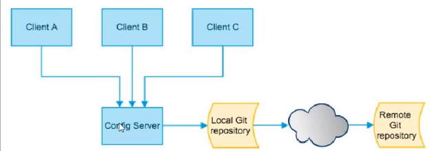
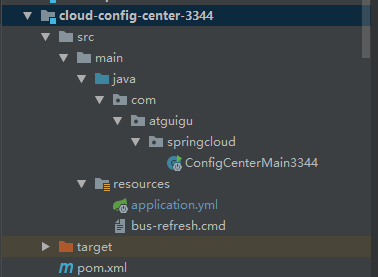
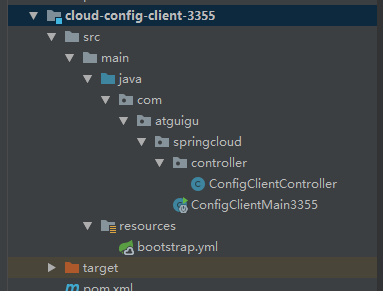

## Config 分布式配置中心





### Config总控中心搭建

**ConfigServer**




pom依赖

主要引入spring-cloud-config-server

消息总线bus：spring-cloud-starter-bus-amqp

```xml
<?xml version="1.0" encoding="UTF-8"?>
<project xmlns="http://maven.apache.org/POM/4.0.0"
         xmlns:xsi="http://www.w3.org/2001/XMLSchema-instance"
         xsi:schemaLocation="http://maven.apache.org/POM/4.0.0 http://maven.apache.org/xsd/maven-4.0.0.xsd">
    <parent>
        <artifactId>cloud2020</artifactId>
        <groupId>com.atguigu.springcloud</groupId>
        <version>1.0-SNAPSHOT</version>
    </parent>
    <modelVersion>4.0.0</modelVersion>

    <artifactId>cloud-config-center-3344</artifactId>

    <dependencies>
        <dependency>
            <groupId>org.springframework.cloud</groupId>
            <artifactId>spring-cloud-starter-bus-amqp</artifactId>
        </dependency>
        <dependency>
            <groupId>org.springframework.cloud</groupId>
            <artifactId>spring-cloud-config-server</artifactId>
        </dependency>
        <dependency>
            <groupId>org.springframework.cloud</groupId>
            <artifactId>spring-cloud-starter-netflix-eureka-client</artifactId>
        </dependency>
        <dependency>
            <groupId>org.springframework.boot</groupId>
            <artifactId>spring-boot-starter-web</artifactId>
        </dependency>
        <dependency>
            <groupId>org.springframework.boot</groupId>
            <artifactId>spring-boot-starter-actuator</artifactId>
        </dependency>
        <dependency>
            <groupId>org.projectlombok</groupId>
            <artifactId>lombok</artifactId>
            <optional>true</optional>
        </dependency>
        <dependency>
            <groupId>org.springframework.boot</groupId>
            <artifactId>spring-boot-starter-test</artifactId>
            <scope>test</scope>
        </dependency>

    </dependencies>

</project>
```

配置文件

```yaml
server:
  port: 3344

spring:
  application:
    name: cloud-config-center
  cloud:
    config:
      server:
        git:
          uri: git@github.com:leelovejava/springcloud-config.git
          search-paths:
            - spring-config
      label: master
  rabbitmq:
    host: localhost
    port: 5672
    username: guest
    password: guest


eureka:
  client:
    service-url:
      defaultZone: http://eureka7001.com:7001/eureka

# 暴露bus刷新配置的端点
management:
  endpoints:
    web:
      exposure:
        include: "bus-refresh"

```

主启动类加上注解

**@EnableConfigServer **表示为Config配置中心，服务端。

```java
@SpringBootApplication
@EnableConfigServer
public class ConfigCenterMain3344 {
    public static void main(String[] args) {
        SpringApplication.run(ConfigCenterMain3344.class, args);
    }
}
```


### Config客户端搭建




pom依赖

主要是spring-cloud-starter-config，与配置中心服务端相比，少了一个Server

消息总线BUS：spring-cloud-starter-bus-amqp

```xml
<?xml version="1.0" encoding="UTF-8"?>
<project xmlns="http://maven.apache.org/POM/4.0.0"
         xmlns:xsi="http://www.w3.org/2001/XMLSchema-instance"
         xsi:schemaLocation="http://maven.apache.org/POM/4.0.0 http://maven.apache.org/xsd/maven-4.0.0.xsd">
    <parent>
        <artifactId>cloud2020</artifactId>
        <groupId>com.atguigu.springcloud</groupId>
        <version>1.0-SNAPSHOT</version>
    </parent>
    <modelVersion>4.0.0</modelVersion>

    <artifactId>cloud-config-client-3355</artifactId>

    <dependencies>
        <dependency>
            <groupId>org.springframework.cloud</groupId>
            <artifactId>spring-cloud-starter-bus-amqp</artifactId>
        </dependency>
        <dependency>
            <groupId>org.springframework.cloud</groupId>
            <artifactId>spring-cloud-starter-config</artifactId>
        </dependency>
        <dependency>
            <groupId>org.springframework.cloud</groupId>
            <artifactId>spring-cloud-starter-netflix-eureka-client</artifactId>
        </dependency>
        <dependency>
            <groupId>org.springframework.boot</groupId>
            <artifactId>spring-boot-starter-web</artifactId>
        </dependency>
        <dependency>
            <groupId>org.springframework.boot</groupId>
            <artifactId>spring-boot-starter-actuator</artifactId>
        </dependency>
        <dependency>
            <groupId>org.projectlombok</groupId>
            <artifactId>lombok</artifactId>
            <optional>true</optional>
        </dependency>
        <dependency>
            <groupId>org.springframework.boot</groupId>
            <artifactId>spring-boot-starter-test</artifactId>
            <scope>test</scope>
        </dependency>
    </dependencies>

</project>
```

**配置文件 bootstrap.xml**

**bootstrap.xml表示是系统级的配置文件，级别比application.yml更高，application.yml是用户级别配置文件。**

```yaml
server:
  port: 3355

spring:
  application:
    name: config-client
  cloud:
    config:
      label: master # 分支名称
      name: config #配置文件名称
      profile: dev # 读取的后缀，上述三个综合，为master分支上的config-dev.yml的配置文件被读取，http://config-3344.com:3344/master/config-dev.yml
      uri: http://config-3344.com:3344 #配置中心的地址
  rabbitmq: #rabbitmq相关配置，15672是web管理端口，5672是mq访问端口
    port: 5672
    host: localhost
    username: guest
    password: guest


eureka:
  client:
    service-url:
      defaultZone: http://eureka7001.com:7001/eureka

management:
  endpoints:
    web:
      exposure:
        include: "*"

```


### Config动态刷新

当github远程配置文件中心中的配置文件被修改后，Config服务端3344能够快速响应正确的结果（修改后的结果），但是Config Client客户端3355访问服务端获取配置时，还是旧的配置，新修改没有生效，需要手动重启微服务后才会生效。所以需要进行动态刷新，获取最新的配置。

**解决方案**

在Config-Client中引入actuator监控

```xml
<dependency>
    <groupId>org.springframework.boot</groupId>
    <artifactId>spring-boot-starter-actuator</artifactId>
</dependency>

```

**暴露刷新地址**

修改配置文件application.yml

```yaml
management:
  endpoints:
    web:
      exposure:
        include: "*"
```

在Controller上新增注解 **@RefreshScope**


**修改Github配置文件后，手动发送Post请求，刷新对应的服务**

```
curl +X POST "http://localhost:3355/actuator/refresh"
```


### 问题

假如有多个微服务，上百个，如果都需要去访问同一个配置文件，那么Github上配置文件修改后，需要手动调用

```
curl +X POST "http://localhost:3355/actuator/refresh"
```

通知对应的微服务进行刷新，才能获取到对应的配置。

可否进行广播，一次通知，处处生效？

**如果有些修改每一个微服务都必须要知道，如何让每个微服务都进行刷新？**

**如果某些修改一些服务不想更新，可否就通知某些微服务进行刷新？**


引入下一章 12、**BUS 消息总线**


