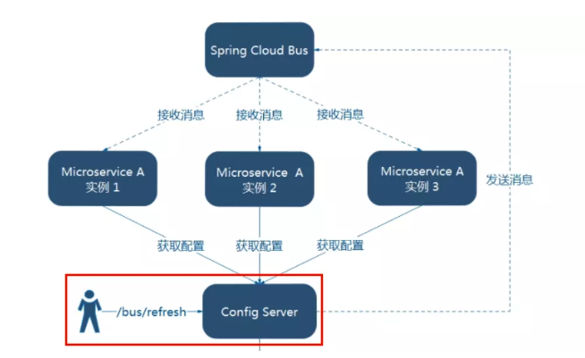

## BUS 消息总线

### 概述

springcloud bus是用来将分布式系统的节点  与  轻量级消息系统  链接起来的框架。 

它整合了java事件处理机制和消息中间件的功能 SpringCloud Bus 目前仅支持RabbitMq和Kafka 

springcloud bus能管理和传播分布式系统间的消息，就像一个分布式执行器，可用于广播状态更改、时间推送等。 

也可以当做微服务间的通信通道。


#### 什么是总线 

在微服务架构的系统中，通常会使用轻量级的消息代理来构建一个公用的消息主题，并让系统中的所有微服务实例都连接上来。由于该主题中产生的消息会被所有实例监听和消费，所以称为消息总线。在总线上的各个实例，都可以方便地广播一些需要让其他链接在该主题行的实例都知道的消息。 

#### 基本原来理：
ConfigClient实例都监听MQ中的同一个**topic**（默认是**SpringcloudBus**）。当一个服务刷新数据的时候，它会把这个信息放入到topic中，这样其它监听同一个topic的服务就能得到通知，然后去更新自身的配置。


### 设计思想

1、利用消息总线触发一个客户端/bus/refresh,而刷新所有客户端的配置（不常用）


由第一个接受到消息的客户端去通知其他客户端。


2、利用消息总线触发一个服务端ConfigServer的/bus/refresh端点,而刷新所有客户端的配置（更加推荐）




### 动态刷新全局广播

Config-Server  和Config-Client 添加消息总线支持

```xml
<dependency>
            <groupId>org.springframework.cloud</groupId>
            <artifactId>spring-cloud-starter-bus-amqp</artifactId>
</dependency>
```


**Config-Server配置文件**

```yaml
#RabbitMQ
rabbitmq:
  host: localhost
  port: 5672
  username: guest
  password: guest
#新增bus 暴露刷新地址
management:
  endpoints:
    web:
      exposure:
        include: 'bus-refresh'
```


**controller新增注解**

```java
@RefreshScope//新增
@RestController
public class ConfigClientRestController {
    //。。。。省略
}
```


**Config-Client修改配置文件**

```yaml
#新增RabbitMQ
rabbitmq:
  host: localhost
  port: 5672
  username: guest
  password: guest

#新增 bus刷新暴露地址
management:
  endpoints:
    web:
      exposure:
        include: "*"
```


修改配置文件后只需要通知Config-Server即可，然后订阅了响应MQ topic的服务会受到通知，然后刷新自己的配置文件

```
# 全部通知
curl +X POST "http://config-3344.com:3344/actuator/bus-refresh"

# 公式 http://配置中心ip:配置中心端口/actuator/bus-refresh/{destination}
# destination = 微服务名称：端口号
# 定点通知
curl +X POST "http://config-3344.com:3344/actuator/bus-refresh/config-client:3355"
```