# SpringCloud Stream 消息驱动


##  是什么

屏蔽底层消息中间件的差异，降低切换成本，统一消息的编程模型。


官方定义Spring Cloud Stream是一个**构件消息驱动微服务的框架**。

应用程序通过inputs和outputs与Spring Cloud Stream中的binder对象交互。

通过我们配置来binding（绑定），而SpringCloud Stream 的binder对象复制与消息中间件交互。

通过使用过Spring Integtation来连接消息代理中间件以实现消息事件驱动。

SpringCLoud Stream 为一些供应商的消息中间件产品提供了个性化的自动化配置实现，引用了发布-订阅、消费组、分区的三个核心概念。

目前仅支持**RabbitMQ、Kafka**


## Cloud Stream 架构

当用到两种以上MQ，由于两个消息中间件架构不同。

RabbitMQ 有exchange，kafka有 Topic 和 Partitions分区。

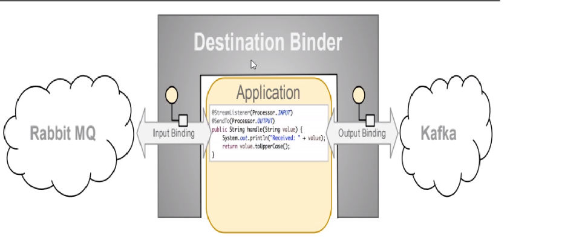

SpringCloud Stream为我们提供了一种解耦合的方式。


**SpringCLoud Stream 通过定义绑定器作为中间层，完美的实现了应用程序与消息中间件细节之间的隔离。**

**通过向应用程序暴露唯一的Channel通道，使得应用程序不需要在考虑各种不同的消息中间件实现。**


## Binder

- input 消息生产者
- output 消息消费者

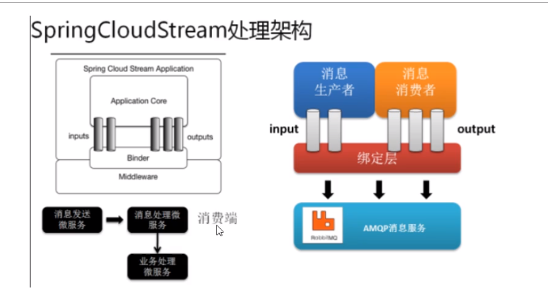


**Stream中的消息通信方式遵循了发布-订阅模式。**


## SpringCLoud Stream常用注解，编码方式


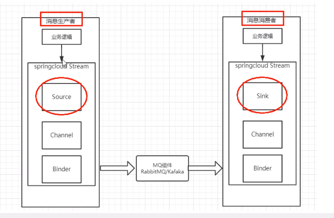


- Binder 方便的连接中间件，屏蔽差异
- Channel 是队列Queue的一种抽象，在消息通讯系统中就是实现存储和转发的媒介，通过Channel对队列进行配置
- Source & Sink 理解为参照对象是SpringCloud Stream自身，从Stream发布消息就是输出、接受消息就是输入。


**常用注解**

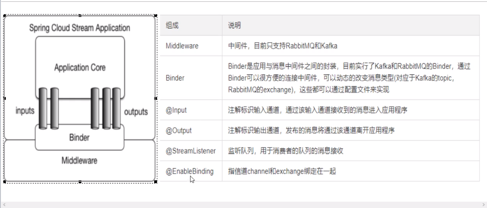


## Stream 消息生产者

新建moudle 

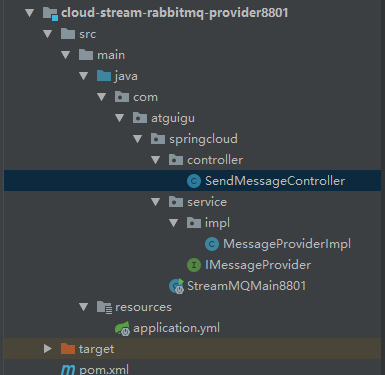


引入依赖

主要是

```xml
<dependency>
            <groupId>org.springframework.cloud</groupId>
            <artifactId>spring-cloud-starter-stream-rabbit</artifactId>
        </dependency>
```

完整依赖

```xml
<?xml version="1.0" encoding="UTF-8"?>
<project xmlns="http://maven.apache.org/POM/4.0.0"
         xmlns:xsi="http://www.w3.org/2001/XMLSchema-instance"
         xsi:schemaLocation="http://maven.apache.org/POM/4.0.0 http://maven.apache.org/xsd/maven-4.0.0.xsd">
    <parent>
        <artifactId>cloud2020</artifactId>
        <groupId>com.atguigu.springcloud</groupId>
        <version>1.0-SNAPSHOT</version>
    </parent>
    <modelVersion>4.0.0</modelVersion>

    <artifactId>cloud-stream-rabbitmq-provider8801</artifactId>

    <dependencies>
        <dependency>
            <groupId>org.springframework.boot</groupId>
            <artifactId>spring-boot-starter-web</artifactId>
        </dependency>
        <dependency>
            <groupId>org.springframework.boot</groupId>
            <artifactId>spring-boot-starter-actuator</artifactId>
        </dependency>

        <dependency>
            <groupId>org.springframework.cloud</groupId>
            <artifactId>spring-cloud-starter-netflix-eureka-client</artifactId>
        </dependency>

        <dependency>
            <groupId>org.springframework.cloud</groupId>
            <artifactId>spring-cloud-starter-stream-rabbit</artifactId>
        </dependency>

        <dependency>
            <groupId>org.projectlombok</groupId>
            <artifactId>lombok</artifactId>
            <optional>true</optional>
        </dependency>
        <dependency>
            <groupId>org.springframework.boot</groupId>
            <artifactId>spring-boot-starter-test</artifactId>
            <scope>test</scope>
        </dependency>
    </dependencies>

</project>
```

**配置文件**

```yaml
server:
  port: 8801

spring:
  application:
    name: cloud-stream-provider
  cloud:
    stream:
      binders: # 在此处配置要绑定的rabbitMQ的服务信息
        defaultRabbit: # 表示定义的名称，用于binding的整合
          type: rabbit # 消息中间件类型
          environment: # 设置rabbitMQ的相关环境配置
            spring:
              rabbitmq:
                host: localhost
                port: 5672
                username: hening
                password: hening
      bindings: # 服务的整合处理
        output: # 这个名字是一个通道的名称
          destination: studyExchange # 表示要使用的exchange名称定义
          content-type: application/json # 设置消息类型，本次为json，文本则设为text/plain
          binder: defaultRabbit # 设置要绑定的消息服务的具体设置

eureka:
  client:
    service-url:
      defaultZone: http://eureka7001.com:7001/eureka
  instance:
    lease-renewal-interval-in-seconds: 2 # 设置心跳的间隔时间，默认30
    lease-expiration-duration-in-seconds: 5 # 超过5秒间隔，默认90
    instance-id: send-8801.com # 主机名
    prefer-ip-address: true # 显示ip

```


**主启动类**

没有加**@EnableEurekaClient**，加不加这个注解要看是否是Eureka客户端，？？？？疑问？？

```java
@SpringBootApplication
public class StreamMQMain8801 {
    public static void main(String[] args) {
        SpringApplication.run(StreamMQMain8801.class, args);
    }
}
```

**消息发送接口**

**IMessageProvider**

```java
public interface IMessageProvider {
    /**
     * 消息发送
     * @return
     */
    String send();
}
```

**消息发送实现类 MessageProviderImpl**

```java
@EnableBinding(Source.class)
public class MessageProviderImpl implements IMessageProvider {

    /**
     * 消息发送管道
     */
    @Resource
    private MessageChannel output;

    @Override
    public String send() {
        String serial = UUID.randomUUID().toString();
        output.send(MessageBuilder.withPayload(serial).build());
        System.out.println("serial = " + serial);
        return serial;
    }
}
```


**消息发送Controller SendMessageController**

```java
@RestController
public class SendMessageController {

    @Resource
    private IMessageProvider messageProvider;

    @GetMapping("/sendMessage")
    public String sendMessage(){
         return messageProvider.send();
    }
}
```

**依次启动Eureka注册中心7001 以及 消息发送者8801**

发现在MQ中自动生成了exchange **studyExchange**，这是在配置文件中配置的**destination.output.destination**属性值。

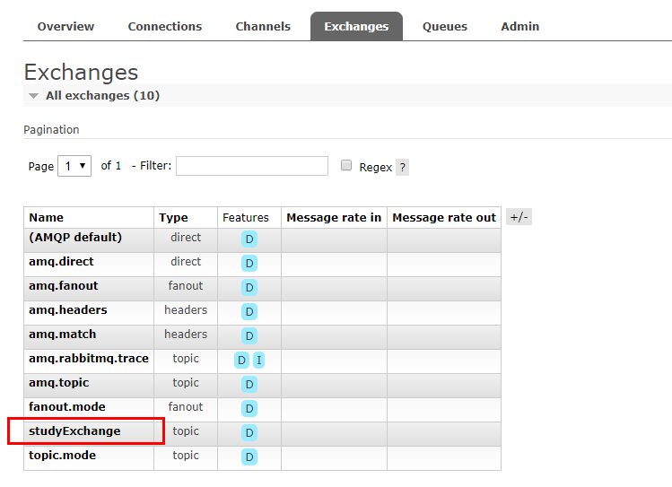

**调用发送消息接口**

发现mq成功接收到了消息，但是由于没有设置queue所以消息到了exchange后没有地方消费，就丢失了？？

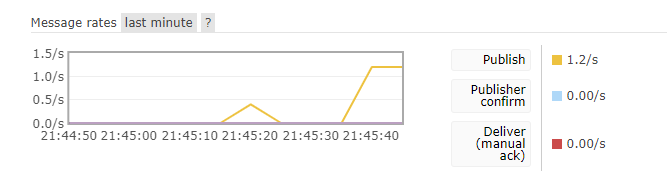


## Stream消息消费者

新建消费者moudule

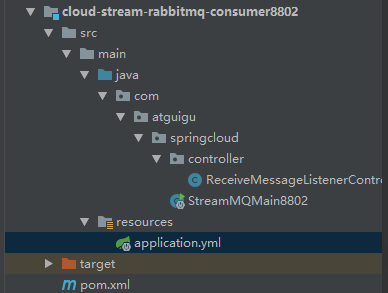


依赖pom

主要依赖

```xml
<dependency>
            <groupId>org.springframework.cloud</groupId>
            <artifactId>spring-cloud-starter-stream-rabbit</artifactId>
        </dependency>
```

完整依赖

```xml
<?xml version="1.0" encoding="UTF-8"?>
<project xmlns="http://maven.apache.org/POM/4.0.0"
         xmlns:xsi="http://www.w3.org/2001/XMLSchema-instance"
         xsi:schemaLocation="http://maven.apache.org/POM/4.0.0 http://maven.apache.org/xsd/maven-4.0.0.xsd">
    <parent>
        <artifactId>cloud2020</artifactId>
        <groupId>com.atguigu.springcloud</groupId>
        <version>1.0-SNAPSHOT</version>
    </parent>
    <modelVersion>4.0.0</modelVersion>

    <artifactId>cloud-stream-rabbitmq-consumer8802</artifactId>

    <dependencies>
        <dependency>
            <groupId>org.springframework.boot</groupId>
            <artifactId>spring-boot-starter-web</artifactId>
        </dependency>
        <dependency>
            <groupId>org.springframework.boot</groupId>
            <artifactId>spring-boot-starter-actuator</artifactId>
        </dependency>

        <dependency>
            <groupId>org.springframework.cloud</groupId>
            <artifactId>spring-cloud-starter-netflix-eureka-client</artifactId>
        </dependency>

        <dependency>
            <groupId>org.springframework.cloud</groupId>
            <artifactId>spring-cloud-starter-stream-rabbit</artifactId>
        </dependency>

        <dependency>
            <groupId>org.projectlombok</groupId>
            <artifactId>lombok</artifactId>
            <optional>true</optional>
        </dependency>
        <dependency>
            <groupId>org.springframework.boot</groupId>
            <artifactId>spring-boot-starter-test</artifactId>
            <scope>test</scope>
        </dependency>
    </dependencies>
</project>
```


配置文件

注意：**bindings.input** ,这里为消费者为input，生产者才output

监听的exchange是一致的，都为**studyExchange**

```yaml
server:
  port: 8802

spring:
  application:
    name: cloud-stream-consumer
  cloud:
    stream:
      binders: # 在此处配置要绑定的rabbitMQ的服务信息
        defaultRabbit: # 表示定义的名称，用于binding的整合
          type: rabbit # 消息中间件类型
          environment: # 设置rabbitMQ的相关环境配置
            spring:
              rabbitmq:
                host: localhost
                port: 5672
                username: hening
                password: hening
      bindings: # 服务的整合处理
        input: # 这个名字是一个通道的名称
          destination: studyExchange # 表示要使用的exchange名称定义
          content-type: application/json # 设置消息类型，本次为json，文本则设为text/plain
          binder: defaultRabbit # 设置要绑定的消息服务的具体设置
          group: spectrumrpcA

eureka:
  client:
    service-url:
      defaultZone: http://eureka7001.com:7001/eureka
  instance:
    lease-renewal-interval-in-seconds: 2 # 设置心跳的间隔时间，默认30
    lease-expiration-duration-in-seconds: 5 # 超过5秒间隔，默认90
    instance-id: receive-8802.com #主机名
    prefer-ip-address: true # 显示ip


```


主启动类

```java
@SpringBootApplication
public class StreamMQMain8802 {
    public static void main(String[] args) {
        SpringApplication.run(StreamMQMain8802.class, args);
    }
}
```


**消费消息COntroller  ReceiveMessageListenerController**

```java
@Component
@EnableBinding(Sink.class) //标志自己为消费者 Sink
public class ReceiveMessageListenerController {
    @Value("${server.port}")
    private String serverPort;

    @StreamListener(Sink.INPUT) //标志自己是消费者
    public void input(Message<String> message){
        System.out.println("消费者1号，----->接收到的消息："+ message.getPayload() +"\t port:" + serverPort);
    }
}
```


**启动消息消费者8802**

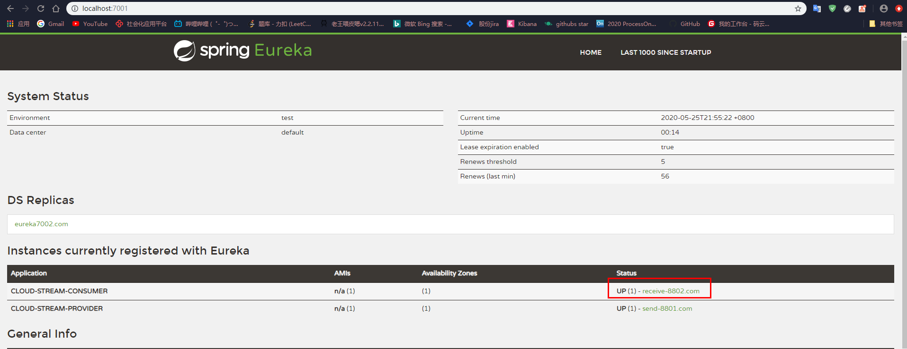


**然后通过消息生产者向studyExchange发送消息**

**发现交换机中收到了消息，也发现studyExchange有了一个订阅者。**

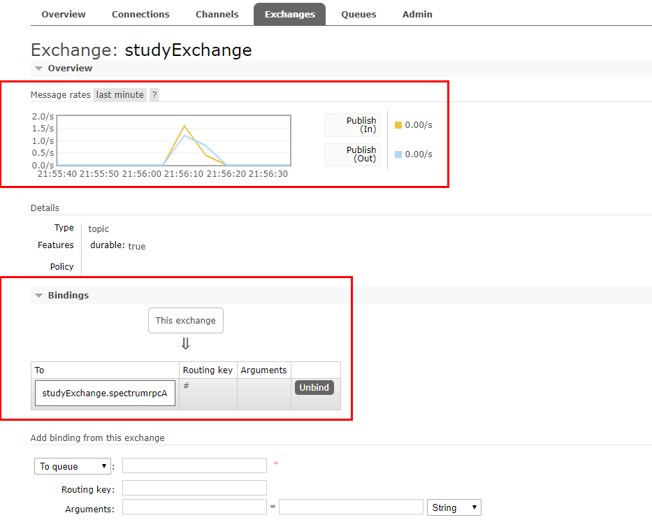

**查看8802消息消费者有没有消费消息**

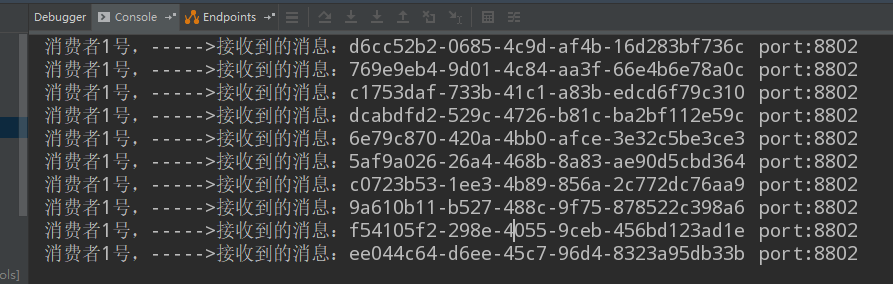


## 新建消费者8803

同8802项目一毛一样

### 分组消费

为什么要分组？

如果是同一个订单被两台服务器同时获取到了，那么就会出现数据错误，需要避免这种情况。

这是需要使用Stream中的消息分组来解决

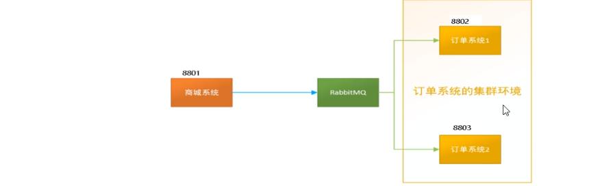

**注意在Stream中处于同一个组（group）中的消费者是竞争关系，就能够保证同一组中只有一个消费者获取到消息。**

**如果处于不同组，那么可以全面消费即重复消费。**


**为消费者进行自定义分组**

8802/8803变为不同组，**修改配置文件,增加group配置，设置组名**

```yaml
bindings: # 服务的整合处理
  input: # 这个名字是一个通道的名称
    destination: studyExchange # 表示要使用的exchange名称定义
    content-type: application/json # 设置消息类型，本次为json，文本则设为text/plain
    binder: defaultRabbit # 设置要绑定的消息服务的具体设置
    group: spectrumrpcA
```

- 8802 groupA
- 8803 groupB


**将8802 和 8803变为同一组，将group组名设置为一样的即可。这样就变味竞争关系，只有一个消费者获取会消费。**


## Stream持久化

当在配置文件中配置了group 组名后，就会自动生成一个队列 名字默认为 交换机名+group名  **studyExchange.spectrumrpcA**

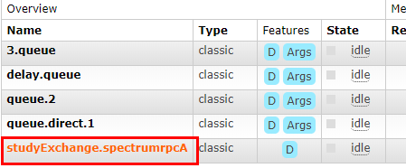

**如果不设置group名，那么不会自动生成队列，意味着如果消费者挂掉了，但是生产者还在继续发送消息，当消息到了Exchange交换机后由于没有队列，那么消息就会丢失。如果设置了Queue（队列），那么消息就会放在队列中，等待消费者重启后，会从队列中拿到消息继续消费，保证了消息不会丢失。**


**所以要记得设置group**