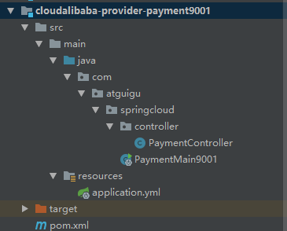
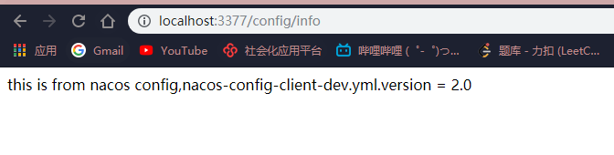

# Alibaba-Nacos

## 为什么产生SpringCloud-Alibaba

有了spring cloud这个微服务的框架，为什么又要使用spring cloud alibaba这个框架了？最重要的原因在于spring  cloud中的几乎所有的组件都使用Netflix公司的产品，然后在其基础上做了一层封装，同时也新增了一些其他框架。然而 Netflix的服务发现组件Eureka已经停止更新，同时Feign、Hystrix、Zuul等也都出于升级或停更进入维护阶段。 所以急需其他的一些替代产品，也就是spring cloud alibaba。


## 能做什么

1、Nacos 阿里巴巴开源产品，一个更易于构建云原生应用的动态服务发现、配置管理和服务管理平台。

 2、Sentinel 阿里巴巴开源产品，把流量作为切入点，从流量控制、熔断降级、系统负载保护等多个维度保护服务的稳定性。

 3、RocketMQ Apache RocketMQ™ 基于 Java 的高性能、高吞吐量的分布式消息和流计算平台。 

4、Dubbo Apache Dubbo™ 是一款高性能 Java RPC 框架。

 5、Seata 阿里巴巴开源产品，一个易于使用的高性能微服务分布式事务解决方案。 

6、Alibaba Cloud OSS 阿里云对象存储服务（Object Storage Service，简称 OSS），是阿里云提供的海量、安全、低成本、高可靠的云存储 服务。您可以在任何应用、任何时间、任何地点存储和访问任意类型的数据。 

7、Alibaba Cloud SchedulerX 阿里中间件团队开发的一款分布式任务调度产品，支持周期性的任务与固定时间点触发任务。

 8、Alibaba Cloud SMS 覆盖全球的短信服务，友好、高效、智能的互联化通讯能力，帮助企业迅速搭建客户触达通道。


## 官网资料

```
https://github.com/alibaba/spring-cloud-alibaba

https://spring-cloud-alibaba-group.github.io/github-pages/greenwich/spring-cloud-alibaba.html
```

## 安装Nacos

直接在官网下载解压 

https://github.com/alibaba/nacos/releases/tag/1.2.1


点击bin下的startup.cmd


### 访问Nacos

输入localhost:8848/nacos

默认账号密码 nacos / nacos


## Nacos 作为服务注册中心

### 父类引入Allibaba 依赖

```xml
<dependencyManagement>
    <dependencies>
        <dependency>
            <groupId>com.alibaba.cloud</groupId>
            <artifactId>spring-cloud-alibaba-dependencies</artifactId>
            <version>2.1.0.RELEASE</version>
            <type>pom</type>
            <scope>import</scope>
        </dependency>
    </dependencies>
</dependencyManagement>
```


### 新建moudle 9001



### pom引入依赖

主要依赖

```xml
<dependency>
            <groupId>com.alibaba.cloud</groupId>
            <artifactId>spring-cloud-starter-alibaba-nacos-discovery</artifactId>
        </dependency>
```

完整依赖

```xml
<?xml version="1.0" encoding="UTF-8"?>
<project xmlns="http://maven.apache.org/POM/4.0.0"
         xmlns:xsi="http://www.w3.org/2001/XMLSchema-instance"
         xsi:schemaLocation="http://maven.apache.org/POM/4.0.0 http://maven.apache.org/xsd/maven-4.0.0.xsd">
    <parent>
        <artifactId>cloud2020</artifactId>
        <groupId>com.atguigu.springcloud</groupId>
        <version>1.0-SNAPSHOT</version>
    </parent>
    <modelVersion>4.0.0</modelVersion>

    <artifactId>cloudalibaba-provider-payment9001</artifactId>

    <dependencies>
        <dependency>
            <groupId>com.alibaba.cloud</groupId>
            <artifactId>spring-cloud-starter-alibaba-nacos-discovery</artifactId>
        </dependency>
        <dependency>
            <groupId>org.springframework.boot</groupId>
            <artifactId>spring-boot-starter-web</artifactId>
        </dependency>
        <dependency>
            <groupId>org.springframework.boot</groupId>
            <artifactId>spring-boot-starter-actuator</artifactId>
        </dependency>
        <dependency>
            <groupId>org.projectlombok</groupId>
            <artifactId>lombok</artifactId>
            <optional>true</optional>
        </dependency>
        <dependency>
            <groupId>org.springframework.boot</groupId>
            <artifactId>spring-boot-starter-test</artifactId>
            <scope>test</scope>
        </dependency>
    </dependencies>

</project>
```


### 修改配置文件

```yaml
server:
  port: 9001

spring:
  application:
    name: nacos-payment-provider #注册到nacos的服务名
  cloud:
    nacos:
      discovery:
        server-addr: localhost:8848

#用于监控，暴露接口
management:
  endpoints:
    web:
      exposure:
        include: "*"
```


### 主启动类

使用注解@EnableDiscoveryClient，启用服务发现

```java
@SpringBootApplication
@EnableDiscoveryClient
public class PaymentMain9001 {
    public static void main(String[] args) {
        SpringApplication.run(PaymentMain9001.class, args);
    }
}

```


### 业务类

提供/payment/nacos/{id}接口，简单返回端口信息。

```java
@RestController
public class PaymentController {

    @Value("${server.port}")
    private String serverPort;

    @GetMapping("/payment/nacos/{id}")
    public String getPayment(@PathVariable("id") Integer id){
        return "nacos register, serverport=" + serverPort + "\t id:" + id;
    }
}
```

**启动9001服务**

**成功注册到Nacos注册中心**


### 新建服务消费者83


### pom引入依赖

主要依赖

```xml
<dependency>
            <groupId>com.alibaba.cloud</groupId>
            <artifactId>spring-cloud-starter-alibaba-nacos-discovery</artifactId>
        </dependency>
```


完整依赖

```xml
<?xml version="1.0" encoding="UTF-8"?>
<project xmlns="http://maven.apache.org/POM/4.0.0"
         xmlns:xsi="http://www.w3.org/2001/XMLSchema-instance"
         xsi:schemaLocation="http://maven.apache.org/POM/4.0.0 http://maven.apache.org/xsd/maven-4.0.0.xsd">
    <parent>
        <artifactId>cloud2020</artifactId>
        <groupId>com.atguigu.springcloud</groupId>
        <version>1.0-SNAPSHOT</version>
    </parent>
    <modelVersion>4.0.0</modelVersion>

    <artifactId>cloudalibaba-consumer-nacos-order83</artifactId>


    <dependencies>
        <dependency>
            <groupId>com.alibaba.cloud</groupId>
            <artifactId>spring-cloud-starter-alibaba-nacos-discovery</artifactId>
        </dependency>
        <dependency>
            <groupId>com.atguigu.springcloud</groupId>
            <artifactId>cloud-api-common</artifactId>
            <version>${project.version}</version>
        </dependency>
        <dependency>
            <groupId>org.springframework.boot</groupId>
            <artifactId>spring-boot-starter-web</artifactId>
        </dependency>
        <dependency>
            <groupId>org.springframework.boot</groupId>
            <artifactId>spring-boot-starter-actuator</artifactId>
        </dependency>
        <dependency>
            <groupId>org.projectlombok</groupId>
            <artifactId>lombok</artifactId>
            <optional>true</optional>
        </dependency>
        <dependency>
            <groupId>org.springframework.boot</groupId>
            <artifactId>spring-boot-starter-test</artifactId>
            <scope>test</scope>
        </dependency>
    </dependencies>

</project>
```


### 配置文件

```yaml
server:
  port: 83

spring:
  application:
    name: nacos-order-consumer
  cloud:
    nacos:
      discovery:
        server-addr: localhost:8848

#消费者将要去访问的微服务名称（注册成功进nacos的微服务提供者）
service-url:
  nacos-user-service: http://nacos-payment-provider
```


### 启动类

```java
@SpringBootApplication
@EnableDiscoveryClient
public class OrderNacosMain83 {
    public static void main(String[] args) {
        SpringApplication.run(OrderNacosMain83.class, args);
    }
}
```

### 业务类

#### 注入RestTemplate 并负载均衡

新建配置类ApplicationContextConfig，注入RestTemplate，并使用**@LoadBalanced**进行负载均衡

```java
@Configuration
public class ApplicationContextConfig {

    @Bean
    @LoadBalanced
    public RestTemplate getRestTemplate(){
        return new RestTemplate();
    }
}
```

**通过jar包依赖，可以防线alibaba-nacos-discovery内部依赖了netfix的ribbon，所以nacos自带了负载均衡的功能。**


#### 消费者Controller

通过 **@Value("${service-url.nacos-user-service}")**从配置文件中获取服务提供方地址，将服务提供方地址与代码解耦。

通过**restTemplate.getForObject(serverUrl + "/payment/nacos/" + id, String.class)**进行远程过程调用，访问9001服务。

```java
@RestController
@Slf4j
public class OrderNacosController {

    @Resource
    private RestTemplate restTemplate;

    @Value("${service-url.nacos-user-service}")
    private String serverUrl;

    @GetMapping("/consumer/payment/nacos/{id}")
    public String paymentInfo(@PathVariable("id") Integer id){
        return restTemplate.getForObject(serverUrl + "/payment/nacos/" + id, String.class);
    }
}
```


### 启动83服务

成功注册到Nacos注册中心


### 访问服务消费者

```java
http://localhost:83/consumer/payment/nacos/100
```


**成功通过83消费者服务，访问到9001服务提供方的接口。**


## 各个注册中心对比


## Nacos的AP和CP模式切换*

**CAP：C数据一致性、A可用写、P分区容错性**

**Nacos默认是AP模式，如下进行切换**：

```shell
curl -X PUT '$NACOS_SERVER:8848/nacos/v1/ns/operator/switches?entry=serverMode&value=CP'
```

**何时选择何种模式**：

AP模式: 如果不需要存储服务级别的信息，且服务实例是通过nacos-client注册，并能够保持心跳上报，那么选择AP模式。 当前的主流服务如springcloud和dubbo都适用AP模式，AP模式为了服务的可用性而减弱了一致性，因此AP模式下只支持 注册临时实例。

 CP模式： 如果需要在服务级别编辑或者存储配置信息，那么CP是必须的，K8S服务和DNS服务则适用CP模式。 CP模式支持注册持久化实例，此时则是以raft协议为集群运行模式，该模式下注册实例之前必须先注册服务，如果服务不存在，则返回错误


## Nacos 作为配置中心


### 新建config 服务


### 引入依赖

主要依赖

```xml
<dependency>
            <groupId>com.alibaba.cloud</groupId>
            <artifactId>spring-cloud-starter-alibaba-nacos-config</artifactId>
        </dependency>
        <dependency>
            <groupId>com.alibaba.cloud</groupId>
            <artifactId>spring-cloud-starter-alibaba-nacos-discovery</artifactId>
        </dependency>
```


完整依赖

```xml
<?xml version="1.0" encoding="UTF-8"?>
<project xmlns="http://maven.apache.org/POM/4.0.0"
         xmlns:xsi="http://www.w3.org/2001/XMLSchema-instance"
         xsi:schemaLocation="http://maven.apache.org/POM/4.0.0 http://maven.apache.org/xsd/maven-4.0.0.xsd">
    <parent>
        <artifactId>cloud2020</artifactId>
        <groupId>com.atguigu.springcloud</groupId>
        <version>1.0-SNAPSHOT</version>
    </parent>
    <modelVersion>4.0.0</modelVersion>

    <artifactId>cloudalibaba-config-nacos-client3377</artifactId>

    <dependencies>
        <dependency>
            <groupId>com.alibaba.cloud</groupId>
            <artifactId>spring-cloud-starter-alibaba-nacos-config</artifactId>
        </dependency>
        <dependency>
            <groupId>com.alibaba.cloud</groupId>
            <artifactId>spring-cloud-starter-alibaba-nacos-discovery</artifactId>
        </dependency>
        <dependency>
            <groupId>org.springframework.boot</groupId>
            <artifactId>spring-boot-starter-web</artifactId>
        </dependency>
        <dependency>
            <groupId>org.springframework.boot</groupId>
            <artifactId>spring-boot-starter-actuator</artifactId>
        </dependency>
        <dependency>
            <groupId>org.projectlombok</groupId>
            <artifactId>lombok</artifactId>
            <optional>true</optional>
        </dependency>
        <dependency>
            <groupId>org.springframework.boot</groupId>
            <artifactId>spring-boot-starter-test</artifactId>
            <scope>test</scope>
        </dependency>
    </dependencies>

</project>
```


### 配置文件

**系统级配置文件，优先级高于application.yml**

bootstrap.yml

```yaml
server:
  port: 3377
spring:
  application:
    name: nacos-config-client
  cloud:
    nacos:
      discovery:
        server-addr: localhost:8848 # 注册中心
      config:
        server-addr: localhost:8848 # 配置中心
        file-extension: yml # 这里指定的文件格式需要和nacos上新建的配置文件后缀相同，否则读不到
        #group: TEST_GROUP
        #namespace: 4ccc4c4c-51ec-4bd1-8280-9e70942c0d0c

# config配置文件名匹配格式
#  ${spring.application.name}-${spring.profile.active}.${spring.cloud.nacos.config.file-extension}
```

application.yml  **指定当前开发环境**

```yaml
spring:
  profiles:
    active: dev # 开发环境
#    active: test # 测试环境
#    active: info # 开发环境
```

### 启动类

```java
@SpringBootApplication
@EnableDiscoveryClient
public class NacosConfigClientMain3377 {
    public static void main(String[] args) {
        SpringApplication.run(NacosConfigClientMain3377.class, args);
    }
}
```

### 业务类

编写Config的Controller获取配置文件的配置信息

使用 **@RefreshScope**注解支持nacos的动态刷新

```java
@RestController
@RefreshScope // 支持nacos的动态刷新
public class ConfigClientController {
    @Value("${config.info}")
    private String configInfo;

    @GetMapping("/config/info")
    public String getConfigInfo(){
        return configInfo;
    }
}
```


### Nacos新建配置文件

注意DataId要完全匹配官网给定的格式

即 **服务名-环境.后缀名**

**注意yaml文件的格式**

```java
${spring.application.name}-${spring.profile.active}.${spring.cloud.nacos.config.file-extension}
```


**成功注册到Nacos注册中心**


**通过接口访问Nacos配置中心的配置文件信息**

输入http://localhost:3377/config/info 进行访问


**将Nacos配置文件的Version进行更改为2.0，会进行动态刷新，接口能够及时返回正确的配置信息**



## Nacos命名空间分组和DataId


一个大型分布式微服务系统会有很多微服务子项目，每个微服务项目又会产生多个运行环境：开发环境、测试环境、正式环境等。

那么怎么对这些微服务配置进行管理呢？


nacos通过namespace+groupID+dataId三者对不同开发环境、不同微服务进行管理

 **namespace**：划分部署环境DEV\TEST\PROD等，默认PUBLIC 

**group**：划分微服务项目，如 order user cms等，默认DEFAULT_GROUP 

**dataID**：如上面的命名规则 


### 通过DataId访问不同配置文件

一般通过修改**spring.profile.active**，区分不同环境的配置文件，如dev，test，prod等

在Nacos上新建test配置文件

**nacos-config-client-test.yml**


修改application.yml，的**spring.profile.active**

```yaml
spring:
  profiles:
    active: test # 开发环境
#    active: test # 测试环境
#    active: info # 开发环境
```

访问接口

**成功访问到新建的test配置文件信息**


### 通过Group访问不同配置文件

在Nacos新建一个新的Group ，**DEV_GROUP**


**修改配置文件，增加group属性，在指定的Group上找配置文件**

```yaml
group: DEV_GROUP
```

完整配置

```yaml
server:
  port: 3377
spring:
  application:
    name: nacos-config-client
  cloud:
    nacos:
      discovery:
        server-addr: localhost:8848 # 注册中心
      config:
        server-addr: localhost:8848 # 配置中心
        file-extension: yml # 这里指定的文件格式需要和nacos上新建的配置文件后缀相同，否则读不到
        group: TEST_GROUP
        #namespace: 4ccc4c4c-51ec-4bd1-8280-9e70942c0d0c
```


**访问接口，会去指定的Group中找符合命名的配置文件。**


### 通过命名空间访问不同配置文件

在Nacos新建命名空间，会自动生成命名空间id。


在dev命名空间下，新建不同分组和配置文件


**修改配置文件**

```yaml
namespace: 0af7f0fc-ffef-43ca-a8e2-243decacca3f
```

完整配置

```yaml
server:
  port: 3377
spring:
  application:
    name: nacos-config-client
  cloud:
    nacos:
      discovery:
        server-addr: localhost:8848 # 注册中心
      config:
        server-addr: localhost:8848 # 配置中心
        file-extension: yml # 这里指定的文件格式需要和nacos上新建的配置文件后缀相同，否则读不到
        group: TEST_GROUP
        namespace: 0af7f0fc-ffef-43ca-a8e2-243decacca3f
```

**配置了group和namespace，那么就会到指定的命名空间下，找指定的分组下的配置文件，配置文件名称需要满足上面的配置规则（项目名-环境.后缀名）。**


## Nacos 集群和持久化配置


### Nacos集群持久化架构图

VIP：虚拟ip，即Nginx


Nacos 自带了Apache 的derby数据库，如果使用过Nacos集群，那么每一个Nacos都会有一个derby数据库，会有数据不一致问题。


### Derby切换Mysqk持久化

修改nacos配置文件application.properties

```properties
#*************** Config Module Related Configurations ***************#
### If user MySQL as datasource:
spring.datasource.platform=mysql

### Count of DB:
db.num=1

### Connect URL of DB:
db.url.0=jdbc:mysql://47.100.214.147:3306/nacos_config?characterEncoding=utf8&connectTimeout=1000&socketTimeout=3000&autoReconnect=true
db.user=root
db.password=123456
```


发现之前存入derby的数据消失了，现在是从mysql读取数据。

新建一个命名空间，对应mysql为tenant_info表


### Nacos集群

**需要Nginx集群 + 3个或以上nacos实例 + mysql主备模式 or 高可用数据库**


这里模拟Nacos集群，只用一个nginx和一个mysql数据库


### 启动三个Nacos服务

使用docker 拉去nacos镜像

```shell
docker search nacos
docker pull nacos/nacos-server
```

启动nacos镜像,，映射到不同的端口

```shell
docker run --env MODE=standalone --name nacos3333 -d -p 3333:8848 nacos/nacos-server
docker run --env MODE=standalone --name nacos3334 -d -p 3334:8848 nacos/nacos-server
docker run --env MODE=standalone --name nacos3335 -d -p 3335:8848 nacos/nacos-server
```


**访问47.100.214.147:3333/nacos 成功访问到nacos，说明docker部署nacos成功**


### Nginx配置负载均衡

配置nginx监听1111端口，将监听到的请求转发到upstream进行负载均衡。

配置upstream将请求分发到Nacos集群上，由不同Nacos实例处理

nginx.conf配置文件

**监听1111端口，从 根节点开始匹配，转发到cluster上，由nginx负载均衡发送到不同的nacos实例上**

```conf
upstream cluster {
		# 阿里云服务器内网ip
        server 172.19.134.108:3333;
        server 172.19.134.108:3334;
        server 172.19.134.108:3335;
}
server {
        listen    1111;
       # listen       [::]:80 default_server;
        server_name localhost;
        root         /usr/share/nginx/html;

        # Load configuration files for the default server block.
        include /etc/nginx/default.d/*.conf;

        location / {
        proxy_pass http://cluster;
        }

        error_page 404 /404.html;
            location = /40x.html {
        }

        error_page 500 502 503 504 /50x.html;
            location = /50x.html {
        }
    }
```

**成功通过nginx转发到nacos服务上，具体是哪一个nacos服务（3333、3334、3335）不清楚**


### 新建mysql数据库

新建nacos_config数据库，执行nacos中预制的sql脚本


修改nacos application.properties 启用mysql，并配置用户名密码

```properties
### If user MySQL as datasource:
spring.datasource.platform=mysql

### Count of DB:
db.num=1

### Connect URL of DB:
db.url.0=jdbc:mysql://47.100.214.147:3306/nacos_config?characterEncoding=utf8&connectTimeout=1000&socketTimeout=3000&autoReconnect=true
db.user=root
db.password=123456
```


### 修改payment9002服务

将服务注册地址改为nginx地址，通过nginx进行转发到nacos上。

```yaml
server:
  port: 9002

spring:
  application:
    name: nacos-payment-provider
  cloud:
    nacos:
      discovery:
#        server-addr: localhost:8848
        # 换成nginx的1111端口
        server-addr: 47.100.214.147:1111

management:
  endpoints:
    web:
      exposure:
        include: "*"
```

**启动9002服务,成功通过nginx转发注册到了nacos服务注册中心**


**说明nacos集群搭建成功~**


### 通过Nacos集群访问配置中心


**修改3377配置服务配置文件bootstrap.yml**

**修改config.server-addr 为nginx地址，通过nginx转发到nacos配置中心**

```yaml
server:
  port: 3377
spring:
  application:
    name: nacos-config-client
  cloud:
    nacos:
      discovery:
        server-addr: localhost:8848 # 注册中心
      config:
        server-addr: 47.100.214.147:1111 # 配置中心
        file-extension: yml # 这里指定的文件格式需要和nacos上新建的配置文件后缀相同，否则读不到
        #group: TEST_GROUP
        #namespace: 0af7f0fc-ffef-43ca-a8e2-243decacca3f

# config配置文件名匹配格式
#  ${spring.application.name}-${spring.profile.active}.${spring.cloud.nacos.config.file-extension}
```

**通过nginx访问nacos并新建一个配置文件nacos-config-client-dev.yml**


**启动3377配置服务，访问http://localhost:3377/config/info，成功访问到nacos对应配置文件内容。**

