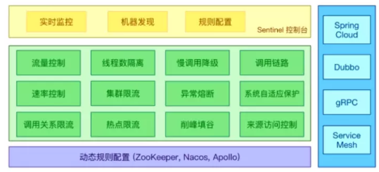
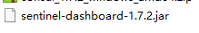
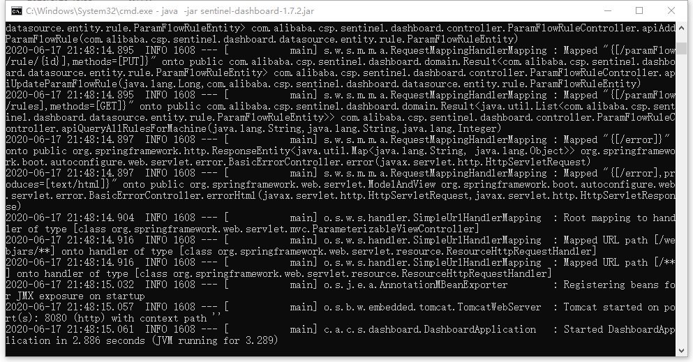
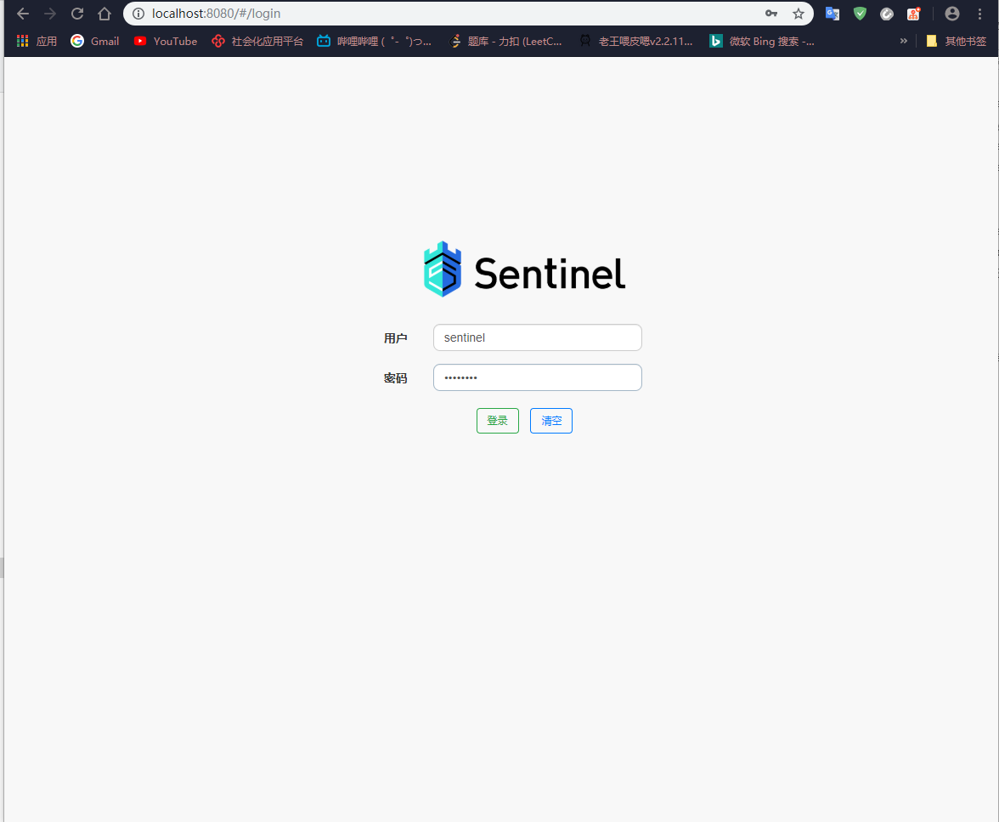
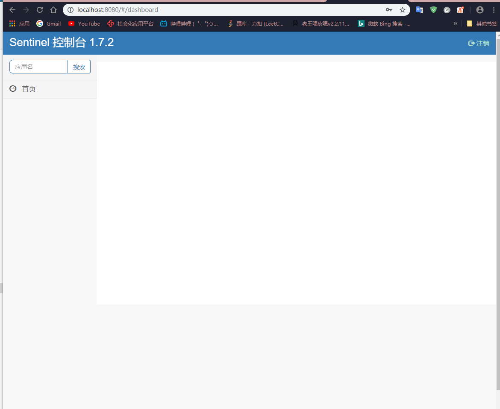
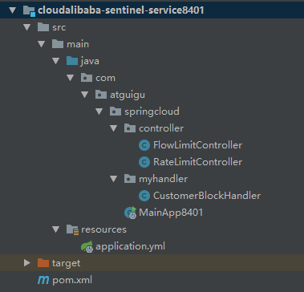
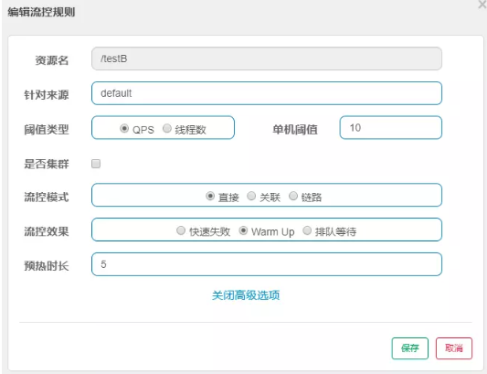
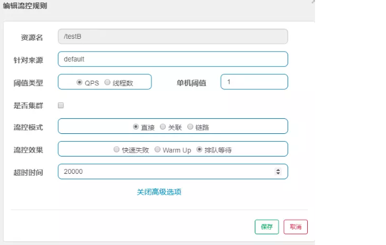

# Alibaba-Sentinel


## Hystrix 缺点

- 需要程序员手工搭建监控平台
- 没有一套web界面让程序员更加细粒度的配置流控、速率控制、服务熔断、服务降级。需要使用HystrixCommend手动配置


## Sentinal 优点

- 单独一个组件，可以独立出来，不用新建项目启动
- 直接界面化的细粒度统一配置


一般采用**配置**和**注解** 代替在代码里进行配置


## Sentinel 概述

### SEntinel是什么

```
随着微服务的流行，服务和服务之间的稳定性变得越来越重要。Sentinel 以流量为切入点，从流量控制、熔断降级、系统负载保护等多个维度保护服务的稳定性。

一句话概括：sentinel即Hystrix的替代品

官网： https://sentinelguard.io/zh-cn/

下载：https://github.com/alibaba/Sentinel/releases
```




### 基本概念


## Sentinel安装

```
Sentinel分为两个部分：
1、核心库
2、控制台dashboard，基于Springboot开发，打包后可直接运行，不需要Tomcat等额外的容器
```

下载地址

```
https://github.com/alibaba/Sentinel/releases
```



运行

```
Sentinel Dashboard默认的端口是8080

java -jar sentinel-dashboard-1.7.0.jar
```



访问

```
http://localhost:8080/

账号：sentinel  密码：sentinel
```





## Sentinel 案例

新建sentinel工程



引入 sentinel依赖

```xml
<dependency>
            <groupId>com.alibaba.cloud</groupId>
            <artifactId>spring-cloud-starter-alibaba-sentinel</artifactId>
        </dependency>
```

完整依赖

```xml
<?xml version="1.0" encoding="UTF-8"?>
<project xmlns="http://maven.apache.org/POM/4.0.0"
         xmlns:xsi="http://www.w3.org/2001/XMLSchema-instance"
         xsi:schemaLocation="http://maven.apache.org/POM/4.0.0 http://maven.apache.org/xsd/maven-4.0.0.xsd">
    <parent>
        <artifactId>cloud2020</artifactId>
        <groupId>com.atguigu.springcloud</groupId>
        <version>1.0-SNAPSHOT</version>
    </parent>
    <modelVersion>4.0.0</modelVersion>

    <artifactId>cloudalibaba-sentinel-service8401</artifactId>

    <dependencies>
        <dependency>
            <groupId>com.alibaba.cloud</groupId>
            <artifactId>spring-cloud-starter-alibaba-nacos-discovery</artifactId>
        </dependency>
        <!--     sentinel-datasource-nacos 后续持久化用   -->
        <dependency>
            <groupId>com.alibaba.csp</groupId>
            <artifactId>sentinel-datasource-nacos</artifactId>
        </dependency>
        <dependency>
            <groupId>com.alibaba.cloud</groupId>
            <artifactId>spring-cloud-starter-alibaba-sentinel</artifactId>
        </dependency>
        <dependency>
            <groupId>org.springframework.cloud</groupId>
            <artifactId>spring-cloud-starter-openfeign</artifactId>
        </dependency>
        <dependency>
            <groupId>org.springframework.boot</groupId>
            <artifactId>spring-boot-starter-web</artifactId>
        </dependency>
        <dependency>
            <groupId>org.springframework.boot</groupId>
            <artifactId>spring-boot-starter-actuator</artifactId>
        </dependency>
        <dependency>
            <groupId>org.projectlombok</groupId>
            <artifactId>lombok</artifactId>
            <optional>true</optional>
        </dependency>
        <dependency>
            <groupId>org.springframework.boot</groupId>
            <artifactId>spring-boot-starter-test</artifactId>
            <scope>test</scope>
        </dependency>
        <dependency>
            <groupId>com.atguigu.springcloud</groupId>
            <artifactId>cloud-api-common</artifactId>
            <version>${project.version}</version>
        </dependency>
    </dependencies>

</project>
```

配置文件

配置nacos注册中心地址

配置sentinel监控地址

```yaml
server:
  port: 8401
spring:
  application:
    name: cloudalibaba-sentinel-service
  cloud:
    nacos:
      discovery:
        # Nacos服务注册中心地址
        server-addr: localhost:8848
    sentinel:
      transport:
        # sentinel dashboard 地址
        dashboard: localhost:8080
        # 默认为8719，如果被占用会自动+1，直到找到为止
        port: 8719
management:
  endpoints:
    web:
      exposure:
        include: "*"

```

业务类，测试sentinel监控

**FlowLimitController**

```java
package com.atguigu.springcloud.controller;

import com.alibaba.csp.sentinel.annotation.SentinelResource;
import com.alibaba.csp.sentinel.slots.block.BlockException;
import lombok.extern.slf4j.Slf4j;
import org.springframework.web.bind.annotation.GetMapping;
import org.springframework.web.bind.annotation.RequestParam;
import org.springframework.web.bind.annotation.RestController;

import java.util.concurrent.TimeUnit;

/**
 *
 * @author zzyy
 * @version 1.0
 * @create 2020/03/06
 */
@RestController
@Slf4j
public class FlowLimitController {

    @GetMapping("/testA")
    public String testA(){
//        try {
//            TimeUnit.MILLISECONDS.sleep(800);
//        } catch (InterruptedException e) {
//            e.printStackTrace();
//        }
        return "testA-----";
    }

    @GetMapping("/testB")
    public String testB(){
        log.info(Thread.currentThread().getName() + "...testB ");
        return "testB   -----";
    }

    @GetMapping("/testD")
    public String testD(){
        try {
            TimeUnit.SECONDS.sleep(1);
        } catch (InterruptedException e) {
            e.printStackTrace();
        }
        log.info("testD 测试RT");
        return "testD -----";
    }

    @GetMapping("/testException")
    public String testException(){
        log.info("testException 异常比例");
        int age = 10 /0 ;
        return "testException -----";
    }

    @GetMapping("/testExceptionCount")
    public String testExceptionCount(){
        log.info("testExceptionCount 异常数");
        int age = 10 /0 ;
        return "testExceptionCount -----";
    }

    @GetMapping("/testHotKey")
    @SentinelResource(value = "testHotKey", blockHandler = "dealTestHotKey")
    public String testHotKey(@RequestParam(value = "p1", required = false) String p1,
                             @RequestParam(value = "p2", required = false) String p2){
        int age = 10 /0;
        return "testHotKey -----";
    }

    public String dealTestHotKey(String p1, String p2, BlockException blockException){
        return "dealTestHotKey---------";
    }
}
```

启动类

```java
@SpringBootApplication
@EnableDiscoveryClient
public class MainApp8401 {
    public static void main(String[] args) {
        SpringApplication.run(MainApp8401.class, args);
    }
}
```


## 流控规则

### 基本介绍

- 资源名：唯一名称，默认请求路径
- 针对来源：Sentinel可以针对调用者进行限流，填写微服务名，默认default（不区分来源）
- 阈值类型\单机阈值：
  - QPS（每秒钟请求数量）:当调用该api达到阈值时，进行限流
  - 线程数：当调用api的线程数达到阈值时，进行限流
- 是否集群
- 流控模式
  - 直接：api达到限流条件，直接限流
  - 关联：当关联的资源达到阈值，限流自己
  - 链路：只记录指定链路上的流量（指定资源从入口资源进来的流量到达阈值，就进行限流）
- 流控效果
  - 快速失败：直接失败，抛异常
  - Warm Up ：根据codeFactor（冷加载因子，默认3）的值，从阈值/codeFactor，经过预热时长才达到设置的QPS阈值。
  - 排队等待：匀速排队，让请求以匀速通过，阈值类型必须是QPS，否则无效。

### 流控模式

#### 直接（默认）

QPS限流：每秒钟请求数量，当一秒请求两次时直接报错。


线程数：只有一个线程进行处理，如果还没有处理完，请求就又进来了，就直接限流报错。


#### 关联

当与A关联的资源B达到阈值后，就限流A自己（**比如下订单接口关联支付接口，当支付接口达到阈值时，就限流下订单接口**）


#### 链路


### 流控效果

#### 直接失败（默认）

 ```
源码：
com.alibaba.csp.sentinel.slots.block.flow.controller.DefaultController

上面写流控模式的时候已经展示了效果，不符合配置的时候，快速做出对应的反映
 ```


#### 预热

```
源码:
com.alibaba.csp.sentinel.slots.block.flow.controller.WarmUpController

公式：
阈值除以coldFactor（默认为3），经过预热时长后才会达到阈值


限流-冷启动：
当流量突然增大的时候，我们常常会希望系统从空闲状态到繁忙状态的切换的时间长一些。即如果系统在此之前长期处于空闲
的状态，我们希望处理请求的数量是缓步的增多，经过预期的时间以后，到达系统处理请求个数的最大值。Warm Up（冷启
动，预热）模式就是为了实现这个目的的。


应用场景：
秒杀系统在开启的瞬间，会有很多流量上来，会把系统打死，预热方式就是为了保护系统，可以慢慢的把流量放进来。
慢慢的把阈值增长到设定的阈值、
```



**配置解读： 系统初始化的阈值为10/3约等于3，即阈值刚开始为3.然后过了5秒后阈值才逐渐升到10**


#### 排队等待

```
源码：
com.alibaba.csp.sentinel.slots.block.flow.controller.RateLimiterController

匀速排队，阈值必须设置为QPS。

匀速排队会严格控制请求通过的时间间隔。也即是让请求以均匀的速度通过，对应的是漏桶算法。（类似消息队列）
```



**配置解读： /testB每秒1次请求，超过的话就排队等待。等待的超时时间是20000ms,即使超过了阈值，也不会直接拒绝，而是排队等待进行处理。**


## 降级规则


