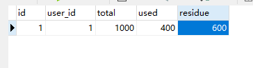

# Seata 

参考博客：

https://my.oschina.net/ngc7293/blog/4272279

## 什么是分布式事务

随着互联网的快速发展，软件系统由原来的单体应用转变为分布式应用。

分布式系统会把一个应用系统拆分为可独立部署的多个服务，因此需要服务与服务之间远程协作才能完成事务操作，这种分布式系统环境下由不同的服务之间通过网络远程协作完成事务称之为分布式事务。

例如用户注册送积分事务、创建订单减库存事务，银行转账事务等都是分布式事务。

**1.1、 本地事务依赖数据库本身提供的事务特性来实现 ：**

```
begin transaction；
	//1.本地数据库操作：张三减少金额
	//2.本地数据库操作：李四增加金额
commit transation;
```

**1.2、 但是在分布式环境下，会变成下边这样：**

```
begin transaction；
	//1.本地数据库操作：张三减少金额
	//2.远程调用：让李四增加金额
commit transation;
```

可以设想，当远程调用让李四增加金额成功了，由于网络问题远程调用并没有返回，此时本地事务提交失败就回滚了张三减少金额的操作，此时张三和李四的数据就不一致了。

因此在分布式架构的基础上，传统数据库事务就无法使用了，张三和李四的账户不在一个数据库中甚至不在一个应用系统里，实现转账事务需要通过远程调用，由于网络问题就会导致分布式事务问题。


## 分布式事务产生场景

典型的场景就是微服务架构 微服务之间通过远程调用完成事务操作。 比如：订单微服务和库存微服务，下单的同时订单微服务请求库存微服务减库存。


 单体系统访问多个数据库实例 当单体系统需要访问多个数据库（实例）时就会产生分布式事务。 比如：用户信息和订单信息分别在两个MySQL实例存储，用户管理系统删除用户信息，需要分别删除用户信息及用户的订单信息，由于数据分布在不同的数据实例，需要通过不同的数据库链接去操作数据，此时产生分布式事务。


多服务访问同一个数据库实例 比如：订单微服务和库存微服务即使访问同一个数据库也会产生分布式事务，原因就是跨JVM进程，两个微服务持有了不同的数据库链接进行数据库操作，此时产生分布式事务


## Seata 概述

### Seata脚本说明

# 脚本说明

## client 

> 存放用于客户端的配置和SQL

- at: AT模式下的 `undo_log` 建表语句
- conf: 客户端的配置文件
- saga: SAGA 模式下所需表的建表语句
- spring: SpringBoot 应用支持的配置文件

## server

> 存放server侧所需SQL

- db: server 侧的保存模式为 `db` 时所需表的建表语句

## config-center

> 用于存放各种配置中心的初始化脚本，执行时都会读取 `config.txt`配置文件，并写入配置中心

- nacos: 用于向 Nacos 中添加配置
- zk: 用于向 Zookeeper 中添加配置，脚本依赖 Zookeeper 的相关脚本，需要手动下载；ZooKeeper相关的配置可以写在 `zk-params.txt` 中，也可以在执行的时候输入
- apollo: 向 Apollo 中添加配置，Apollo 的地址端口等可以写在 `apollo-params.txt`，也可以在执行的时候输入
- etcd3: 用于向 Etcd3 中添加配置
- consul: 用于向 consul 中添加配置

### 配置文件

修改service 下的vgroup_mapping.my_test_tx_group

修改存储模式，修改为db，配置数据库信息

```
service {
  #transaction service group mapping
  vgroup_mapping.my_test_tx_group = "seataTxGroup"
  #only support when registry.type=file, please don't set multiple addresses
  default.grouplist = "127.0.0.1:8091"
  #disable seata
  disableGlobalTransaction = false
}

## transaction log store, only used in seata-server
store {
  ## store mode: file、db
  mode = "db"

  ## file store property
  file {
    ## store location dir
    dir = "sessionStore"
  }

  ## database store property
  db {
    ## the implement of javax.sql.DataSource, such as DruidDataSource(druid)/BasicDataSource(dbcp) etc.
    datasource = "dbcp"
    ## mysql/oracle/h2/oceanbase etc.
    db-type = "mysql"
    driver-class-name = "com.mysql.jdbc.Driver"
    url = "jdbc:mysql://47.100.214.147:3306/seata"
    user = "root"
    password = "123456"
  }
}
```


注册文件

配置为使用nacos作为注册中心，配置nacos地址

```
registry {
  # file 、nacos 、eureka、redis、zk、consul、etcd3、sofa
  type = "nacos"

  nacos {
    serverAddr = "localhost:8848"
    namespace = ""
    cluster = "seataTxGroup"
  }
  eureka {
    serviceUrl = "http://localhost:8761/eureka"
    application = "default"
    weight = "1"
  }
  redis {
    serverAddr = "localhost:6379"
    db = "0"
  }
  zk {
    cluster = "default"
    serverAddr = "127.0.0.1:2181"
    session.timeout = 6000
    connect.timeout = 2000
  }
  consul {
    cluster = "default"
    serverAddr = "127.0.0.1:8500"
  }
  etcd3 {
    cluster = "default"
    serverAddr = "http://localhost:2379"
  }
  sofa {
    serverAddr = "127.0.0.1:9603"
    application = "default"
    region = "DEFAULT_ZONE"
    datacenter = "DefaultDataCenter"
    cluster = "default"
    group = "SEATA_GROUP"
    addressWaitTime = "3000"
  }
  file {
    name = "file.conf"
  }
}
```


## 数据库准备

#### Seata数据库

创建Seata数据库，脚本在 script db: server 侧的保存模式为 `db` 时所需表的建表语句

```sql
-- -------------------------------- The script used when storeMode is 'db' --------------------------------
-- the table to store GlobalSession data
CREATE TABLE IF NOT EXISTS `global_table`
(
    `xid`                       VARCHAR(128) NOT NULL,
    `transaction_id`            BIGINT,
    `status`                    TINYINT      NOT NULL,
    `application_id`            VARCHAR(32),
    `transaction_service_group` VARCHAR(32),
    `transaction_name`          VARCHAR(128),
    `timeout`                   INT,
    `begin_time`                BIGINT,
    `application_data`          VARCHAR(2000),
    `gmt_create`                DATETIME,
    `gmt_modified`              DATETIME,
    PRIMARY KEY (`xid`),
    KEY `idx_gmt_modified_status` (`gmt_modified`, `status`),
    KEY `idx_transaction_id` (`transaction_id`)
) ENGINE = InnoDB
  DEFAULT CHARSET = utf8;

-- the table to store BranchSession data
CREATE TABLE IF NOT EXISTS `branch_table`
(
    `branch_id`         BIGINT       NOT NULL,
    `xid`               VARCHAR(128) NOT NULL,
    `transaction_id`    BIGINT,
    `resource_group_id` VARCHAR(32),
    `resource_id`       VARCHAR(256),
    `branch_type`       VARCHAR(8),
    `status`            TINYINT,
    `client_id`         VARCHAR(64),
    `application_data`  VARCHAR(2000),
    `gmt_create`        DATETIME,
    `gmt_modified`      DATETIME,
    PRIMARY KEY (`branch_id`),
    KEY `idx_xid` (`xid`)
) ENGINE = InnoDB
  DEFAULT CHARSET = utf8;

-- the table to store lock data
CREATE TABLE IF NOT EXISTS `lock_table`
(
    `row_key`        VARCHAR(128) NOT NULL,
    `xid`            VARCHAR(96),
    `transaction_id` BIGINT,
    `branch_id`      BIGINT       NOT NULL,
    `resource_id`    VARCHAR(256),
    `table_name`     VARCHAR(32),
    `pk`             VARCHAR(36),
    `gmt_create`     DATETIME,
    `gmt_modified`   DATETIME,
    PRIMARY KEY (`row_key`),
    KEY `idx_branch_id` (`branch_id`)
) ENGINE = InnoDB
  DEFAULT CHARSET = utf8;

```


#### 业务数据库

```sql
CREATE DATABASE seata_account;

use seata_account;

CREATE TABLE t_account(
    `id` BIGINT(11) NOT NULL AUTO_INCREMENT PRIMARY KEY COMMENT 'id',
    `user_id` BIGINT(11) DEFAULT NULL COMMENT '用户id',
    `total` DECIMAL(10,0) DEFAULT NULL COMMENT '总额度',
    `used` DECIMAL(10,0) DEFAULT NULL COMMENT '已用余额',
    `residue` DECIMAL(10,0) DEFAULT '0' COMMENT '剩余可用额度'
) ENGINE=INNODB AUTO_INCREMENT=2 DEFAULT CHARSET=utf8;
 
INSERT INTO seata_account.t_account(`id`,`user_id`,`total`,`used`,`residue`) VALUES('1','1','1000','0','1000');
 
SELECT * FROM t_account;
```


```sql
CREATE DATABASE seata_storage;
 
use seata_storage;

CREATE TABLE t_storage(
    `id` BIGINT(11) NOT NULL AUTO_INCREMENT PRIMARY KEY,
    `product_id` BIGINT(11) DEFAULT NULL COMMENT '产品id',
    `total` INT(11) DEFAULT NULL COMMENT '总库存',
    `used` INT(11) DEFAULT NULL COMMENT '已用库存',
    `residue` INT(11) DEFAULT NULL COMMENT '剩余库存'
) ENGINE=INNODB AUTO_INCREMENT=2 DEFAULT CHARSET=utf8;
 
INSERT INTO t_storage(`id`,`product_id`,`total`,`used`,`residue`)
VALUES('1','1','100','0','100');
 
 
SELECT * FROM t_storage;

```


```sql
CREATE DATABASE seata_order;

use seata_order;
 
CREATE TABLE t_order(
    `id` BIGINT(11) NOT NULL AUTO_INCREMENT PRIMARY KEY,
    `user_id` BIGINT(11) DEFAULT NULL COMMENT '用户id',
    `product_id` BIGINT(11) DEFAULT NULL COMMENT '产品id',
    `count` INT(11) DEFAULT NULL COMMENT '数量',
    `money` DECIMAL(11,0) DEFAULT NULL COMMENT '金额',
    `status` INT(1) DEFAULT NULL COMMENT '订单状态：0：创建中; 1：已完结'
) ENGINE=INNODB AUTO_INCREMENT=7 DEFAULT CHARSET=utf8;
 
SELECT * FROM t_order;
```


常见回滚记录表 undo_log

```sql
-- for AT mode you must to init this sql for you business database. the seata server not need it.
CREATE TABLE IF NOT EXISTS `undo_log`
(
    `id`            BIGINT(20)   NOT NULL AUTO_INCREMENT COMMENT 'increment id',
    `branch_id`     BIGINT(20)   NOT NULL COMMENT 'branch transaction id',
    `xid`           VARCHAR(100) NOT NULL COMMENT 'global transaction id',
    `context`       VARCHAR(128) NOT NULL COMMENT 'undo_log context,such as serialization',
    `rollback_info` LONGBLOB     NOT NULL COMMENT 'rollback info',
    `log_status`    INT(11)      NOT NULL COMMENT '0:normal status,1:defense status',
    `log_created`   DATETIME     NOT NULL COMMENT 'create datetime',
    `log_modified`  DATETIME     NOT NULL COMMENT 'modify datetime',
    PRIMARY KEY (`id`),
    UNIQUE KEY `ux_undo_log` (`xid`, `branch_id`)
) ENGINE = InnoDB
  AUTO_INCREMENT = 1
  DEFAULT CHARSET = utf8 COMMENT ='AT transaction mode undo table';
```


### 微服务准备

主要依赖 seata

```xml
 <!-- seata-->
        <dependency>
            <groupId>com.alibaba.cloud</groupId>
            <artifactId>spring-cloud-starter-alibaba-seata</artifactId>
            <exclusions>
                <exclusion>
                    <groupId>io.seata</groupId>
                    <artifactId>seata-all</artifactId>
                </exclusion>
            </exclusions>
        </dependency>
        <dependency>
            <groupId>io.seata</groupId>
            <artifactId>seata-all</artifactId>
            <version>1.0.0</version>
        </dependency>
```


### 账务服务

seata-account-service-2003

**将seata conf文件夹的下的 file.conf 和regitry.conf 复制到项目的resourse目录下** 


配置文件

注意配置微服务名称，自定义事务组名称，与seata-serer中配置一致

```yaml
server:
  port: 2003

spring:
  application:
    name: seata-account-service
  cloud:
    alibaba:
      seata:
        # 自定义事务组名称需要与seata-server中的对应
        tx-service-group: seataTxGroup
    nacos:
      discovery:
        server-addr: 127.0.0.1:8848
  datasource:
    # 当前数据源操作类型
    type: com.alibaba.druid.pool.DruidDataSource
    # mysql驱动类
    driver-class-name: com.mysql.cj.jdbc.Driver
    url: jdbc:mysql://47.100.214.147:3306/seata_account?useUnicode=true&characterEncoding=UTF-8&useSSL=false&serverTimezone=GMT%2B8
    username: root
    password: 123456
feign:
  hystrix:
    enabled: false
logging:
  level:
    io:
      seata: info

mybatis:
  mapper-locations: classpath*:mapper/*.xml

```

实体类 省略


配置类 用于配置数据库Datasource代理，供seata使用

```java
package com.atguigu.springcloud.alibaba.config;


import com.alibaba.druid.pool.DruidDataSource;
import io.seata.rm.datasource.DataSourceProxy;
import org.apache.ibatis.session.SqlSessionFactory;
import org.mybatis.spring.SqlSessionFactoryBean;
import org.mybatis.spring.SqlSessionTemplate;
import org.springframework.beans.factory.annotation.Value;
import org.springframework.boot.context.properties.ConfigurationProperties;
import org.springframework.context.annotation.Bean;
import org.springframework.context.annotation.Configuration;
import org.springframework.context.annotation.Primary;
import org.springframework.core.io.support.PathMatchingResourcePatternResolver;
import org.springframework.core.io.support.ResourcePatternResolver;

import javax.sql.DataSource;

/**

 * seata管理数据源
 *
 * @author zzyy
 * @version 1.0
 * @create 2020/3/8 15:35
 */

@Configuration
public class MyBatisConfig {

    @Value("${mybatis.mapper-locations}")
    private String mapperLocations;

    /**
     * @param sqlSessionFactory SqlSessionFactory
     * @return SqlSessionTemplate
     */
    @Bean
    public SqlSessionTemplate sqlSessionTemplate(SqlSessionFactory sqlSessionFactory) {
        return new SqlSessionTemplate(sqlSessionFactory);
    }

    /**
     * 从配置文件获取属性构造datasource，注意前缀，这里用的是druid，根据自己情况配置,
     * 原生datasource前缀取"spring.datasource"
     *
     * @return
     */
    @Bean
    @ConfigurationProperties(prefix = "spring.datasource")
    public DataSource druidDataSource() {
        return new DruidDataSource();
    }

    /**
     * 构造datasource代理对象，替换原来的datasource
     *
     * @param druidDataSource
     * @return
     */
    @Primary
    @Bean("dataSource")
    public DataSourceProxy dataSourceProxy(DataSource druidDataSource) {
        return new DataSourceProxy(druidDataSource);
    }

    @Bean(name = "sqlSessionFactory")
    public SqlSessionFactory sqlSessionFactoryBean(DataSourceProxy dataSourceProxy) throws Exception {
        SqlSessionFactoryBean bean = new SqlSessionFactoryBean();
        bean.setDataSource(dataSourceProxy);
        ResourcePatternResolver resolver = new PathMatchingResourcePatternResolver();
        bean.setMapperLocations(resolver.getResources(mapperLocations));

        SqlSessionFactory factory;
        try {
            factory = bean.getObject();
        } catch (Exception e) {
            throw new RuntimeException(e);
        }
        return factory;
    }
}
```

主启动类（其他服务同样配置）

**备注 @SpringBootApplication(exclude = DataSourceAutoConfiguration.class) // 取消SpringBoot DataSource自动注册，改为配置类手动注册**

```java
@EnableDiscoveryClient // 开启服务发现
@EnableFeignClients // 开启openfeign 
@SpringBootApplication(exclude = DataSourceAutoConfiguration.class) // 取消SpringBoot DataSource自动注册，改为配置类手动注册
public class SeataAccountMain2001 {
    public static void main(String[] args) {
        SpringApplication.run(SeataAccountMain2001.class, args);
    }
}
```


### 订单服务

seata-order-service-2001

创建于账号服务一致

多写两个feign的调用接口 类，通过openfeign 调用到对应的微服务内

```java
package com.atguigu.springcloud.alibaba.service;

import com.atguigu.springcloud.alibaba.domain.CommonResult;
import org.springframework.cloud.openfeign.FeignClient;
import org.springframework.web.bind.annotation.PostMapping;
import org.springframework.web.bind.annotation.RequestParam;

import java.math.BigDecimal;

/**
 * @author zzyy
 * @date 2020/3/8 13:55
 **/
@FeignClient(value = "seata-account-service")
public interface AccountService {
    /**
     * 减余额
     *
     * @param userId
     * @param money
     * @return
     */
    @PostMapping(value = "account/decrease")
    CommonResult decrease(@RequestParam("userId") Long userId, @RequestParam("money") BigDecimal money);
}

```

同样也需要Mybatis配置，Datasource 代理。配置同上。


### 库存服务

seata-storage-service-2002

配置同上。


### 测试

```
1、启动nacos-server、seata-server、seata-order-service-2001\2002\2003

2、此时order微服务没有开启全局事务
//@GlobalTransactional(name = "test-create-order",rollbackFor = Exception.class)
account微服务扣款接口的延迟也没有开启
//try { TimeUnit.SECONDS.sleep(20); } catch (InterruptedException e) { e.printStackTrace(); }
一切正常
浏览器调用：http://localhost:2001/order/create?userId=1&productId=1&count=10&money=100
结果：
{"code":200,"message":"订单创建成功","data":null}

数据库对应的表都做了相应的更改


3、现在我们将account微服务扣款接口延迟，因为openFeign的默认调用时长为1s，如果超过1s则调用失败
将try { TimeUnit.SECONDS.sleep(20); } catch (InterruptedException e) { e.printStackTrace(); }注释打开

浏览器访问：http://localhost:2001/order/create?userId=1&productId=1&count=10&money=100
报错：java.net.SocketTimeoutException: Read timed out

数据库对应的表：
订单表数据新增了，但status为0创建中
库存表数据被修改了used10 residue90
账户表没动

4、现在我们再将全局事务打开
@GlobalTransactional(name = "test-create-order",rollbackFor = Exception.class)

浏览器访问：http://localhost:2001/order/create?userId=1&productId=1&count=10&money=100

报错：java.net.SocketTimeoutException: Read timed out

数据库对应的表：
没有改变
```





