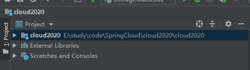
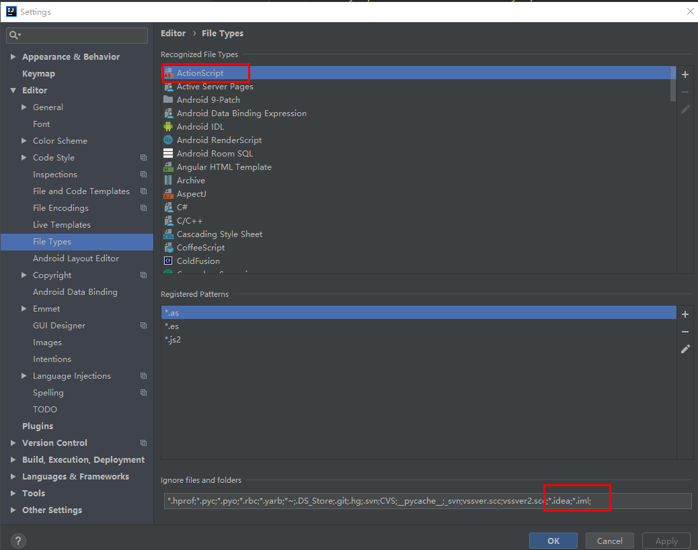

## 新建父工程

新建一个maven工程



### file type过滤

将idea 和iml结尾的文件过滤，不显示。



### 设置pom文件

packaging 为pom表示为一个总父工程，所有的子工程都继承于父工程，获得相同的版本依赖

```xml
<packaging>pom</packaging>
```

### dependencyManagement

使用dependencyManagement标签，锁定通用依赖的版本等信息

Maven使用dependencyManagement元素来提供了一种管理依赖版本号的方式。

通常会在一个组织会最顶层的父POM中看到这个标签。

使用pom.xml的dependencyManagement能让所有的子项目引用一个依赖而不用显示的列出版本号，Maven会沿着父子层次向上走，直到找到一个拥有dependencyManagement元素的项目，用这个标签中的指定的版本号。

```xml
<!--子模块继承后,提供作用:锁定版本+子module不用groupId和version-->
<dependencyManagement>
    <dependencies>
        <!--springboot 2.2.2-->
        <dependency>
            <groupId>org.springframework.boot</groupId>
            <artifactId>spring-boot-dependencies</artifactId>
            <version>${spring.boot.version}</version>
            <type>pom</type>
            <scope>import</scope>
        </dependency>
        <!--Spring cloud Hoxton.SR1-->
        <dependency>
            <groupId>org.springframework.cloud</groupId>
            <artifactId>spring-cloud-dependencies</artifactId>
            <version>${spring.cloud.version}</version>
            <type>pom</type>
            <scope>import</scope>
        </dependency>
        <!--Spring cloud alibaba 2.1.0.RELEASE-->
        <dependency>
            <groupId>com.alibaba.cloud</groupId>
            <artifactId>spring-cloud-alibaba-dependencies</artifactId>
            <version>${spring.cloud.alibaba.version}</version>
            <type>pom</type>
            <scope>import</scope>
        </dependency>
        <dependency>
            <groupId>mysql</groupId>
            <artifactId>mysql-connector-java</artifactId>
            <version>${mysql.version}</version>
        </dependency>
        <dependency>
            <groupId>com.alibaba</groupId>
            <artifactId>druid</artifactId>
            <version>${druid.version}</version>
        </dependency>
        <dependency>
            <groupId>com.alibaba</groupId>
            <artifactId>druid-spring-boot-starter</artifactId>
            <version>${druid.spring.boot.starter.version}</version>
        </dependency>
        <dependency>
            <groupId>org.mybatis.spring.boot</groupId>
            <artifactId>mybatis-spring-boot-starter</artifactId>
            <version>${mybatis-spring-boot-starter.version}</version>
        </dependency>
        <dependency>
            <groupId>org.projectlombok</groupId>
            <artifactId>lombok</artifactId>
            <version>${lombok.version}</version>
        </dependency>
    </dependencies>
</dependencyManagement>
```

**备注：**

dependencyManagement 并不是将依赖引入，这是声明版本号和规范，真正的引入是由子工程引入。


父工程pom.xml

```xml
<?xml version="1.0" encoding="UTF-8"?>
<project xmlns="http://maven.apache.org/POM/4.0.0"
         xmlns:xsi="http://www.w3.org/2001/XMLSchema-instance"
         xsi:schemaLocation="http://maven.apache.org/POM/4.0.0 http://maven.apache.org/xsd/maven-4.0.0.xsd">
    <modelVersion>4.0.0</modelVersion>

    <groupId>com.atguigu.springcloud</groupId>
    <artifactId>cloud2020</artifactId>
    <version>1.0-SNAPSHOT</version>
    <modules>
        <module>cloud-api-common</module>

        <module>cloud-provider-payment8001</module>
        <module>cloud-provider-payment8002</module>
        <module>cloud-providerconsul-payment8006</module>
        <module>cloud-provider-hystrix-payment8001</module>
        <module>cloud-provider-payment8004</module>
        <module>cloud-stream-rabbitmq-provider8801</module>
        <module>cloudalibaba-provider-payment9001</module>
        <module>cloudalibaba-provider-payment9002</module>

        <!--eureka-->
        <module>cloud-eureka-server7001</module>
        <module>cloud-eureka-server7002</module>

        <!--consumer-->
        <module>cloud-consumer-consul-order80</module>
        <module>cloud-consumer-order80</module>
        <module>cloud-consumerzk-order80</module>
        <module>cloud-consumerconsul-order80</module>
        <module>cloud-consumer-feign-hystrix-order80</module>
        <module>cloud-consumer-hystrix-dashboard9001</module>
        <module>cloud-consumer-feign-order80</module>
        <module>cloudalibaba-consumer-nacos-order83</module>

        <!--config-->
        <module>cloud-config-center-3344</module>
        <module>cloud-config-client-3355</module>
        <module>cloud-config-client-3366</module>
        <module>cloudalibaba-config-nacos-client3377</module>

        <module>cloud-gateway-gateway9527</module>

        <module>cloudalibaba-sentinel-service8401</module>

        <module>cloud-stream-rabbitmq-consumer8802</module>
        <module>cloud-stream-rabbitmq-consumer8803</module>
        <module>seata-order-service2001</module>
        <module>seata-storage-service2002</module>
        <module>seata-account-service2003</module>

        <module>cloudalibaba-provider-payment9003</module>
        <module>cloudalibaba-provider-payment9004</module>
        <module>cloudalibaba-consumer-nacos-order84</module>

    </modules>
    <packaging>pom</packaging>
    <description>父工程,统一管理jar包版本</description>

    <!--统一管理jar包版本-->
    <properties>
        <project.build.sourceEncoding>UTF-8</project.build.sourceEncoding>
        <maven.compiler.source>1.8</maven.compiler.source>
        <maven.compiler.target>1.8</maven.compiler.target>
        <junit.version>4.12</junit.version>
        <log4j.version>1.2.17</log4j.version>
        <lombok.version>1.16.18</lombok.version>
        <mysql.version>8.0.18</mysql.version>
        <druid.version>1.1.16</druid.version>
        <druid.spring.boot.starter.version>1.1.10</druid.spring.boot.starter.version>
        <spring.boot.version>2.2.2.RELEASE</spring.boot.version>
        <spring.cloud.version>Hoxton.SR1</spring.cloud.version>
        <spring.cloud.alibaba.version>2.1.0.RELEASE</spring.cloud.alibaba.version>
        <mybatis.spring.boot.version>1.3.0</mybatis.spring.boot.version>
        <mybatis-spring-boot-starter.version>2.1.1</mybatis-spring-boot-starter.version>
        <hutool-all.version>5.1.0</hutool-all.version>
    </properties>

    <!--子模块继承后,提供作用:锁定版本+子module不用groupId和version-->
    <dependencyManagement>
        <dependencies>
            <!--springboot 2.2.2-->
            <dependency>
                <groupId>org.springframework.boot</groupId>
                <artifactId>spring-boot-dependencies</artifactId>
                <version>${spring.boot.version}</version>
                <type>pom</type>
                <scope>import</scope>
            </dependency>
            <!--Spring cloud Hoxton.SR1-->
            <dependency>
                <groupId>org.springframework.cloud</groupId>
                <artifactId>spring-cloud-dependencies</artifactId>
                <version>${spring.cloud.version}</version>
                <type>pom</type>
                <scope>import</scope>
            </dependency>
            <!--Spring cloud alibaba 2.1.0.RELEASE-->
            <dependency>
                <groupId>com.alibaba.cloud</groupId>
                <artifactId>spring-cloud-alibaba-dependencies</artifactId>
                <version>${spring.cloud.alibaba.version}</version>
                <type>pom</type>
                <scope>import</scope>
            </dependency>
            <dependency>
                <groupId>mysql</groupId>
                <artifactId>mysql-connector-java</artifactId>
                <version>${mysql.version}</version>
            </dependency>
            <dependency>
                <groupId>com.alibaba</groupId>
                <artifactId>druid</artifactId>
                <version>${druid.version}</version>
            </dependency>
            <dependency>
                <groupId>com.alibaba</groupId>
                <artifactId>druid-spring-boot-starter</artifactId>
                <version>${druid.spring.boot.starter.version}</version>
            </dependency>
            <dependency>
                <groupId>org.mybatis.spring.boot</groupId>
                <artifactId>mybatis-spring-boot-starter</artifactId>
                <version>${mybatis-spring-boot-starter.version}</version>
            </dependency>
            <dependency>
                <groupId>org.projectlombok</groupId>
                <artifactId>lombok</artifactId>
                <version>${lombok.version}</version>
            </dependency>
        </dependencies>
    </dependencyManagement>

    <build>
        <plugins>
            <plugin>
                <groupId>org.springframework.boot</groupId>
                <artifactId>spring-boot-maven-plugin</artifactId>
                <configuration>
                    <fork>true</fork>
                    <addResources>true</addResources>
                </configuration>
            </plugin>
        </plugins>
    </build>

    <!--第三方maven私服-->
    <repositories>
        <repository>
            <id>nexus-aliyun</id>
            <name>Nexus aliyun</name>
            <url>http://maven.aliyun.com/nexus/content/groups/public</url>
            <releases>
                <enabled>true</enabled>
            </releases>
            <snapshots>
                <enabled>false</enabled>
            </snapshots>
        </repository>
    </repositories>

</project>
```


