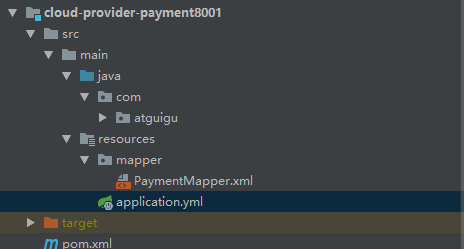
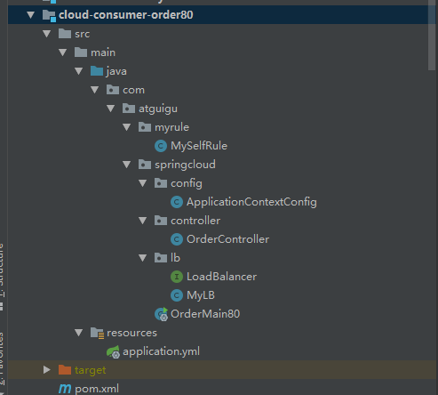

## 支付模块构建

### 构建步骤

-  建module
- 改pom.xml
- 写YML or properties
- 主启动类（一般自带）
- 编写业务类

### 创建支付子模块

cloud-provider-payment8001



### 编写pom.xml

在父工程已经定义了groupId和version，这里可以不写

```xml
<artifactId>cloud-provider-payment8001</artifactId>
<description>支付模块</description>
```

移入依赖

```xml
<dependencies>
    <!--包含了sleuth+zipkin-->
    <dependency>
        <groupId>org.springframework.cloud</groupId>
        <artifactId>spring-cloud-starter-zipkin</artifactId>
    </dependency>
    <dependency>
        <groupId>com.atguigu.springcloud</groupId>
        <artifactId>cloud-api-common</artifactId>
        <version>${project.version}</version>
    </dependency>
    <dependency>
        <groupId>org.springframework.boot</groupId>
        <artifactId>spring-boot-starter-web</artifactId>
    </dependency>
    <!--eureka client-->
    <dependency>
        <groupId>org.springframework.cloud</groupId>
        <artifactId>spring-cloud-starter-netflix-eureka-client</artifactId>
    </dependency>
    <!--监控-->
    <dependency>
        <groupId>org.springframework.boot</groupId>
        <artifactId>spring-boot-starter-actuator</artifactId>
    </dependency>
    <dependency>
        <groupId>org.mybatis.spring.boot</groupId>
        <artifactId>mybatis-spring-boot-starter</artifactId>
    </dependency>
    <dependency>
        <groupId>com.alibaba</groupId>
        <artifactId>druid-spring-boot-starter</artifactId>
        <!--如果没写版本,从父层面找,找到了就直接用,全局统一-->
        <version>${druid.spring.boot.starter.version}</version>
    </dependency>
    <!--mysql-connector-java-->
    <dependency>
        <groupId>mysql</groupId>
        <artifactId>mysql-connector-java</artifactId>
    </dependency>
    <!--jdbc-->
    <dependency>
        <groupId>org.springframework.boot</groupId>
        <artifactId>spring-boot-starter-jdbc</artifactId>
    </dependency>
    <!--热部署-->
    <dependency>
        <groupId>org.springframework.boot</groupId>
        <artifactId>spring-boot-devtools</artifactId>
        <scope>runtime</scope>
        <optional>true</optional>
    </dependency>
    <dependency>
        <groupId>org.projectlombok</groupId>
        <artifactId>lombok</artifactId>
        <optional>true</optional>
    </dependency>
    <dependency>
        <groupId>org.springframework.boot</groupId>
        <artifactId>spring-boot-starter-test</artifactId>
        <scope>test</scope>
    </dependency>
</dependencies>
```

### 修改配置

```yaml
server:
  port: 8001
spring:
  application:
    name: cloud-payment-service
  datasource:
    # 当前数据源操作类型
    type: com.alibaba.druid.pool.DruidDataSource
    # mysql驱动类
    driver-class-name: com.mysql.cj.jdbc.Driver
    url: jdbc:mysql://localhost:3306/db2019?useUnicode=true&characterEncoding=UTF-8&useSSL=false&serverTimezone=GMT%2B8
    username: root
    password: 123456
  # zipkin/sleuth链路跟踪
  zipkin:
    base-url: http://localhost:9411
  sleuth:
    sampler:
      # 采样值介于0到1之间,1表示全部采集
      probability: 1
eureka:
  client:
    register-with-eureka: true #是否注册到eureka注册中心
    fetch-registry: true #是否到注册中心获取服务
    service-url:
      # defaultZone: http://localhost:7001/eureka
      # 集群版
      defaultZone: http://eureka7001.com:7001/eureka,http://eureka7002.com:7002/eureka
  instance:
    instance-id: payment8001
    # 访问路径可以显示ip地址
    prefer-ip-address: true
mybatis:
  mapper-locations: classpath*:mapper/*.xml
  type-aliases-package: com.atguigu.springcloud.entities

```

## 消费者模块构建



同样修改pom.xml和配置文件


配置文件

```yaml
server:
  port: 9001
spring:
  application:
    name: cloud-consumer-order
  # zipkin/sleuth链路跟踪
#  zipkin:
#    base-url: http://localhost:9411
#  sleuth:
#    sampler:
#      # 采样值介于0到1之间,1表示全部采集
#      probability: 1
eureka:
  client:
    register-with-eureka: true
    fetch-registry: true
    service-url:
      #单机版
      defaultZone: http://localhost:7001/eureka
      # 集群版
      #defaultZone: http://eureka7001.com:7001/eureka,http://eureka7002.com:7002/eureka
```


## 子工程pom.xml

```xml
<?xml version="1.0" encoding="UTF-8"?>
<project xmlns="http://maven.apache.org/POM/4.0.0"
         xmlns:xsi="http://www.w3.org/2001/XMLSchema-instance"
         xsi:schemaLocation="http://maven.apache.org/POM/4.0.0 http://maven.apache.org/xsd/maven-4.0.0.xsd">
    <parent>
        <artifactId>cloud2020</artifactId>
        <groupId>com.atguigu.springcloud</groupId>
        <version>1.0-SNAPSHOT</version>
    </parent>
    <modelVersion>4.0.0</modelVersion>

    <artifactId>cloud-provider-payment8001</artifactId>
    <description>支付模块</description>


    <dependencies>
        <!--包含了sleuth+zipkin-->
        <!--<dependency>-->
            <!--<groupId>org.springframework.cloud</groupId>-->
            <!--<artifactId>spring-cloud-starter-zipkin</artifactId>-->
        <!--</dependency>-->
        <dependency>
            <groupId>com.atguigu.springcloud</groupId>
            <artifactId>cloud-api-common</artifactId>
            <version>${project.version}</version>
        </dependency>
        <dependency>
            <groupId>org.springframework.boot</groupId>
            <artifactId>spring-boot-starter-web</artifactId>
        </dependency>
        <!--eureka client-->
        <dependency>
            <groupId>org.springframework.cloud</groupId>
            <artifactId>spring-cloud-starter-netflix-eureka-client</artifactId>
        </dependency>
        <!--监控-->
        <dependency>
            <groupId>org.springframework.boot</groupId>
            <artifactId>spring-boot-starter-actuator</artifactId>
        </dependency>
        <dependency>
            <groupId>org.mybatis.spring.boot</groupId>
            <artifactId>mybatis-spring-boot-starter</artifactId>
        </dependency>
        <dependency>
            <groupId>com.alibaba</groupId>
            <artifactId>druid-spring-boot-starter</artifactId>
            <!--如果没写版本,从父层面找,找到了就直接用,全局统一-->
          <version>${druid.spring.boot.starter.version}</version>
        </dependency>
        <!--mysql-connector-java-->
        <dependency>
            <groupId>mysql</groupId>
            <artifactId>mysql-connector-java</artifactId>
        </dependency>
        <!--jdbc-->
        <dependency>
            <groupId>org.springframework.boot</groupId>
            <artifactId>spring-boot-starter-jdbc</artifactId>
        </dependency>
        <!--热部署-->
        <dependency>
            <groupId>org.springframework.boot</groupId>
            <artifactId>spring-boot-devtools</artifactId>
            <scope>runtime</scope>
            <optional>true</optional>
        </dependency>
        <dependency>
            <groupId>org.projectlombok</groupId>
            <artifactId>lombok</artifactId>
            <optional>true</optional>
        </dependency>
        <dependency>
            <groupId>org.springframework.boot</groupId>
            <artifactId>spring-boot-starter-test</artifactId>
            <scope>test</scope>
        </dependency>
    </dependencies>
</project>
```

