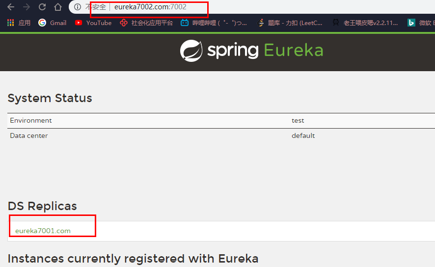

## Eureka基础知识

### 服务治理

SpringCloud封装了Netflix开发的Eureka模块来实现**服务治理**

在传统的rpc远程调用框架中，管理每个服务与服务的依赖管理比较复杂，所以需要服务治理，管理服务与服务之间的关系，可以实现服务调用，负载均衡，容错等，实现服务注册与发现。

 

### Eureka架构图


当服务器启动时，会将服务器的信息如服务器地、别名等信息。Eureka中的服务注册表会记录所有可用的服务节点。然后消费者根据别名拿到服务器实际地址，然后进行rpc远程调用。

 Eureka有一个客户端用于直观的查看Eureka的服务信息，客户端内置了一个轮训的负载算法的负载均衡器。每一个服务启动后会向Eureka发送心跳，如果Eureka Server在多个心跳周期没手动节点发送的心跳，那么就会从服务注册表移除，表明这个服务不能提供服务了。（默认90S）


### 构建Eureka单机模块

新建一个工程


修改pom.xml，引入eureka依赖

```xml
<!--eureka-server-->
        <dependency>
            <groupId>org.springframework.cloud</groupId>
            <artifactId>spring-cloud-starter-netflix-eureka-server</artifactId>
        </dependency>
```

修改配置文件

 ```yaml
server:
  port: 7001
spring:
  application:
    name: cloud-eureka-service
eureka:
  instance:
    # eureka服务端的实例名称
    # 单机 hostname: localhost
    hostname: eureka7001.com
    # Eureka客户端向服务端发送心跳的时间间隔,单位为秒(默认是30秒)
    lease-renewal-interval-in-seconds: 1
    # Eureka服务端在收到最后一次心跳后等待时间上限 ,单位为秒(默认是90秒),超时剔除服务
    lease-expiration-duration-in-seconds: 2
  server:
    # 禁用自我保护,保证不可用服务被及时删除
    enable-self-preservation: true
    eviction-interval-timer-in-ms: 2000
  client:
    # false表示不向注册中心注册自己
    register-with-eureka: false
    # false表示自己端就是注册中心,我的职责就是维护服务实例,并不需要检索服务
    fetch-registry: false
    service-url:
      # 设置与Eureka Server交互的地址查询服务和注册服务都需要依赖这个地址
       #单机
      defaultZone: http://${eureka.instance.hostname}:${server.port}/eureka/
      # 相互注册
      #defaultZone: http://eureka7002.com:7002/eureka/
 ```


修改主启动类

添加**@EnableEurekaServer** 开启Eureka注解

```java
@SpringBootApplication
@EnableEurekaServer
public class EurekaMain7001 {
    public static void main(String[] args) {
        SpringApplication.run(EurekaMain7001.class);
    }
}
```

启动主启动类，然后访问localhost:7001即可


## Eureka pom.xml

```xml
<?xml version="1.0" encoding="UTF-8"?>
<project xmlns="http://maven.apache.org/POM/4.0.0"
         xmlns:xsi="http://www.w3.org/2001/XMLSchema-instance"
         xsi:schemaLocation="http://maven.apache.org/POM/4.0.0 http://maven.apache.org/xsd/maven-4.0.0.xsd">
    <modelVersion>4.0.0</modelVersion>
    <parent>
        <artifactId>cloud2020</artifactId>
        <groupId>com.atguigu.springcloud</groupId>
        <version>1.0-SNAPSHOT</version>
    </parent>
    <artifactId>cloud-eureka-server7001</artifactId>
    <version>1.0-SNAPSHOT</version>
    <description>eureka服务注册中心的服务端</description>

    <dependencies>
        <!--eureka-server-->
        <dependency>
            <groupId>org.springframework.cloud</groupId>
            <artifactId>spring-cloud-starter-netflix-eureka-server</artifactId>
        </dependency>
        <dependency>
            <groupId>com.atguigu.springcloud</groupId>
            <artifactId>cloud-api-common</artifactId>
            <version>${project.version}</version>
        </dependency>
        <dependency>
            <groupId>org.springframework.boot</groupId>
            <artifactId>spring-boot-starter-web</artifactId>
        </dependency>
        <dependency>
            <groupId>org.springframework.boot</groupId>
            <artifactId>spring-boot-starter-actuator</artifactId>
        </dependency>
        <!--一般为通用配置-->
        <dependency>
            <groupId>org.springframework.boot</groupId>
            <artifactId>spring-boot-devtools</artifactId>
            <scope>runtime</scope>
            <optional>true</optional>
        </dependency>
        <dependency>
            <groupId>org.projectlombok</groupId>
            <artifactId>lombok</artifactId>
            <optional>true</optional>
        </dependency>
        <dependency>
            <groupId>org.springframework.boot</groupId>
            <artifactId>spring-boot-starter-test</artifactId>
            <scope>test</scope>
        </dependency>
    </dependencies>
</project>
```


### 将支付服务8001注册到Eureka

修改pom.xml

引入Eureka-Client

```xml
<!--eureka client-->
        <dependency>
            <groupId>org.springframework.cloud</groupId>
            <artifactId>spring-cloud-starter-netflix-eureka-client</artifactId>
        </dependency>
```

修改主启动类

添加**@EnableEurekaClient**标记自身为Eureka的客户端，注册到Eureka

```java
@SpringBootApplication
@EnableEurekaClient
@EnableDiscoveryClient
public class PaymentMain8001 {
    public static void main(String[] args) {
        SpringApplication.run(PaymentMain8001.class, args);
    }
}

```

修改配置文件

添加eureka服务信息(先使用单机版)

```yaml
eureka:
  client:
    register-with-eureka: true #是否注册到eureka注册中心
    fetch-registry: true #是否到注册中心获取服务
    service-url:
      #单机版
      defaultZone: http://localhost:7001/eureka
      # 集群版
      #defaultZone: http://eureka7001.com:7001/eureka,http://eureka7002.com:7002/eureka
  instance:
  	#服务实例id
    instance-id: payment8001
    # 访问路径可以显示ip地址
    prefer-ip-address: true
```


### 订单服务注册到Eureka

修改pom.xml

引入Eureka-Client

```xml
<!--eureka client-->
        <dependency>
            <groupId>org.springframework.cloud</groupId>
            <artifactId>spring-cloud-starter-netflix-eureka-client</artifactId>
        </dependency>
```

修改主启动类

添加**@EnableEurekaClient**标记自身为Eureka的客户端，注册到Eureka

```java
@SpringBootApplication
@EnableEurekaClient
@RibbonClient(name = "CLOUD-PAYMENT-SERVICE", configuration = MySelfRule.class)//负载均衡
public class OrderMain80 {
    public static void main(String[] args) {
        SpringApplication.run(OrderMain80.class, args);
    }
}
```


修改配置文件

使用80端口报错了，这里改为9001

```yaml
server:
  port: 9001
spring:
  application:
    name: cloud-consumer-order
  # zipkin/sleuth链路跟踪
#  zipkin:
#    base-url: http://localhost:9411
#  sleuth:
#    sampler:
#      # 采样值介于0到1之间,1表示全部采集
#      probability: 1
eureka:
  client:
    register-with-eureka: true
    fetch-registry: true
    service-url:
      #单机版
      defaultZone: http://localhost:7001/eureka
      # 集群版
      #defaultZone: http://eureka7001.com:7001/eureka,http://eureka7002.com:7002/eureka
```


成功注册到Eureka注册中心

**注意**

consumer访问支付模块的时候，需要进行一个必要的配置,注入一个RestTemplate，并且需要添加@LoadBalanced注解，不然会报找不到服务名的错误

```
java.net.UnknownHostException: CLOUD-PAYMENT-SERVICE
```

```java
@Configuration
public class ApplicationContextConfig {
    /**
     * applicationContext.xml <bean id="" class=""> </bean>
     * LoadBalanced 负载均衡
     * @return
     */
    //必须添加此注解，否则java.net.UnknownHostException: CLOUD-PAYMENT-SERVICE
    @LoadBalanced
    @Bean
    /// 使用自定义负载均衡规则 @LoadBalanced
    public RestTemplate getRestTemplate() {
        return new RestTemplate();
    }
}
```


通过访问Consumer的接口，在Eureka注册中心找到支付模块服务，成功调进去了支付模块8001服务。


### Eureka集群构建

**为了防止Eureka服务的单节点故障，实现高可用，我们需要搭建Eureka集群。**


根据Eureka7001再次构建一个7002端口的Eureka服务


修改主机host映射（因为在同一台机器上 模拟两个Eurka实例），实例名不能在写为localhost了


```yaml
 defaultZone: http://eureka7001.com:7001/eureka/localhost
```

```yaml
# 相互注册
defaultZone: http://eureka7002.com:7002/eureka/
```




### 支付和消费注册到Eureka集群

修改配置文件，将注册到单个Eureka改为注册到Eureka集群

```yaml
#单机版
#defaultZone: http://localhost:7001/eureka
# 集群版
defaultZone: http://eureka7001.com:7001/eureka,http://eureka7002.com:7002/eureka
```

在启动两个服务，发现在Eureka集群中，两个服务都注册到了Eureka中


## 支付模块集群配置

根据支付模块8001工程一样，再建一个工程端口为8002


修改配置文件

服务名称不变还是cloud-payment-service，同样注册到Eureka集群中

```yaml
server:
  port: 8002
spring:
  application:
    name: cloud-payment-service
  datasource:
    # 当前数据源操作类型
    type: com.alibaba.druid.pool.DruidDataSource
    # mysql驱动类
    driver-class-name: com.mysql.cj.jdbc.Driver
    url: jdbc:mysql://xx.xxx.xx.xx:3306/db2019?useUnicode=true&characterEncoding=UTF-8&useSSL=false&serverTimezone=GMT%2B8
    username: root
    password: 123456
eureka:
  client:
    register-with-eureka: true
    fetch-registry: true
    service-url:
      defaultZone: http://eureka7001.com:7001/eureka,http://eureka7002.com:7002/eureka
#  instance:
#    instance-id: payment8002
#    # 访问路径可以显示ip地址
#    prefer-ip-address: true
mybatis:
  mapper-locations: classpath*:mapper/*.xml
  type-aliases-package: com.atguigu.springcloud.entities

```

**启动后发现Eureka中的cloud-payment-service服务有了两个实例**


在postman访问两个实例

8001：


8002：


**通过consumer模块调用支付模块**

在使用resttemplate时注意要添加一个负载均衡机制，不然consumer不知道应该调用哪一个服务。**@LoadBalanced注解**

```java
@Configuration
public class ApplicationContextConfig {
    /**
     * applicationContext.xml <bean id="" class=""> </bean>
     * LoadBalanced 负载均衡
     * @return
     */
    //必须添加此注解，否则java.net.UnknownHostException: CLOUD-PAYMENT-SERVICE
    @LoadBalanced
    @Bean
    /// 使用自定义负载均衡规则 @LoadBalanced
    public RestTemplate getRestTemplate() {
        return new RestTemplate();
    }
}
```

这样就会轮训的调用8001和8002两个服务了


### actuator 信息完善

通过修改配置文件，我们可以更改服务注册到Eureka注册中心时，是否显示ip、是否显示自定义的实例名称。

```yaml
eureka:
  client:
    register-with-eureka: true #是否注册到eureka注册中心
    fetch-registry: true #是否到注册中心获取服务
    service-url:
      #单机版
      #defaultZone: http://localhost:7001/eureka
      # 集群版
      defaultZone: http://eureka7001.com:7001/eureka,http://eureka7002.com:7002/eureka
  #配置实例id
  instance:
    instance-id: payment8001
    # 访问路径可以显示ip地址
    prefer-ip-address: true
```


### 服务发现

在启动类使用注解**@EnableDiscoveryClient**表示进行服务发现，在Controller中自动注入DiscoveryClient

```java
/**
 * 服务发现 获取服务信息
 */
@Resource
private DiscoveryClient discoveryClient;
```

使用DiscoveryClient就能获取到Eureka上所有的服务信息

```java
/**
 * 服务发现
 *
 * @return
 */
@GetMapping(value = "payment/discovery")
public Object discovery() {
    List<String> services = discoveryClient.getServices();
    for (String element : services) {
        log.info("*****element:" + element);
    }
    // 一个微服务下的全部实例
    List<ServiceInstance> instances = discoveryClient.getInstances("CLOUD-PAYMENT-SERVICE");
    for (ServiceInstance instance : instances) {
        log.info(instance.getServiceId() + "\t" + instance.getHost() + "\t" + instance.getPort() + instance.getUri());
    }
    return this.discoveryClient;
}
```

同样在消费端，也可以进行服务发现，获取到服务实例，获取到实例的url，然后进行请求（但是一般不这样做）

```java
/**
 * 路由规则: 轮询
 * http://localhost/consumer/payment/payment/lb
 *
 * @return
 */
@GetMapping(value = "/consumer/payment/lb")
public String getPaymentLB() {
    //获取CLOUD-PAYMENT-SERVICE服务所有实例
    List<ServiceInstance> instances = discoveryClient.getInstances("CLOUD-PAYMENT-SERVICE");
    if (instances == null || instances.size() <= 0) {
        return null;
    }
    //使用负载均衡 得到得到一个实例去请求
    ServiceInstance serviceInstance = loadBalancer.instances(instances);
    //得到服务实例的请求地址
    URI uri = serviceInstance.getUri();
    return restTemplate.getForObject(uri + "/payment/lb", String.class);
}
```


### Eureka 自我保护机制

自我保护机制指的是：可能由于网络原因导致网络分区故障，即服务可能还是健康状态，但是由于网络堵塞导致Eureka Server没有收到心跳检测，那么Eureka不会立即清除服务的注册信息，会等待服务进行恢复。

**即设计策略是宁愿存储错误的服务注册信息，也不错删掉健康的服务信息。**

在配置文件可以修改是否启用自我保护机制

Eurka Server配置文件

```yaml
eureka:
  instance:
    # eureka服务端的实例名称
    # 单机 hostname: localhost
    hostname: eureka7001.com
    # Eureka客户端向服务端发送心跳的时间间隔,单位为秒(默认是30秒)
    lease-renewal-interval-in-seconds: 1
    # Eureka服务端在收到最后一次心跳后等待时间上限 ,单位为秒(默认是90秒),超时剔除服务
    lease-expiration-duration-in-seconds: 2
  server:
    # 禁用自我保护,保证不可用服务被及时删除 true 表示开启，false表示关闭
    enable-self-preservation: true
    #超时时间，2s内没有心跳则清除服务，默认是90s，一般默认30s服务向Eureka发送一次心跳
    eviction-interval-timer-in-ms: 2000
```

