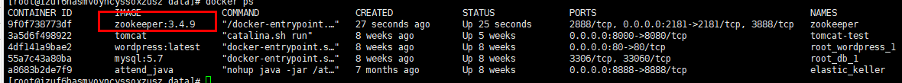
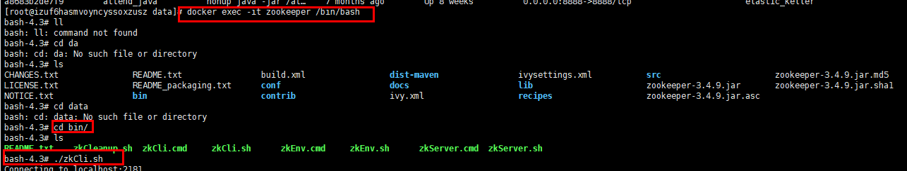
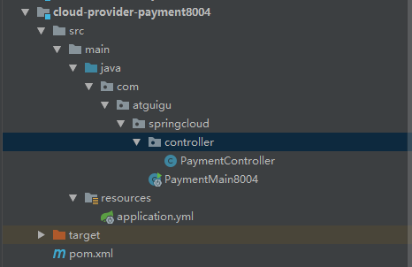
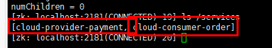
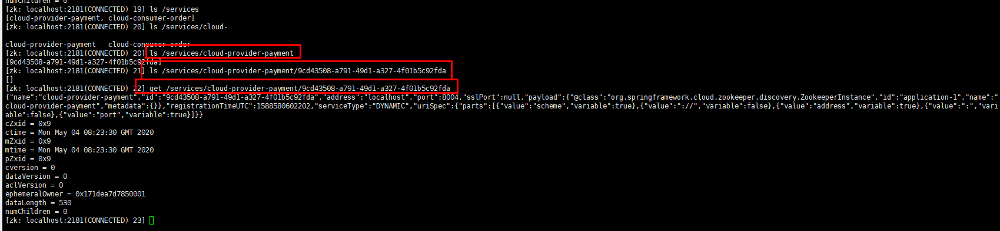
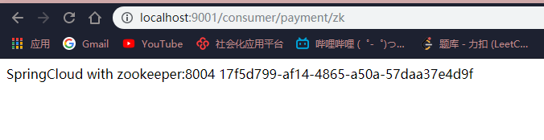

# Zookeeper注册中心

## Docker安装Zookeeper

查找镜像

```shell
docker search zookeeper
```

下载镜像

```she
docker pull zookeeper:3.4.9
```

启动容器

```shell
docker run -d -p 2181:2181 -v /mydata/zookeeper/data:/data --name=zookeeper zookeeper:3.4.9
```



进入容器并启动ZkCli客户端

```shell
docker exec -it zookeeper /bin/bash
```




## 新创建一个支付模块8004



修改pom.xml

**备注：根据自己的zookeeper引入对应的jar包，不然会有冲突，导致起不来**

```xml
<!--SpringBoot整合Zookeeper客户端-->
        <dependency>
            <groupId>org.springframework.cloud</groupId>
            <artifactId>spring-cloud-starter-zookeeper-discovery</artifactId>
            <exclusions>
                <!--先排除自带的zookeeper3.5.3-->
                <exclusion>
                    <groupId>org.apache.zookeeper</groupId>
                    <artifactId>zookeeper</artifactId>
                </exclusion>
            </exclusions>
        </dependency>
        <!--添加zookeeper3.4.9版本-->
        <dependency>
            <groupId>org.apache.zookeeper</groupId>
            <artifactId>zookeeper</artifactId>
            <version>3.4.14</version>
        </dependency>
```

完整依赖

```xml
<?xml version="1.0" encoding="UTF-8"?>
<project xmlns="http://maven.apache.org/POM/4.0.0"
         xmlns:xsi="http://www.w3.org/2001/XMLSchema-instance"
         xsi:schemaLocation="http://maven.apache.org/POM/4.0.0 http://maven.apache.org/xsd/maven-4.0.0.xsd">
    <parent>
        <artifactId>cloud2020</artifactId>
        <groupId>com.atguigu.springcloud</groupId>
        <version>1.0-SNAPSHOT</version>
    </parent>
    <modelVersion>4.0.0</modelVersion>

    <artifactId>cloud-provider-payment8004</artifactId>
    <description>Zookeeper服务提供者</description>

    <dependencies>
        <dependency>
            <groupId>com.atguigu.springcloud</groupId>
            <artifactId>cloud-api-common</artifactId>
            <version>${project.version}</version>
        </dependency>
        <dependency>
            <groupId>org.springframework.boot</groupId>
            <artifactId>spring-boot-starter-web</artifactId>
        </dependency>
        <!--SpringBoot整合Zookeeper客户端-->
        <dependency>
            <groupId>org.springframework.cloud</groupId>
            <artifactId>spring-cloud-starter-zookeeper-discovery</artifactId>
            <exclusions>
                <!--先排除自带的zookeeper3.5.3-->
                <exclusion>
                    <groupId>org.apache.zookeeper</groupId>
                    <artifactId>zookeeper</artifactId>
                </exclusion>
            </exclusions>
        </dependency>
        <!--添加zookeeper3.4.9版本-->
        <dependency>
            <groupId>org.apache.zookeeper</groupId>
            <artifactId>zookeeper</artifactId>
            <version>3.4.14</version>
        </dependency>
        <dependency>
            <groupId>org.springframework.boot</groupId>
            <artifactId>spring-boot-starter-actuator</artifactId>
        </dependency>
        <dependency>
            <groupId>org.springframework.boot</groupId>
            <artifactId>spring-boot-devtools</artifactId>
            <scope>runtime</scope>
            <optional>true</optional>
        </dependency>
        <dependency>
            <groupId>org.projectlombok</groupId>
            <artifactId>lombok</artifactId>
            <optional>true</optional>
        </dependency>
        <dependency>
            <groupId>org.springframework.boot</groupId>
            <artifactId>spring-boot-starter-test</artifactId>
            <scope>test</scope>
        </dependency>
    </dependencies>

</project>
```

修改配置文件

```yaml
server:
  # 8004表示注册到zookeeper服务器的支付服务提供者端口号
  port: 8004
spring:
  application:
    # 服务别名---注册zookeeper到注册中心的名称
    name: cloud-provider-payment
  cloud:
    zookeeper:
       # 注册到zookeeper地址，若为zookeeper集群，以逗号分割，可以表示为ip01:port01,ip02:port02,ip03:port03以此类推
      connect-string: 47.100.214.147:2181
```

启动项目查看是否注册到zk





### 新建一个消费模块zk9001

与上面步骤一致

```xml
<?xml version="1.0" encoding="UTF-8"?>
<project xmlns="http://maven.apache.org/POM/4.0.0"
         xmlns:xsi="http://www.w3.org/2001/XMLSchema-instance"
         xsi:schemaLocation="http://maven.apache.org/POM/4.0.0 http://maven.apache.org/xsd/maven-4.0.0.xsd">
    <parent>
        <artifactId>cloud2020</artifactId>
        <groupId>com.atguigu.springcloud</groupId>
        <version>1.0-SNAPSHOT</version>
    </parent>
    <modelVersion>4.0.0</modelVersion>

    <artifactId>cloud-consumerzk-order80</artifactId>
    <description>订单消费者之注册中心zookeeper</description>

    <dependencies>
        <dependency>
            <groupId>com.atguigu.springcloud</groupId>
            <artifactId>cloud-api-common</artifactId>
            <version>${project.version}</version>
        </dependency>
        <dependency>
            <groupId>org.springframework.boot</groupId>
            <artifactId>spring-boot-starter-web</artifactId>
        </dependency>
        <!--SpringBoot整合Zookeeper客户端-->
        <dependency>
            <groupId>org.springframework.cloud</groupId>
            <artifactId>spring-cloud-starter-zookeeper-discovery</artifactId>
            <exclusions>
                <!--先排除自带的zookeeper3.5.3-->
                <exclusion>
                    <groupId>org.apache.zookeeper</groupId>
                    <artifactId>zookeeper</artifactId>
                </exclusion>
            </exclusions>
        </dependency>
        <!--添加zookeeper3.4.9版本-->
        <dependency>
            <groupId>org.apache.zookeeper</groupId>
            <artifactId>zookeeper</artifactId>
            <version>3.4.14</version>
        </dependency>
        <dependency>
            <groupId>org.springframework.boot</groupId>
            <artifactId>spring-boot-starter-actuator</artifactId>
        </dependency>
        <dependency>
            <groupId>org.springframework.boot</groupId>
            <artifactId>spring-boot-devtools</artifactId>
            <scope>runtime</scope>
            <optional>true</optional>
        </dependency>
        <dependency>
            <groupId>org.projectlombok</groupId>
            <artifactId>lombok</artifactId>
            <optional>true</optional>
        </dependency>
        <dependency>
            <groupId>org.springframework.boot</groupId>
            <artifactId>spring-boot-starter-test</artifactId>
            <scope>test</scope>
        </dependency>
    </dependencies>

</project>
```

配置文件

```yaml
server:
  port: 9001
spring:
  application:
    # 服务别名
    name: cloud-consumer-order
  cloud:
    zookeeper:
      # 注册到zookeeper地址，若为zookeeper集群，以逗号分割，可以表示为ip01:port01,ip02:port02,ip03:port03以此类推
      connect-string: 47.100.214.147:2181
```

启动项目后发现也注册到了zk

通过消费者模块访问支付模块的接口

OrderZkController

```java
@RestController
@Slf4j
public class OrderZkController {

    public static final String INVOKE_URL = "http://cloud-provider-payment";
    @Resource
    private RestTemplate restTemplate;


    /**
     * http://localhost/consumer/payment/zk
     *
     * @return
     */
    @GetMapping("/consumer/payment/zk")
    public String paymentInfo() {
        return restTemplate.getForObject(INVOKE_URL + "/payment/zk", String.class);
    }
}
```

PaymentContoller

```java
@RestController
@Slf4j
public class PaymentController {
    @Value("${server.port}")
    private String serverPort;

    /**
     * http://localhost:8004/payment/zk
     *
     * @return
     */
    @RequestMapping(value = "payment/zk")
    public String paymentZk() {
        return "SpringCloud with zookeeper:" + serverPort + "\t" + UUID.randomUUID().toString();
    }
}
```



访问：http://localhost:9001/consumer/payment/zk

**说明已经通过zookeeper找到了支付模块并成功调用了支付模块的接口**