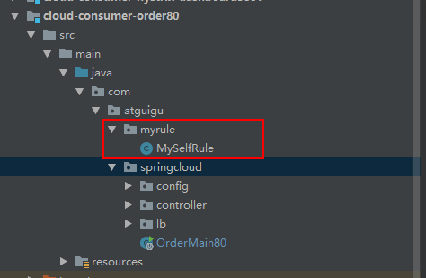

# Ribbon入门

## 介绍

SpringCloud Ribbon 是基于Netflix Ribbon实现的一套客户端负载均衡的工具


Ribbon是Netflix发布的开源项目，**主要功能是提供客户端的软件负载均衡算法的服务调用。**Ribbon客户端组件提供一系列完善的配置项如连接超时、重试等。简单地说就是在配置文件中列出Load Balance（LB）后面的所有机器。Ribbon会自动的帮助我们基于某种规则（如简单轮询、随机连接）去连接不同的机器。我们很容易使用Ribbon实现自定义的负载均衡算法。


## Ribbon能干嘛

### LB负载均衡是什么

简单地说就是将用户的请求分配到多个服务商，从而达到系统的高可用（HA）

常见的负载均衡软件有Ngnix、LVS、硬件F5等。

### Ribbon本地负载均衡客户端和Nginx服务端负载均衡的区别

Nginx是服务器负载均衡，客户端所有的请求都会交给nginx，然后由nginx实现请求转发。即负载均衡是由服务端实现的。（集中式LB）

Ribbon本地负载均衡，在调用微服务接口的时候，会在注册中心上获取注册信息服务列表后会缓存到JVM本地，从而实现本地RPC远程服务调用技术。（进程式LB）

**集中式LB**：即在服务的消费方和提供方之间使用独立的LB设施，由该设施复制将访问的请求通过某种策略转发到服务的提供方。

**进程式LB**：将LB逻辑集成到了消费方，消费方从服务注册中心获知有哪些地址可以调用，然后自己再从这些地址中选择一个合适的服务器。Ribbon属于进程内LB，他只是一个类库，集成于消费方进程，消费方通过它来获取服务提供方的地址。

**个人理解：**即**用户发起一个请求**到达服务器，先经过**Nginx**等进行负载均衡转发到对应的服务提供方，**服务提供方内部还需要调用其他服务**，这个时候需要使用**Ribbon**到服务注册中心获取其他服务提供方地址，然后进行负载均衡选取一个合适的服务实例进行调用。


### Ribbon架构图


## 与RestTemplate 

常用

**getForObject**：返回对象为响应体中转换成的对象，可以理解为json

**getForEntity**：返回对象为RespinseEntity对象，包含了响应 中的一些重要信息，比如响应头，响应状态码，响应体等。


## Ribbon的负载均衡算法


## Ribbon负载均衡算法替换

注意：

如果要是用自己设置的负载均衡规则，所定义的Bean不能放在@ComponentScan注解可以扫描的包下及子包下

因为主启动类的@SpringBootApplication自动就会引入@ComponentScan注解。所以注入的负载均衡规则要放在主启动类所在包的外面。



使用注解**@RibbonClient**表示使用Ribbon负载均衡（参数为自己注入的负载均衡规则）定义多个服务不同的负载均衡策略使用**@RibbonClients**

```java
@RibbonClient(name = "CLOUD-PAYMENT-SERVICE", configuration = MySelfRule.class)//负载均衡

//负载均衡
@RibbonClients({
        @RibbonClient(name = "CLOUD-PAYMENT-SERVICE", configuration = MySelfRule.class)
})
```

```java
/**
 * 自定义负载均衡路由规则类
 *
 * @author zzyy
 * @date 2020/3/6 15:15
 **/
@Configuration
public class MySelfRule {

    @Bean
    public IRule myRule() {
        // 定义为随机
        return new RandomRule();
    }
}
```


## Ribbon默认轮训算法原理

RoundRobinRule


## Ribbon -RoundRobinRule源码分析

首先RoundRobinRule继承了一个抽象类AbstractLoadBalancerRule，这个抽象类又实现了IRule接口，其中选择哪一个服务的接口方法为**choose**方法

备注：

使用了CAS锁进行比较，如果nextServerCyclicCounter（用于记录请求数）与预期的值一样，则进行交换，如果不一样则说明已经被其他线程更新过了，那么就进行自旋，重新进行比较。

```java
public final boolean compareAndSet(int expect, int update) {
        return unsafe.compareAndSwapInt(this, valueOffset, expect, update);
    }
```

expect：初值，update：需要返回得值。如果当前内存里的值和传入的初值一致，说明没有被其他线程修改过，则返回update值。

```java
for (;;) {
            int current = nextServerCyclicCounter.get();
            int next = (current + 1) % modulo;
            if (nextServerCyclicCounter.compareAndSet(current, next))
                return next;
        }
```

**nextServerCyclicCounter是一个原子类，如果nextServerCyclicCounter当前在内存的值和current（初值）一致则进行交换**

```java
public Server choose(ILoadBalancer lb, Object key) {
        if (lb == null) {
            log.warn("no load balancer");
            return null;
        } else {
            Server server = null;
            int count = 0;

            while(true) {
                if (server == null && count++ < 10) {
                    List<Server> reachableServers = lb.getReachableServers();
                    List<Server> allServers = lb.getAllServers();
                    int upCount = reachableServers.size();
                    int serverCount = allServers.size();
                    if (upCount != 0 && serverCount != 0) {
                        int nextServerIndex = this.incrementAndGetModulo(serverCount);
                        server = (Server)allServers.get(nextServerIndex);
                        if (server == null) {
                            Thread.yield();
                        } else {
                            if (server.isAlive() && server.isReadyToServe()) {
                                return server;
                            }

                            server = null;
                        }
                        continue;
                    }

                    log.warn("No up servers available from load balancer: " + lb);
                    return null;
                }

                if (count >= 10) {
                    log.warn("No available alive servers after 10 tries from load balancer: " + lb);
                }

                return server;
            }
        }
    }

private int incrementAndGetModulo(int modulo) {
        int current;
        int next;
        do {
            current = this.nextServerCyclicCounter.get();
            next = (current + 1) % modulo;
        } while(!this.nextServerCyclicCounter.compareAndSet(current, next));

        return next;
    }


```

## 手写轮训算法

```java
public interface LoadBalancer {
    /**
     * 获取存活的服务实例列表
     *
     * @param serviceInstances
     * @return
     */
    ServiceInstance instances(List<ServiceInstance> serviceInstances);
}
```


```java
@Component
public class MyLB implements LoadBalancer {
    private AtomicInteger atomicInteger = new AtomicInteger(0);

    public final int getAndIncrement() {
        int current;
        int next;
        do {
            current = this.atomicInteger.get();
            // 超过最大值,为0,重新计数 2147483647 Integer.MAX_VALUE
            next = current >= 2147483647 ? 0 : current + 1;
            // 自旋锁
        } while (!atomicInteger.compareAndSet(current, next));
        System.out.println("****第几次访问,次数next:" + next);
        return next;
    }

    /**
     * 负载均衡算法:rest接口第几次请求数%服务器集群总数量=实际调用服务器位置下标,每次服务重启动后rest接口计数从1开始.
     *
     * @param serviceInstances
     * @return
     */
    @Override
    public ServiceInstance instances(List<ServiceInstance> serviceInstances) {
        int index = getAndIncrement() % serviceInstances.size();
        return serviceInstances.get(index);
    }
}
```

### 使用自己写的轮训算法调用服务

```java
@GetMapping(value = "/consumer/payment/lb")
    public String getPaymentLB() {
        //获取CLOUD-PAYMENT-SERVICE服务所有实例
        List<ServiceInstance> instances = discoveryClient.getInstances("CLOUD-PAYMENT-SERVICE");
        if (instances == null || instances.size() <= 0) {
            return null;
        }
        //使用负载均衡 得到得到一个实例去请求
        ServiceInstance serviceInstance = loadBalancer.instances(instances);
        //得到服务实例的请求地址
        URI uri = serviceInstance.getUri();
        return restTemplate.getForObject(uri + "/payment/lb", String.class);
    }
```

