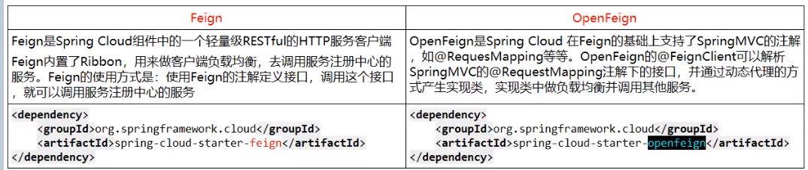
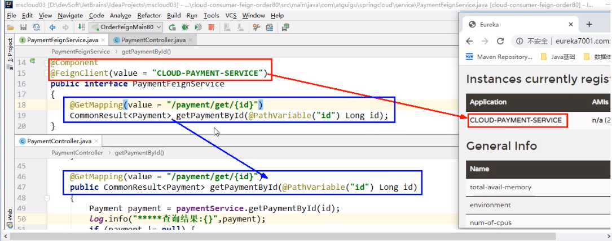

## OpenFeign

### 什么是OpenFeign

Feign是一个声明式WebService客户端。使用Feign能让编写WebService客户端更加简单。

它的使用方法是定义一个服务接口然后在上面添加注解。Feign也支持可拔插式的编码器和解码器。SpringCloud对Feign进行了封装，使其支持了SpringMVC标准注解和HttpMessageConverters。Feign可以与Eureka和Ribbon组合使用以支持负载均衡。

## OpenFeign能干嘛

Feign旨在使编写Java Http客户端变得更容易。 前面在使用Ribbon+RestTemplate时，利用RestTemplate对http请求的封装处理，形成了一套模版化的调用方法。但是在实际开发中，由于对服务依赖的调用可能不止一处，往往一个接口会被多处调用，所以通常都会针对每个微服务自行封装一些客户端类来包装这些依赖服务的调用。所以，Feign在此基础上做了进一步封装，由他来帮助我们定义和实现依赖服务接口的定义。在Feign的实现下，我们只需创建一个接口并使用注解的方式来配置它(以前是Dao接口上面标注Mapper注解,现在是一个微服务接口上面标注一个Feign注解即可)，即可完成对服务提供方的接口绑定，简化了使用Spring cloud Ribbon时，自动封装服务调用客户端的开发量

## Feign集成了Ribbon

利用Ribbon维护了MicroServiceCloud-Dept的服务列表信息，并且通过轮询实现了客户端的负载均衡。而与Ribbon不同的是，通过feign只需要定义服务绑定接口且以声明式的方法，优雅而简单的实现了服务调用

## Feign和Ribbon

上面我们用Ribbon进行负载均衡，功能很强大，甚至可以自定义算法。那么Feign是怎么出来的？ 

1、Ribbon直接调用我们的微服务来进行访问,如 private static final String REST_URL_PREFIX = "http://CLOUD-DEPT"; 但是大家目前都西关面向接口编程，比如webservice捷库，比如我们的DAO接口，这个已经是大家的规范了。 所以SpringCloud提供了两种方式： 

1、微服务名字获得调用地址---->Ribbon 

2、通过接口+注解，获得我们的调用服务---->Feign

## Feign 与 OpenFeugb区别

## 新建OpenFeign项目

、、TODO

**调用链路**

定义了@FeignClient的接口，会根据提供的服务名去Eureka注册中心查找对应服务，选择一个合适的服务实例，调用对应服务端的Controller方法（Controller的路径就是接口上定义的路径）。

## OpenFeign 超时控制

由于OpenFeign天生集成了Ribbon，所以OpenFeign客户端设置超时控制也是由Ribbon来控制。

修改配置文件

添加ribbon.ReadTimeout=5000 //指建立连接后从服务器读取资源的超时时间

​		ribbon.ConnectTimeout=5000//指建立连接所使用的时间

## OpenFeign 日志打印功能

Feign提供了日志打印功能，我们可以通过配置来调整日志级别，从而了解Feign中国Http请求的细节。

就是对Feign接口的调用情况进行监控和输出。

