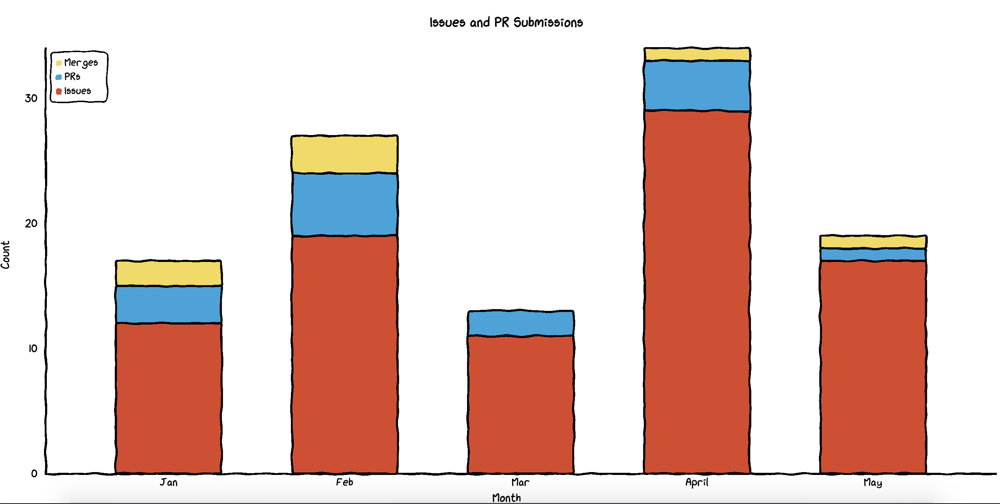
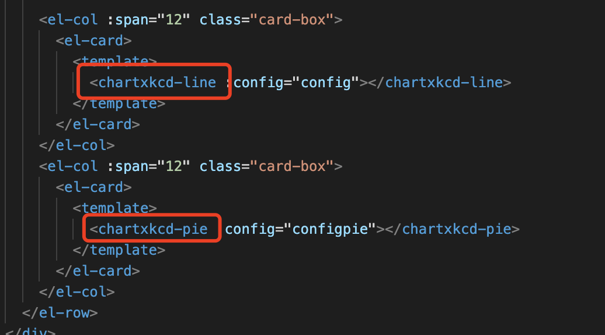
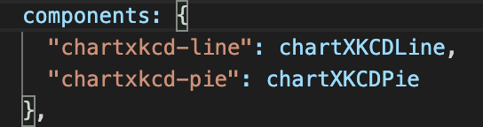
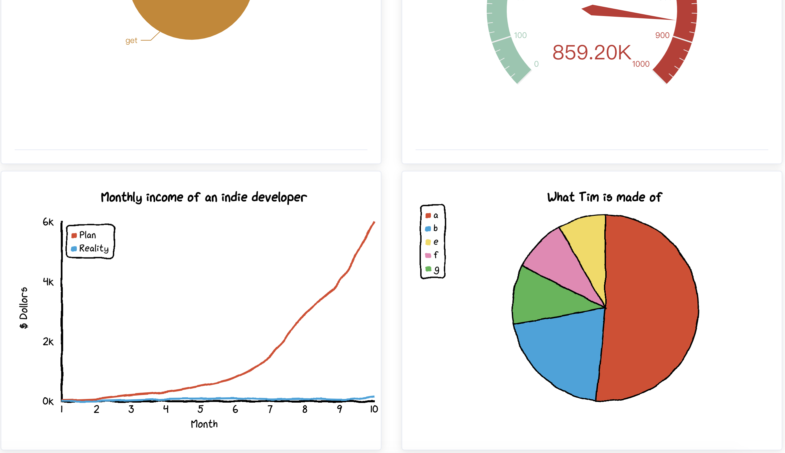

# chart.xkcd  可视化组件

## chart.xkcd

Chart.xkcd is a chart library plots “sketchy”, “cartoony” or “hand-drawn” styled charts

**风格类似手绘的可视化组件**

官网：https://timqian.com/chart.xkcd/#pie_doughnut_chart

```html
<svg class="bar-chart"></svg>
<script src="https://cdn.jsdelivr.net/npm/chart.xkcd@1.1/dist/chart.xkcd.min.js"></script>
<script>
  const svg = document.querySelector('.bar-chart')

  new chartXkcd.StackedBar(svg, {
  title: 'Issues and PR Submissions',
  xLabel: 'Month',
  yLabel: 'Count',
  data: {
    labels: ['Jan', 'Feb', 'Mar', 'April', 'May'],
    datasets: [{
      label: 'Issues',
      data: [12, 19, 11, 29, 17],
    }, {
      label: 'PRs',
      data: [3, 5, 2, 4, 1],
    }, {
      label: 'Merges',
      data: [2, 3, 0, 1, 1],
    }],
  },
});

</script>
```

效果：



## chart.xkcd-vue

集成到Vue中

官网：https://shiyiya.github.io/chart.xkcd-vue/

在vue 工程中，找到main.js

引入chart.xkcd 并挂载到VUE中

```js
import Vue from 'vue'
import chartXkcdVue from 'chart.xkcd-vue'

// ↓↓↓ will auto register all chart.xkcd component.
Vue.use(chartXkcdVue)
```

在vue文件中使用 chart.xkcd 

```js
import Vue from 'vue'
import chartXkcd from 'chart.xkcd'
import { chartXKCDLine } from 'chart.xkcd-vue'
Vue.component('chartxkcd-line', chartXKCDLine)
```

通过组件的方式使用 chart.xkcd 可视化展示

```javascript
<template>
  <chartxkcd-line :config="config"></chartxkcd-line>
</template>

<script>
  import { chartXKCDLine } from 'chart.xkcd-vue'

  export default {
    name: 'app',
    data() {
      return {
        config: {
          title: 'Monthly income of an indie developer',
          xLabel: 'Month',
          yLabel: '$ Dollors',
          data: {
            labels: ['1', '2', '3', '4', '5', '6', '7', '8', '9', '10'],
            datasets: [
              {
                label: 'Plan',
                data: [30, 70, 200, 300, 500, 800, 1500, 2900, 5000, 8000]
              },
              {
                label: 'Reality',
                data: [0, 1, 30, 70, 80, 100, 50, 80, 40, 150]
              }
            ]
          }
        }
      }
    },
    components: {
      'chartxkcd-line': chartXKCDLine
    }
  }
</script>
```

## 实践

```html
<el-col :span="12" class="card-box">
        <el-card>
          <template>
            <chartxkcd-line :config="config"></chartxkcd-line>
          </template>
        </el-card>
      </el-col>
      <el-col :span="12" class="card-box">
        <el-card>
          <template>
            <chartxkcd-pie :config="configpie"></chartxkcd-pie>
          </template>
        </el-card>
      </el-col>
```



**参数绑定**

```js
config: {
        title: "Monthly income of an indie developer",
        xLabel: "Month",
        yLabel: "$ Dollors",
        data: {
          labels: ["1", "2", "3", "4", "5", "6", "7", "8", "9", "10"],
          datasets: [
            {
              label: "Plan",
              data: [30, 70, 200, 300, 500, 800, 1500, 2900, 4000, 6000],
            },
            {
              label: "Reality",
              data: [0, 1, 30, 70, 80, 100, 50, 80, 40, 150],
            },
          ],
        },
      },
      configpie: {
        title: "What Tim is made of", // optional
        data: {
          labels: ["a", "b", "e", "f", "g"],
          datasets: [
            {
              data: [500, 200, 80, 90, 100],
            },
          ],
        },
        options: {
          // optional
          innerRadius: 0,
          legendPosition: 'up right',
        }
      }
```

**申明组件**

```js
components: {
    "chartxkcd-line": chartXKCDLine,
    "chartxkcd-pie": chartXKCDPie
  }
```



### 效果



