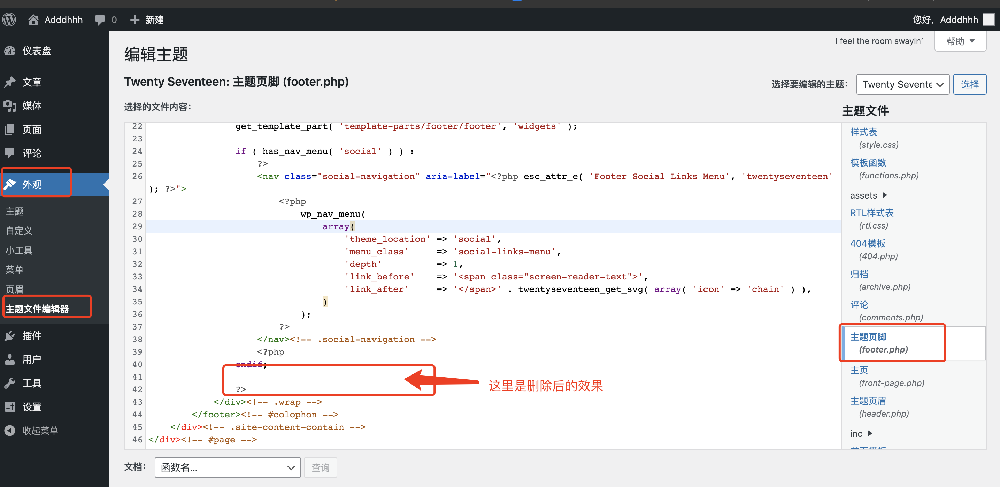
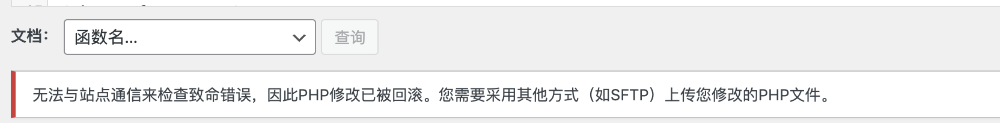
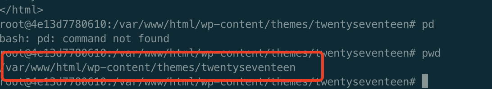
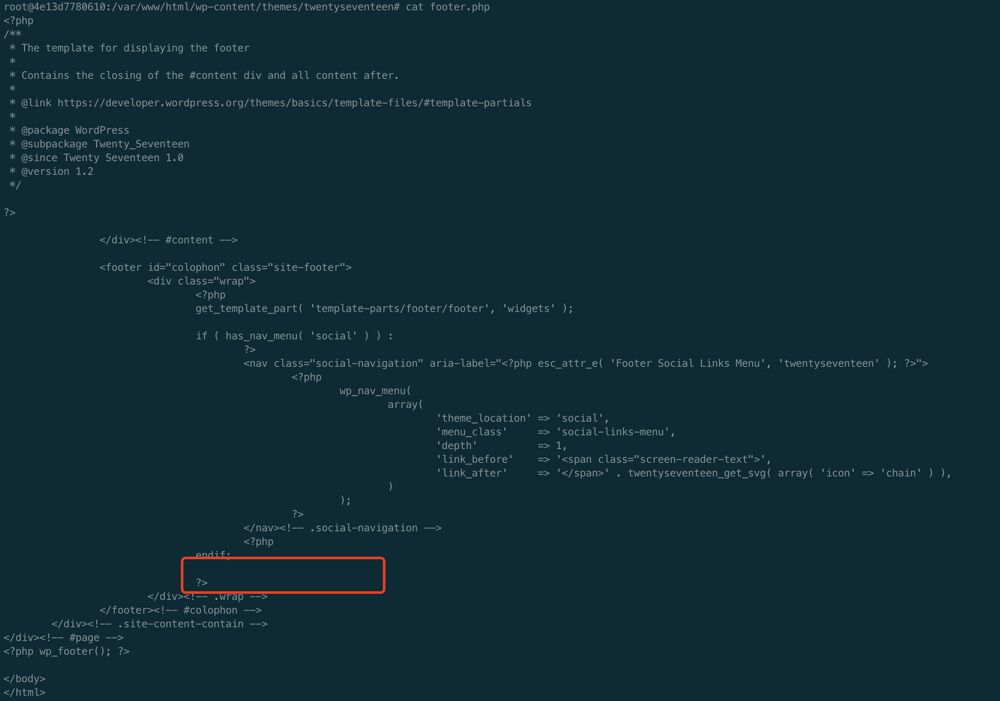
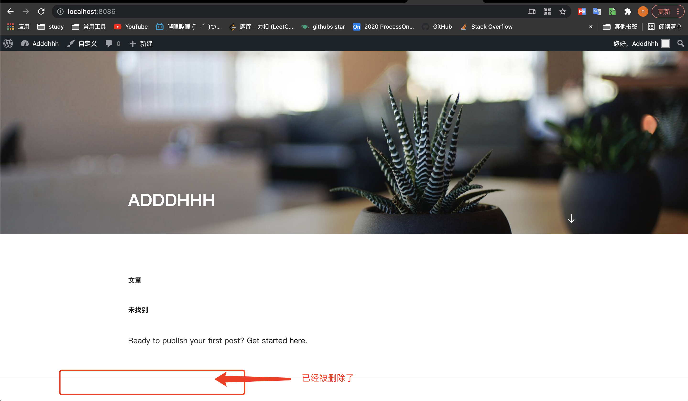

# WordPress

## 安装Mysql

docker 安装mysql

```shell
docker pull mysql
```

启动mysql

```shell
docker run -d -it  --name mysql -p 3306:3306 -v /Users/hening/hening/study/docker/mysql:/var/lib/mysql -e MYSQL_ROOT_PASSWORD='123456' mysql
```

进入mysql 容器

```shell
docker exec -it e1aa9e276278 /bin/bash
```

登录mysql

```
mysql -uroot -p
- 123456
```

**创建数据库**

```sql
CREATE database wordpress;
```

创建用户

```sql
CREATE USER wordpress IDENTIFIED BY 'wordpress';
```

查看用户

```sql
SELECT user,host FROM mysql.user;

```

用户授权

```sql
GRANT ALL ON wordpress.* TO wordpress@'%';

```

刷新

```sql
flush privileges;

```


## 安装 WordPress

```shell
docker pull wordpress
```


启动 wordpress

```shell
docker run -d -it --name wordpress -e WORDPRESS_DB_HOST=172.20.8.164:3306 -e WORDPRESS_DB_USER=wordpress -e WORDPRESS_DB_PASSWORD=wordpress -e WORDPRESS_DB_NAME=wordpress -p 80:80 wordpress
```


查看日志

```shell
docker logs 容器id
```


## 登录

http://localhost:8086/wp-admin/install.php?step=1


### 设置用户名

Adddhhh / DUhan1998


## WordPress 自定义文件

### WordPress 删除主题页脚 

主题页脚有一个商业推广，"自豪的使用WordPress" 需要将它去除掉 




在新版本的WordProess中 是无法直接修改文件的 会报错




所以直接进入服务器内部修改文件


### 安装VIM

docker 内部容器中安装VIM

```shell
apt-get update
apt-get install vim
```


### 修改php文件

进入对应目录，找到要修改的主题




删除对应的代码




### 效果

