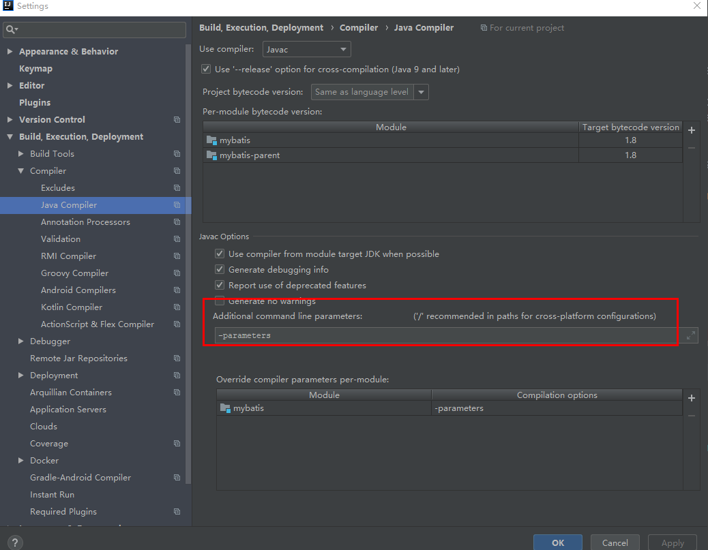

# JDK动态代理复习

```java
interface UserMapper{
    @Select("select * from ts_user where id =#{id} and name = #{name}")
     void say(Integer id, String name);
};

public class ProxyDemo {

    public static void main(String[] args) {
        UserMapper userMapper = (UserMapper) Proxy.newProxyInstance(ProxyDemo.class.getClassLoader(), new Class[]{UserMapper.class}, new InvocationHandler() {
            @Override
            public Object invoke(Object proxy, Method method, Object[] args) throws Throwable {
                Class<?>[] parameterTypes = method.getParameterTypes();
                System.out.println(Arrays.asList(parameterTypes));
                System.out.println(Arrays.asList(args));

                Select annotation = method.getAnnotation(Select.class);
                if(annotation != null) {
                    String[] value = annotation.value();
                    System.out.println(Arrays.asList(value));
                }
                return null;
            }
        });
        System.out.println(Arrays.asList(userMapper.getClass()));
        userMapper.say(1,"hening");
    }
}
```


打印结果

```
[class org.apache.ibatis.proxy.$Proxy0]
[class java.lang.Integer, class java.lang.String]
[1, hening]
[select * from ts_user where id =#{id} and name = #{name}]
```

**可以发现userMapper是通过Proxy为我们动态生成的一个类。**

**在执行userMapper的方法时，会被拦截到InvocationHandler的invoke中，先执行invoke中的方法**


通过反射获取到方法上的注解，以及注解的属性值。


**通过反射获取方法的参数名称，与传入的参数值进行匹配，构建一个map，用于对原始sql进行替换。**

```java
public static Map<String,Object> bindMethodArgs(Method method,Object[] args){
        Map<String,Object> result = new HashMap<>();
        Parameter[] parameters = method.getParameters();
        int i =0;
        for (Parameter parameter : parameters) {
            //判断是否进行开启参数名称编译，设置 -parameters
            System.out.println(parameter.isNamePresent());
           result.put(parameter.getName(),args[i]);
           i++;
        }
        System.out.println(result);
        return result;
    }
```


**备注**：

如果想要获取到方法的参数名称，那么需要IDEA进行java变编译的设置如下，如果不设置，那么获取到的参数名称就会为arg0，arg1，而不是真正的参数名称。



输出

{name=hening, id=1}
{name=hening, id=1}


# Mybatis原始Sql替换基本原理

