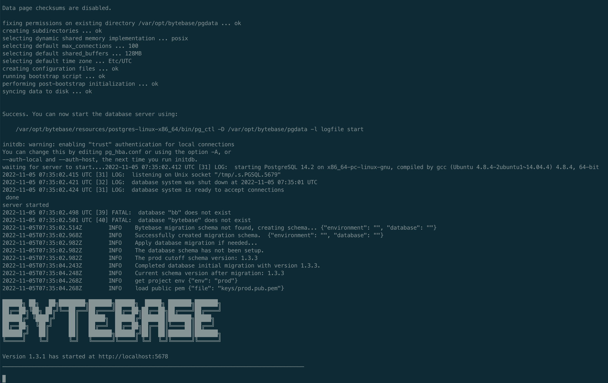
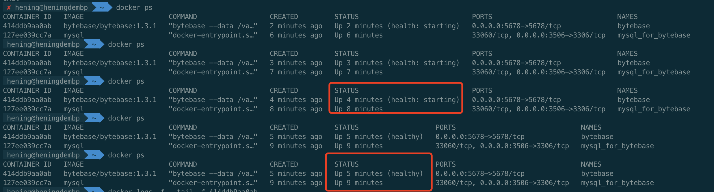
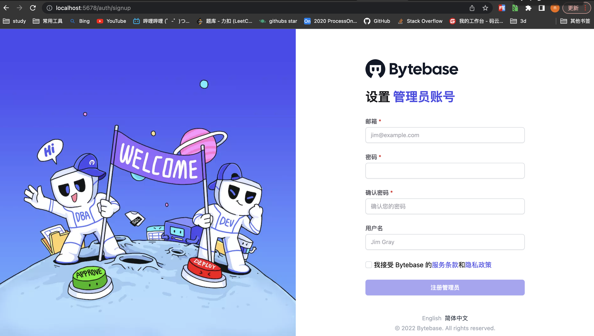

# 安装ByteBase docker 镜像

```
docker pull mysql:8
```


# 启动bytebase

```
docker run --init \
  --name bytebase \
  --restart always \
  --add-host host.docker.internal:192.168.3.105 \
  --publish 5678:5678 \
  --health-cmd "curl --fail http://localhost:5678/healthz || exit 1" \
  --health-interval 5m \
  --health-timeout 60s \
  -d bytebase/bytebase:1.3.1 \
  --data /var/opt/bytebase \
  --host http://localhost \
  --port 5678
```




# 查看是否启动成功

```
docker ps 
```




# 登录bytebase



## 配置管理员账号

```
13699448253@163.com
123445
13699448253
```


## 添加项目成员

一般不使用管理员账号操作

添加成员后，切换成员账号进行操作

