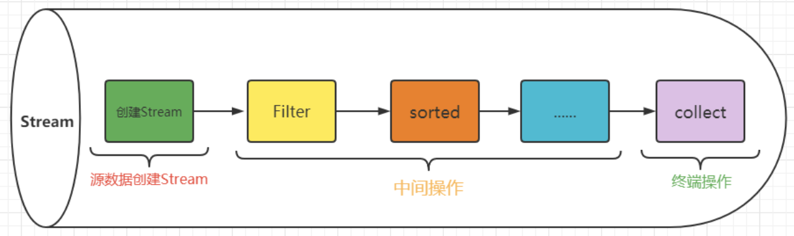

# Java Stream 流操作

## 概念

`Stream`将要处理的元素集合看作一种流，在流的过程中，借助`Stream API`对流中的元素进行操作，比如：筛选、排序、聚合等。

## 流程

## 中间操作符

## 终止操作符

## 常用操作

https://juejin.cn/post/6980135669368619045?utm_source=gold_browser_extension