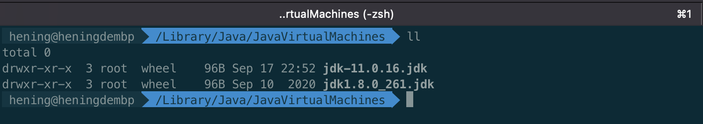
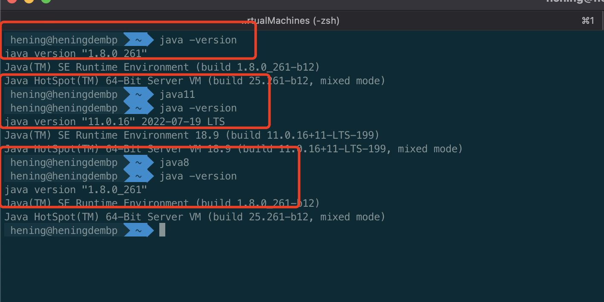

# JAVA 多版本统一管理

## JDK 下载

Oracle 官网下载




## JDK环境变量

更新~/.bash_profile 文件

```
# java8
java8=/Library/Java/JavaVirtualMachines/jdk1.8.0_261.jdk/Contents/Home

# java11
java11=/Library/Java/JavaVirtualMachines/jdk-11.0.16.jdk/Contents/Home

# default jdk8
export JAVA_HOME=$java8

alias java8="export JAVA_HOME=$java8"
alias java11="export JAVA_HOME=$java11"
```

更新后使文件生效

source  ~/.bash_profile

## JDK多版本管理

java -version 查看jDK版本

通过快捷命令实现快速切换java版本

- java11 
- Java8

