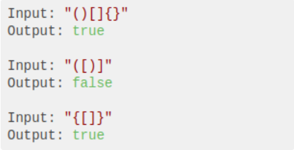
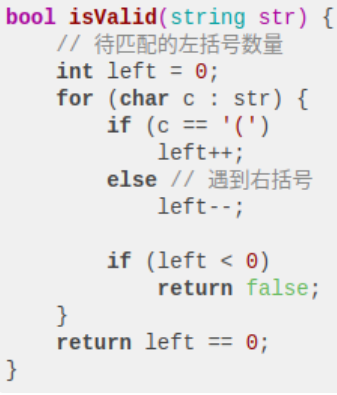
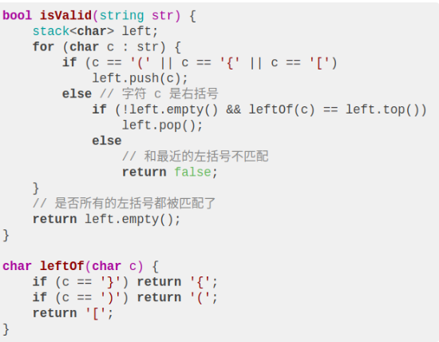

# 判断括号的合法性

对括号的合法性判断是一个很常见且实用的问题，比如说我们写的代码，编辑器和编译器都会检查括号是否正确闭合。而且我们的代码可能会包含三种括号`{}`，判断起来有一点难度。

本文就来聊一道关于括号合法性判断的算法题，相信能加深你对**栈**这种数据结构的理解。

题目很简单，输入一个字符串，其中包含`{}`六种括号，请你判断这个字符串组成的括号是否合法。

## 处理一种括号

字符串中只有圆括号，如果想让括号字符串合法，那么必须做到：

**每个右括号****`)`的左边必须有一个左括号`(`和它匹配**。

比如说字符串`()))((`中，索引为 2 和 3 的两个右括号**左边**就没有左括号匹配，所以这个括号组合是不合法的。

所以我们可以一边遍历一边记录遇到左括号的个数，每次遇到右括号就匹配一个左括号数。根据这个思路，我们可以写出算法：

如果只有圆括号，这样就能正确判断合法性。对于三种括号的情况，我一开始想模仿这个思路，定义三个变量`left1`，`left2`，`left3`分别处理每种括号，虽然要多写不少 if else 分支，但是似乎可以解决问题。

但实际上直接照搬这种思路是不行的，比如说只有一个括号的情况下`(())`是合法的，但是多种括号的情况下，`[(])`显然是不合法的。

仅仅记录每种左括号出现的次数已经不能做出正确判断了，我们要加大存储的信息量，可以利用栈来模仿类似的思路。

## 处理多种括号

栈是一种先进后出的数据结构，处理括号问题的时候尤其有用。

我们这道题就用一个名为`left`的栈代替之前思路中的`left`变量，**遇到左括号就入栈，遇到右括号就去栈中寻找最近的左括号，看是否匹配**。

**代码核心：**核心就是利用了栈先进后出的特点，栈顶元素就是最近的左括号，遇到右括号就在栈顶判断就行了。遇到括号相关的问题，可以优先考虑一下是否能借助栈来解决。

