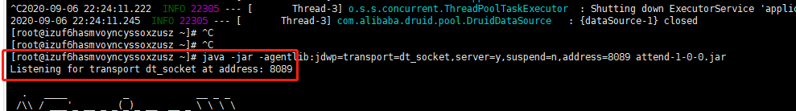
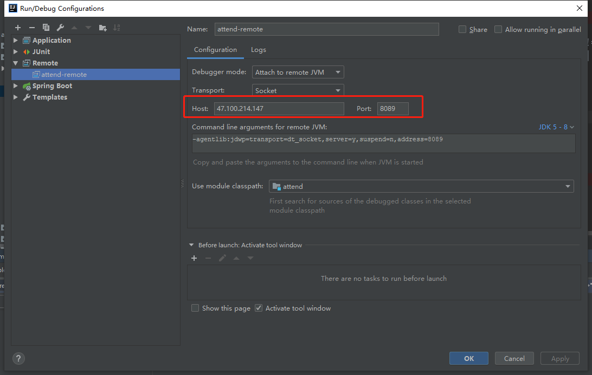
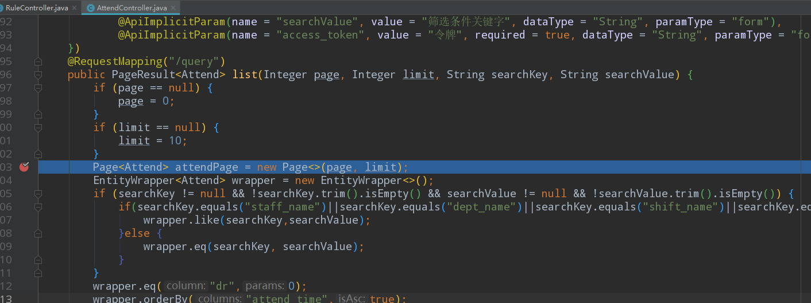

# 远程调试

命令：

```
java -jar -agentlib:jdwp=transport=dt_socket,server=y,suspend=n,address=8089 attend-1-0-0.jar 
```

显示如下则成功监听指定端口

Listening for transport dt_socket at address: 8089




## 调试

IDEA连接远程



在页面点击功能节点，访问接口，在IDEA中打断点进行调试



成功进入断点进行调试

