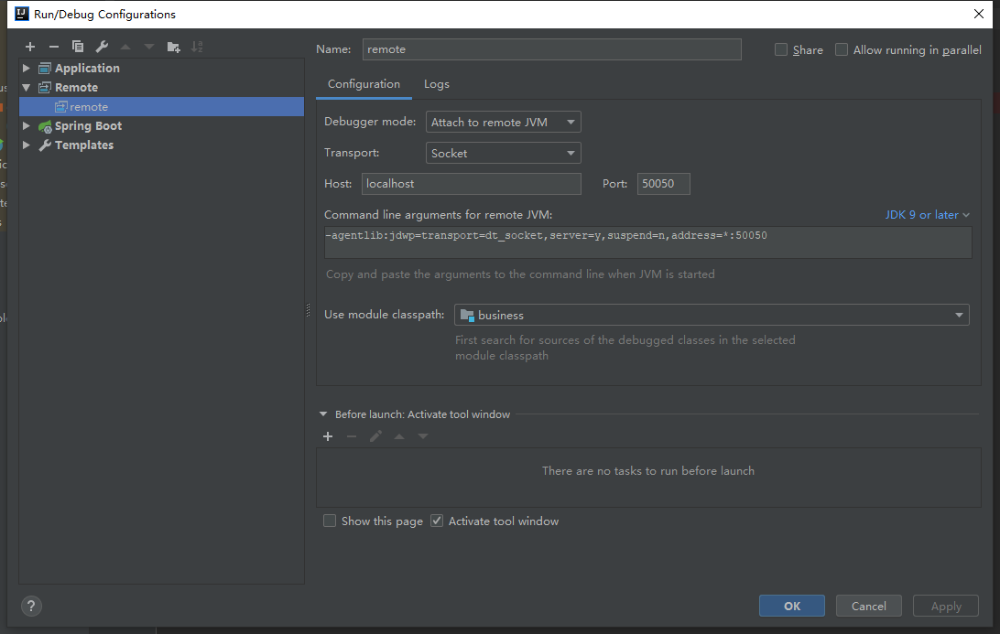

# 调试任何Java程序

## 调试单个文件

简单地一个main方法，打印环境信息

```java
package com.he.business.debug;

import java.util.Map;

public class RemoteDebug {
    public static void main(String[] args) {
        System.out.println("------------------start------------------");

        System.out.println("get all the system environment");
        Map<String, String> envs = System.getenv();

        System.out.println("\nprint out the contains `HOME`");
        System.out.println("------env HOME------");
        envs.entrySet().stream()
                .filter(env -> env.getKey().contains("HOME"))
                .forEach(env -> {
                    System.out.println(env.getKey() + ":" + env.getValue());
                });

        System.out.println("------------------end------------------");
    }
}

```


### 编译Class文件

使用maven clean complie 编译为class文件


### IDEA配置远程调试




### 启动远程调试监听

进入target/class目录执行以下命令就会启动监听，程序就是停止执行，等待调试客户端的连接之后才会执行

```
java -agentlib:jdwp=transport=dt_socket,address=127.0.0.1:50050,suspend=y,server=y com.he.business.RemoteDebug
```

启动IDEA远程调试后，就会自动进入到断点，就可以进行调试拉。


## 调试一切Java程序

更改java默认环境变量，开启远程调试。

当设置这个命令后，其他任何JVM启动的时候，都会识别到这个参数，开启阻塞，等待远程调试客户端连接。


