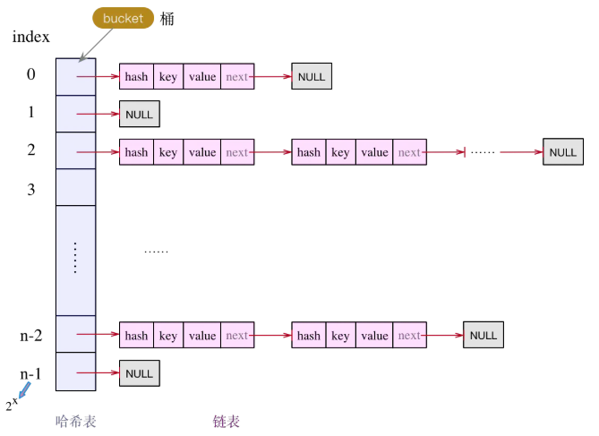
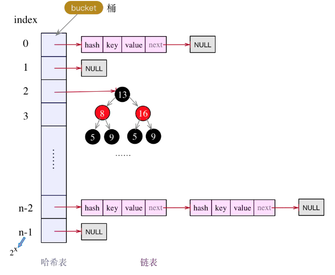
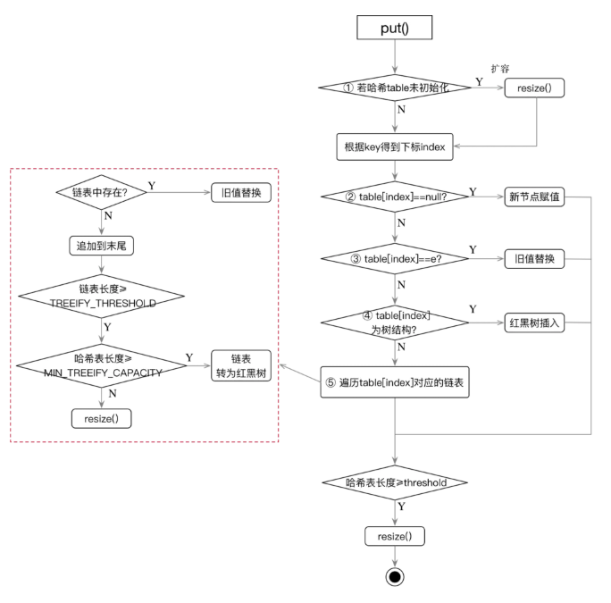

### 静态内部类 Node

实现了Map.Entry<K,V>，重写了hashcode方法，为key的hashcode 与 value的hashcode 进行异或操作

```java
static class Node<K,V> implements Map.Entry<K,V> {
        final int hash;
        final K key;
        V value;
        Node<K,V> next;

        Node(int hash, K key, V value, Node<K,V> next) {
            this.hash = hash;
            this.key = key;
            this.value = value;
            this.next = next;
        }

        public final K getKey()        { return key; }
        public final V getValue()      { return value; }
        public final String toString() { return key + "=" + value; }

        public final int hashCode() {
            return Objects.hashCode(key) ^ Objects.hashCode(value);
        }

        public final V setValue(V newValue) {
            V oldValue = value;
            value = newValue;
            return oldValue;
        }

        public final boolean equals(Object o) {
            if (o == this)
                return true;
            if (o instanceof Map.Entry) {
                Map.Entry<?,?> e = (Map.Entry<?,?>)o;
                if (Objects.equals(key, e.getKey()) &&
                    Objects.equals(value, e.getValue()))
                    return true;
            }
            return false;
        }
    }
```


### put操作

put操作实际上是将key - value存到了一个Node中，node的hash属性存的是 key的hash值。

首先判断table（即一个Node数组）是否为空，如果为空，先进行开辟空间操作，执行resize()方法

```java
//该表在首次使用时初始化，并根据需要调整大小。分配时，长度始终是2的幂
// transient关键字：将不需要序列化的属性前添加关键字transient，序列化对象的时候，这个属性就不会被序列化
// 1、transient关键字修饰的属性，生命周期只会在内存中，不会持久化到内存
// 2、 被transient关键字修饰过得变量，如果是通过实现Exteranlizable接口，重写writeExternal和readExternal方法，那么可以进行序列化
// 3、被static修饰的静态变量，天生不会被序列化。因为static修饰的变量存在方法区。序列化只能虚化列化堆内存
transient Node<K,V>[] table;
```

resize 方法根据设置的初始化大小（默认16，扩容因子0.75）初始化map。

记录下map下次的扩容点（newThr，当前map的大小>newThr时，再次执行resize方法进行扩容）

将 hash值、key、value赋值给Node，设置到Node数组中即完成了put操作。

# 面试题

##  数据结构

HashMap的实现框架都是**哈希表 + 链表**的组合方式




## put方法

put方法的处理过程，可拆分为四部分

**part1：特殊key值处理，key为null；**

-  HashMap中，是允许key、value都为null的，且key为null只存一份，多次存储会将旧value值覆盖
-  key为null的存储位置，都统一放在下标为**0**的bucket，即：table[0]位置的链表
- 如果是第一次对key=null做put操作，将会在table[0]的位置新增一个Entry结点，使用头插法做链表插入

**part2：计算table中目标bucket的下标；**


**part3：指定目标bucket，遍历Entry结点链表，若找到key相同的Entry结点，则做替换；**

**part4：若未找到目标Entry结点，则新增一个Entry结点。**


## 扩容操作

1、扩容后大小是扩容前的2倍

2、数据搬迁，从旧table迁到扩容后的新table。 为避免碰撞过多，先决策是否需要对每个Entry链表结点重新hash，然后根据hash值计算得到bucket下标，然后使用头插法做结点迁移


## Get方法

- 先是通过key的hash值计算目标bucket的下标
- 然后遍历对应bucket上的链表，逐个对比，得到结果

```java
public V get(Object key) {
    if (key == null)
        return getForNullKey();
    Entry<K,V> entry = getEntry(key);


    return null == entry ? null : entry.getValue();
}


/**
 * Returns the entry associated with the specified key in the
 * HashMap.  Returns null if the HashMap contains no mapping
 * for the key.
 */
final Entry<K,V> getEntry(Object key) {
	// 得到hash值
    int hash = (key == null) ? 0 : hash(key);
    // 获取Entry下标
    for (Entry<K,V> e = table[indexFor(hash, table.length)];
         e != null;
         e = e.next) {
        Object k;
        if (e.hash == hash &&
            ((k = e.key) == key || (key != null && key.equals(k))))
            return e;
    }
    return null;
}
```


## Map迭代

### Iterator迭代器

逐个获取哈希table中的每个bucket中的每个Entry结点

### Map.EntrySet 同时得到 Key  Value


### foreach


### 遍历KeySet

若只需要使用key则使用 Map.KeySet，如果需要使用key-value则不建议使用这个


## fail-fast策略

快速失效策略，当遇到可能会诱导失败的条件时立即上报错误，快速失效系统往往被设计在立即终止正常操作过程，而不是尝试去继续一个可能会存在错误的过程。就是尽可能早的发现问题，立即终止当前执行过程，由更高层级的系统来做处理。

如果需要在for循环删除Map中删除一个元素，直接删除会报错，正确做法是使用iterator.remove


## JDK1.8的实现

结构：哈希表+链表+红黑树




链表结点的定义也由**`Entry`**类转为了**`Node`**类

### put方法



### 扩容操作

**场景1**：哈希table为null或长度为0；
**场景2**：Map中存储的k-v对数量超过了阈值**`threshold`**；
**场景3**：链表中的长度超过了`TREEIFY_THRESHOLD`，但表长度却小于`MIN_TREEIFY_CAPACITY`。


### Get方法

1、根据key计算hash ，定位存储在hash表的位置，如果不存在，直接返回null

2、如果存在，并且是树结构，走红黑树查找

3、如果是链表，遍历链表，返回value


## HashMap、ConcurrentHashMap、HashTable的区别

HashMap不是同步的、线程不安全的和不适合应用于多线程并发环境下，而`ConcurrentHashMap`是线程安全的集合容器，特别是在多线程和并发环境中，通常作为`Map`的主要实现


