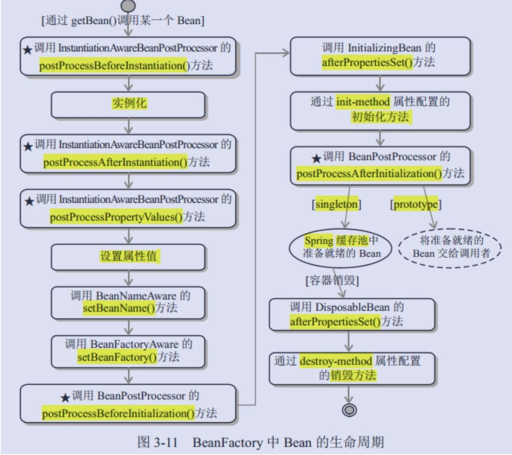

# Spring相关

## Spring中重要的模块

- **Spring Core：** 基础,可以说 Spring 其他所有的功能都需要依赖于该类库。主要提供 IoC 依赖注入功能。
- **Spring Aspects** ： 该模块为与AspectJ的集成提供支持。
- **Spring AOP** ：提供了面向切面的编程实现。
- **Spring JDBC** : Java数据库连接。
- **Spring JMS** ：Java消息服务。
- **Spring ORM** : 用于支持Hibernate等ORM工具。
- **Spring Web** : 为创建Web应用程序提供支持。
- **Spring Test** : 提供了对 JUnit 和 TestNG 测试的支持。

## IOC 是什么？

Ioc—Inversion of Control，即“控制反转”，不是什么技术，而是一种设计思想。在Java开发中，Ioc意味着将你设计好的对象交给容器控制，而不是传统的在你的对象内部直接控制

### **IOC 能做什么？**

IoC不是一种技术，只是一种思想，一个重要的面向对象编程的法则，它能指导我们如何设计出松耦合、更优良的程序。传统应用程序都是由我们在类内部主动创建依赖对象，从而导致类与类之间高耦合，难于测试；有了IoC容器后，把创建和查找依赖对象的控制权交给了容器，由容器进行注入组合对象，所以对象与对象之间是松散耦合，这样也方便测试，利于功能复用，更重要的是使得程序的整个体系结构变得非常灵活。

其实IoC对编程带来的最大改变不是从代码上，而是从思想上，发生了“主从换位”的变化。应用程序原本是老大，要获取什么资源都是主动出击，但是在IoC/DI思想中，应用程序就变成被动的了，被动的等待IoC容器来创建并注入它所需要的资源了。

IoC很好的体现了面向对象设计法则之一—— 好莱坞法则：“别找我们，我们找你”；即由IoC容器帮对象找相应的依赖对象并注入，而不是由对象主动去找。

### IOC 和DI

DI—Dependency Injection，即“依赖注入”：是组件之间依赖关系由容器在运行期决定，形象的说，即由容器动态的将某个依赖关系注入到组件之中。依赖注入的目的并非为软件系统带来更多功能，而是为了提升组件重用的频率，并为系统搭建一个灵活、可扩展的平台。通过依赖注入机制，我们只需要通过简单的配置，而无需任何代码就可指定目标需要的资源，完成自身的业务逻辑，而不需要关心具体的资源来自何处，由谁实现。

### IOC如何实现的？

1）读取Resource(applicationcontext.xml)获取BeanDefinition 注册到(id，type，properties) Bean定义注册表中；

2）第一次向容器getBean操作会触发Bean的创建过程（createBean）,实列化一个Bean时 ,根据BeanDefinition中类信息等实列化Bean；

3）将实列化的Bean放到Bean缓存池内；

4）此后再次获取向容器getBean就会从缓存中获取。

## AOP

AOP(Aspect-Oriented Programming:面向切面编程)能够将那些与业务无关，**却为业务模块所共同调用的逻辑或责任（例如事务处理、日志管理、权限控制等）封装起来**，便于**减少系统的重复代码**，**降低模块间的耦合度**，并**有利于未来的可拓展性和可维护性**。

**Spring AOP就是基于动态代理的**，如果要代理的对象，实现了某个接口，那么Spring AOP会使用**JDK Proxy**，去创建代理对象，而对于没有实现接口的对象，就无法使用 JDK Proxy 去进行代理了，这时候Spring AOP会使用**Cglib** ，这时候Spring AOP会使用 **Cglib** 生成一个被代理对象的子类来作为代理，如下图所示：

### Aspectj AOP  和 Spring AOP的区别

**Spring AOP 属于运行时增强，而 AspectJ 是编译时增强。** Spring AOP 基于代理(Proxying)，而 AspectJ 基于字节码操作(Bytecode Manipulation)。

Spring AOP 已经集成了 AspectJ ，AspectJ 应该算的上是 Java 生态系统中最完整的 AOP 框架了。AspectJ 相比于 Spring AOP 功能更加强大，但是 Spring AOP 相对来说更简单，

如果我们的切面比较少，那么两者性能差异不大。但是，当切面太多的话，最好选择 AspectJ ，它比Spring AOP 快很多。

## Spring Bean

- singleton : 唯一 bean 实例，Spring 中的 bean 默认都是单例的。
- prototype : 每次请求都会创建一个新的 bean 实例。
- request : 每一次HTTP请求都会产生一个新的bean，该bean仅在当前HTTP request内有效。
- session : 每一次HTTP请求都会产生一个新的 bean，该bean仅在当前 HTTP session 内有效。
- global-session： 全局session作用域，仅仅在基于portlet的web应用中才有意义，Spring5已经没有了。Portlet是能够生成语义代码(例如：HTML)片段的小型Java Web插件。它们基于portlet容器，可以像servlet一样处理HTTP请求。但是，与 servlet 不同，每个 portlet 都有不同的会话

### Spring Bean的线程安全问题

大部分时候我们并没有在系统中使用多线程，所以很少有人会关注这个问题。单例 bean 存在线程问题，主要是因为当多个线程操作同一个对象的时候，对这个对象的非静态成员变量的写操作会存在线程安全问题。

常见的有两种解决办法：

1. 在Bean对象中尽量避免定义可变的成员变量（不太现实）。
2. 在类中定义一个ThreadLocal成员变量，将需要的可变成员变量保存在 ThreadLocal 中（推荐的一种方式）。

### @Component 和 @Bean的区别

1. 作用对象不同: `@Component` 注解作用于类，而`@Bean`注解作用于方法。
2. `@Component`通常是通过类路径扫描来自动侦测以及自动装配到Spring容器中（我们可以使用 `@ComponentScan` 注解定义要扫描的路径从中找出标识了需要装配的类自动装配到 Spring 的 bean 容器中）。`@Bean` 注解通常是我们在标有该注解的方法中定义产生这个 bean,`@Bean`告诉了Spring这是某个类的示例，当我需要用它的时候还给我。
3. `@Bean` 注解比 `Component` 注解的自定义性更强，而且很多地方我们只能通过 `@Bean` 注解来注册bean。比如当我们引用第三方库中的类需要装配到 `Spring`容器时，则只能通过 `@Bean`来实现。

### 将一个类声明为Spring Bean有哪些方法

我们一般使用 `@Autowired` 注解自动装配 bean，要想把类标识成可用于 `@Autowired` 注解自动装配的 bean 的类,采用以下注解可实现：

- `@Component` ：通用的注解，可标注任意类为 `Spring` 组件。如果一个Bean不知道属于哪个层，可以使用`@Component` 注解标注。
- `@Repository` : 对应持久层即 Dao 层，主要用于数据库相关操作。
- `@Service` : 对应服务层，主要涉及一些复杂的逻辑，需要用到 Dao层。
- `@Controller` : 对应 Spring MVC 控制层，主要用于接受用户请求并调用 Service 层返回数据给前端页面。

### Spring Bean的声明周期

## SpringIOC初始化流程

1. Spring启动。
2. 加载配置文件，xml、JavaConfig、注解、其他形式等等，将描述我们自己定义的和Spring内置的定义的Bean加载进来。
3. 加载完配置文件后将配置文件转化成统一的Resource来处理。
4. 使用Resource解析将我们定义的一些配置都转化成Spring内部的标识形式：BeanDefinition。
5. 在低级的容器BeanFactory中，到这里就可以宣告Spring容器初始化完成了，Bean的初始化是在我们使用Bean的时候触发的；在高级的容器ApplicationContext中，会自动触发那些lazy-init=false的单例Bean，让Bean以及依赖的Bean进行初始化的流程，初始化完成Bean之后高级容器也初始化完成了。（**Bean初始化流程看上面**）
6. 在我们的应用中使用Bean。
7. Spring容器关闭，销毁各个Bean。