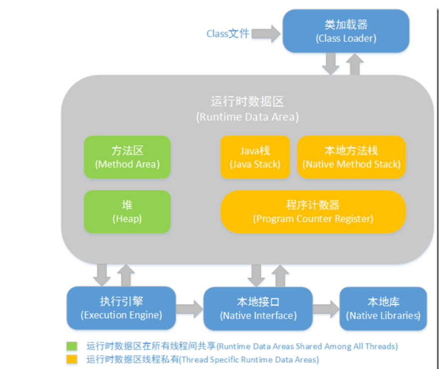

# JVM相关

## JVM内存结构

JVM内存结构主要有三大块：***\*堆内存\****、***\*方法区\****和***\*栈\****。堆内存是JVM中最大的一块由***\*年轻代\****和***\*老年代\****组成，而年轻代内存又被分成三部分，***\*Eden空间\****、***\*From Survivor空间\****、***\*To Survivor空间\****,默认情况下年轻代按照8:1:1的比例来分配；

方法区存储类信息、常量、静态变量等数据，是线程共享的区域，为与Java堆区分，方法区还有一个别名Non-Heap(非堆)；栈又分为java虚拟机栈和本地方法栈主要用于方法的执行。

JVM常用控制参数

-Xms设置堆的最小空间大小。

-Xmx设置堆的最大空间大小。

-XX:NewSize设置新生代最小空间大小。

-XX:MaxNewSize设置新生代最大空间大小。

-XX:PermSize设置永久代最小空间大小。

-XX:MaxPermSize设置永久代最大空间大小。

-Xss设置每个线程的堆栈大小。

示意图

每个区域的作用：

### Java堆 Heap

对于大多数应用来说，Java堆（Java Heap）是Java虚拟机所管理的内存中***\*最大\****的一块。Java堆是被所有线程共享的一块内存区域，在虚拟机启动时创建。此内存区域的唯一目的就是存放对象实例，***\*几乎所有的对象实例都在这里分配内存。\****

   Java堆是垃圾收集器管理的主要区域，因此很多时候也被称做“***\*GC堆\****”。如果从内存回收的角度看，由于现在收集器基本都是采用的分代收集算法，所以Java堆中还可以细分为：***\*新生代和老年代；再细致一点的有Eden空间、From Survivor空间、To Survivor空间等。\****

根据Java虚拟机规范的规定，Java堆可以处于物理上不连续的内存空间中，只要逻辑上是连续的即可，就像我们的磁盘空间一样。在实现时，既可以实现成固定大小的，也可以是可扩展的，不过当前主流的虚拟机都是按照可扩展来实现的（通过-Xmx和-Xms控制）。

如果在堆中没有内存完成实例分配，并且堆也无法再扩展时，将会抛出OutOfMemoryError异常

### 方法区（Method Area）

方法区（Method Area）与Java堆一样，是各个线程共享的内存区域，***\*它用于存储已被虚拟机加载的类信息、常量、静态变量、即时编译器编译后的代码等数据\****。虽然Java虚拟机规范把方法区描述为堆的一个逻辑部分，但是它却有一个别名叫做Non-Heap（非堆），目的应该是与Java堆区分开来。

根据Java虚拟机规范的规定，当方法区无法满足内存分配需求时，将抛出OutOfMemoryError异常。

### 程序计数器（Program Counter Register）

程序计数器（Program Counter Register）是一块较小的内存空间，它的作用可以看做是当前线程所执行的字节码的行号指示器。在虚拟机的概念模型里（仅是概念模型，各种虚拟机可能会通过一些更高效的方式去实现），字节码解释器工作时就是通过改变这个计数器的值来选取下一条需要执行的字节码指令，分支、循环、跳转、异常处理、线程恢复等基础功能都需要依赖这个计数器来完成。 
由于Java虚拟机的多线程是通过线程轮流切换并分配处理器执行时间的方式来实现的，在任何一个确定的时刻，一个处理器（对于多核处理器来说是一个内核）只会执行一条线程中的指令。因此，为了线程切换后能恢复到正确的执行位置，每条线程都需要有一个独立的程序计数器，各条线程之间的计数器互不影响，独立存储，我们称这类内存区域为“线程私有”的内存。
   如果线程正在执行的是一个Java方法，这个计数器记录的是正在执行的虚拟机字节码指令的地址；如果正在执行的是Natvie方法，这个计数器值则为空（Undefined）。

### JVM栈（JVM Stacks

与程序计数器一样，Java虚拟机栈（Java Virtual Machine Stacks）也是线程私有的，**它的生命周期与线程相同**。**虚拟机栈描述的是Java方法执行的内存模型**：每个方法被执行的时候都会同时创建一个栈帧（Stack Frame）用于存储局部变量表、操作栈、动态链接、方法出口等信息。**每一个方法被调用直至执行完成的过程，就对应着一个栈帧在虚拟机栈中从入栈到出栈的过程**

### 本地方法栈（Native Method Stacks）

本地方法栈（Native Method Stacks）与虚拟机栈所发挥的作用是非常相似的，其区别不过是虚拟机栈为虚拟机执行Java方法（也就是字节码）服务，而**本地方法栈则是为虚拟机使用到的Native方法服务**。虚拟机规范中对本地方法栈中的方法使用的语言、使用方式与数据结构并没有强制规定，因此具体的虚拟机可以自由实现它

##  垃圾回收 可达性分析算法

这个算法的基本思想就是通过⼀系列的称为 **“GC Roots”** 的对象作为起点，从这些节点开始向下搜索，

节点所⾛过的路径称为引⽤链，当⼀个对象到 GC Roots 没有任何引⽤链相连的话，则证明此对象是不

可⽤的。

可作为GC Roots的对象

- 虚拟机栈（栈帧中的本地变量表）中引用的对象
- 方法区中的类静态属性引用的对象
- 方法区中常量引用的对象
- Thread - 活着的线程，所引用的对象

