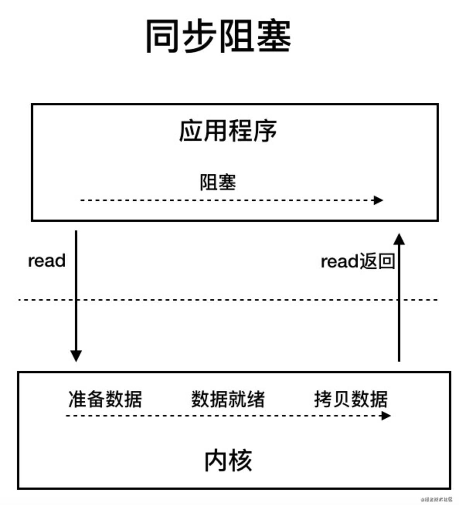
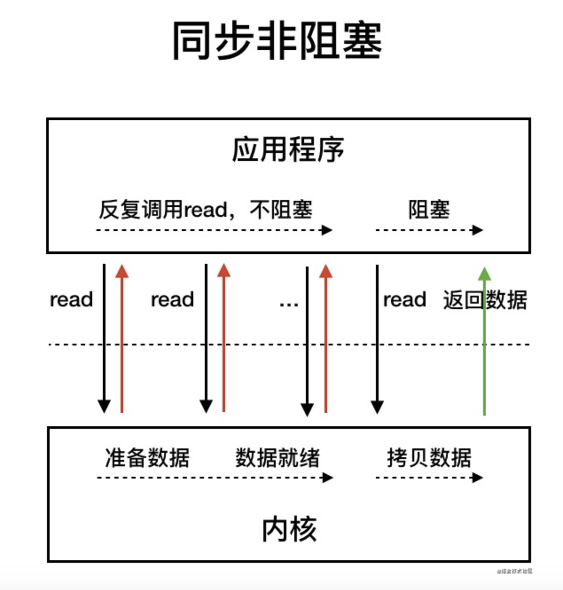
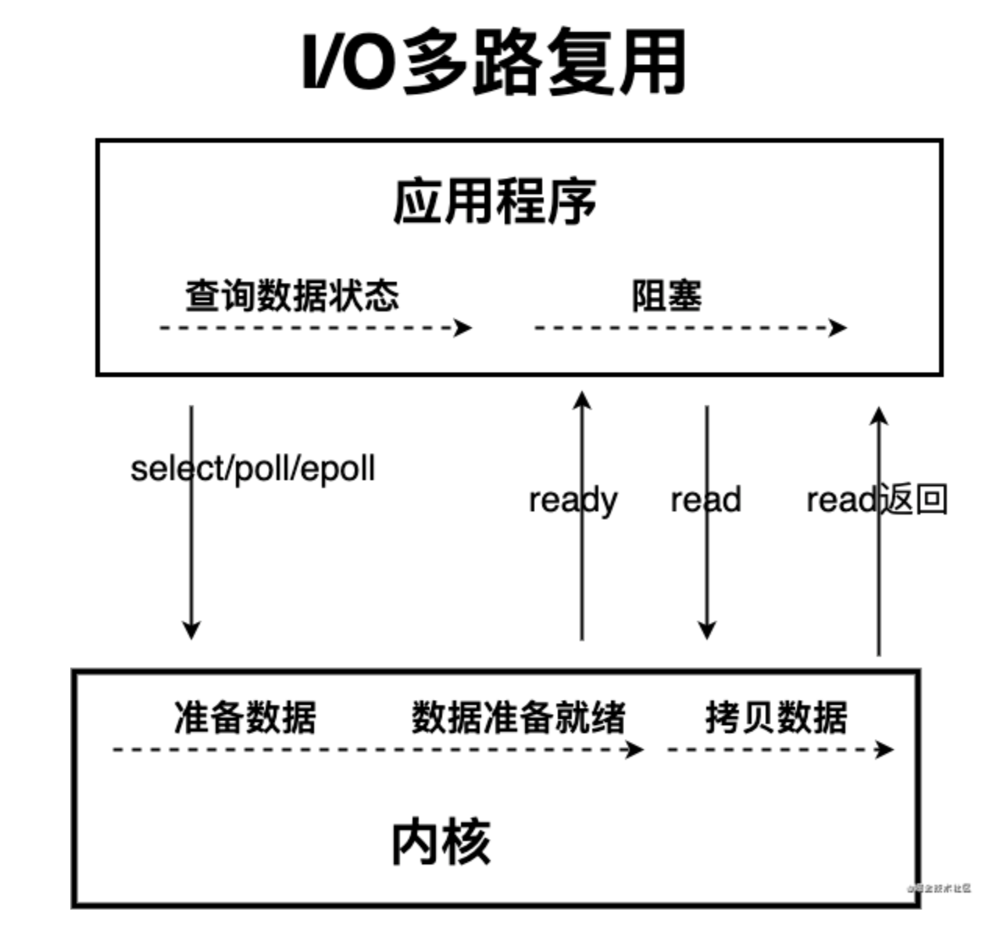

# IO相关知识

两种IO

磁盘IO：读写磁盘

网络IO：网络连接的读写

发起IO发生的步骤

1. 内核等待 I/O 设备准备好数据

1. 内核将数据从内核空间拷贝到用户空间。

## IO模型

同步阻塞IO、同步非阻塞IO、IO多路复用、信号驱动IO、异步IO

## Java中的 IO模型

**BIO**

同步阻塞 IO 模型中，应用程序发起 read 调用后，会一直阻塞，直到在内核把数据拷贝到用户空间.

外部发起一个请求，应用创建一个线程去调用IO，阻塞知道读取出数据，每发起一个请求，就创建一个线程去做IO处理。**在连接数不多的时候没有问题，如果连接数过多会出现问题。**

**NIO**

NIO 于 Java 1.4 中引入，对应 `java.nio` 包，提供了 `Channel` , `Selector`，`Buffer` 等抽象。NIO 中的 N 可以理解为 Non-blocking，不单纯是 New。它支持面向Buffer的，基于channel的 I/O 操作方法。selector用于监听多个Channel的事件，比如连接打开或数据到达，一个线程可以实现对多个数据Channel的管理。Java NIO基于Channel和Buffer进行I/O读写操作，并且数据总是被从Channel读取到 Buffer中，或者从Buffer写入Channel中。**是属于IO多路复用模型**

核心就是通过**选择器 ( Selector )** 的概念，也可以被称为 **多路复用器**，通过一个线程管理多个channel，轮训判断读写完成的channel然后返回。

**同步非阻塞模型**

同步非阻塞 IO 模型中，应用程序会一直发起 read 调用，等待数据从内核空间拷贝到用户空间的这段时间里，线程依然是阻塞的，直到在内核把数据拷贝到用户空间。通过轮询操作，避免了一直阻塞。

但是，这种 IO 模型同样存在问题：**应用程序不断进行 I/O 系统调用轮询数据是否已经准备好的过程是十分消耗 CPU 资源的**

**IO复用模型**

通过一种新的系统调用（select、poll、epoll），一个进程可以监视多个文件描述符，一旦某个描述符就绪（一般是内核缓冲区可读/可写），内核kernel能够通知程序进行相应的IO系统调用。

IO多路复用模型的基本原理就是select/epoll系统调用，单个线程不断的轮询select/epoll系统调用所负责的成百上千的socket连接，当某个或者某些socket网络连接有数据到达了，就返回这些可以读写的连接。因此，好处也就显而易见了——通过一次select/epoll系统调用，就查询到到可以读写的一个甚至是成百上千的网络连接。

**注意点：**

在这种模式中，首先不是进行read系统调动，而是进行select/epoll系统调用。当然，这里有一个前提，需要将目标网络连接，提前注册到select/epoll的可查询socket列表中

**只有真正最后读写数据（内核态写到用户空间）的时候才是阻塞的**

**AIO**

基于事件回调机制，完成后系统通过事件回调通知线程进行后续操作。

