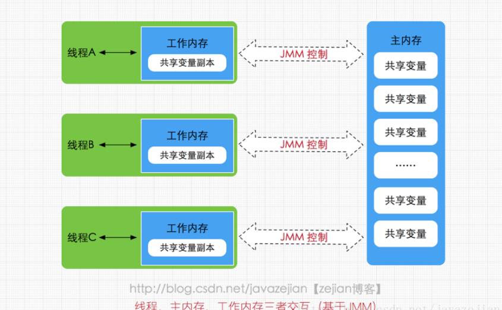

# Java内存模型

Java内存模型(即Java Memory Model，简称JMM)本身是一种抽象的概念，并不真实存在，它描述的是一组规则或规范，通过这组规范定义了程序中各个变量（包括实例字段，静态字段和构成数组对象的元素）的访问方式。

由于JVM运行程序的实体是线程，而每个线程创建时JVM都会为其创建一个工作内存(有些地方称为栈空间)，用于存储线程私有的数据，而Java内存模型中规定所有变量都存储在主内存，主内存是共享内存区域，所有线程都可以访问，但线程对变量的操作(读取赋值等)必须在工作内存中进行，首先要将变量从主内存拷贝的自己的工作内存空间，然后对变量进行操作，操作完成后再将变量写回主内存，不能直接操作主内存中的变量，工作内存中存储着主内存中的变量副本

示意图：

参考：

[https://blog.csdn.net/javazejian/article/details/72772461#java%E5%86%85%E5%AD%98%E6%A8%A1%E5%9E%8B%E6%A6%82%E8%BF%B0](https://blog.csdn.net/javazejian/article/details/72772461#java内存模型概述)

