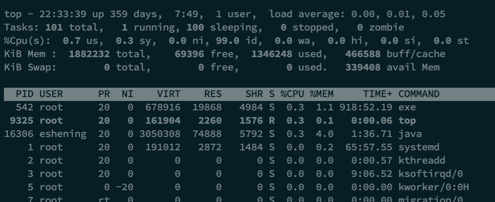

# Liunx相关

## ps

Linux ps （英文全拼：process status）命令用于显示当前进程的状态，类似于 windows 的任务管理器

```shell
ps -ef | grep 关键字
```

## pwd

查看当前路径

## 查看文件

- vi 文件名 #编辑方式查看，可修改
- cat 文件名 #显示全部文件内容
- more 文件名 #分页显示文件内容
- less 文件名 #与 more 相似，更好的是可以往前翻页
- tail 文件名 #仅查看尾部，还可以指定行数
- head 文件名 #仅查看头部,还可以指定行数

## 进程状态

STAT: 该进程的状态:

- D: 无法中断的休眠状态 (通常 IO 的进程)
- R: 正在执行中
- S: 静止状态
- T: 暂停执行
- Z: 不存在但暂时无法消除
- W: 没有足够的记忆体分页可分配
- <: 高优先序的行程
- N: 低优先序的行程
- L: 有记忆体分页分配并锁在记忆体内 (实时系统或捱A I/O)

## 如果后台运行任务

加 & 号在命令结束的位置

## 搜索文件

- find <指定目录> <指定条件> <指定动作>
- whereis 加参数与文件名
- locate 只加文件名
- find 直接搜索磁盘，较慢。
- find / -name "string*"

## 网络是否连通

Netstat -anp -anx 等


-a :所有连接

-t：tcp连接

-u:udp连接

-x：所有unix socket

-n:使用ip地址，而不是域名

-l：只列出监听端口

## top命令



前5行的意义

- 第1行：系统时间、运行时间、登录终端数、系统负载（三个数值分别为1分钟、5分钟、15分钟内的平均值，数值越小意味着负载越低）。
- 第2行：进程总数、运行中的进程数、睡眠中的进程数、停止的进程数、僵死的进程数。
- 第3行：用户占用资源百分比、系统内核占用资源百分比、改变过优先级的进程资源百分比、空闲的资源百分比等。其中数据均为CPU数据并以百分比格式显示，例如“99.9 id”意味着有99.9%的CPU处理器资源处于空闲。
- 第4行：物理内存总量、内存空闲量、内存使用量、作为内核缓存的内存量。
- 第5行：虚拟内存总量、虚拟内存空闲量、虚拟内存使用量、已被提前加载的内存量。

## grep命令

语法：grep [-acinv] [--color=auto] '要查找的字符串' filename

- a:将binary文件以text文件的方式查找数据
- c:计算找到查找字符串的次数
- i:忽略大小写的不同
- n:输出行号
- v:反向选择，显示出没有查找字符串的内容的行
- -color-auto:将找到的字符串以特殊颜色显示

grep [-A] [-B] [--color=auto]'查找字符串' filename'

- A:后面可加数字，为after的意思，除了列出该行以外，后续的n行也列出来。
- B:后面可加数字，为before的意思，除了列出该行以外，前面的n行也列出。

## 磁盘相关

df -h  会自动换算单位 利于查看

