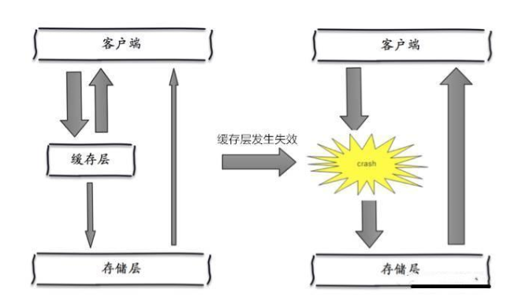
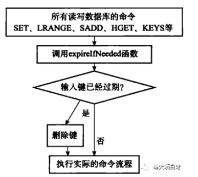
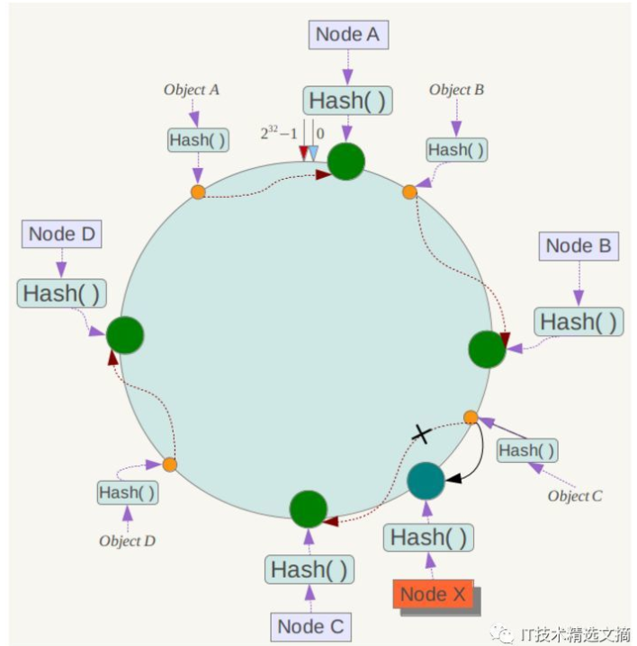
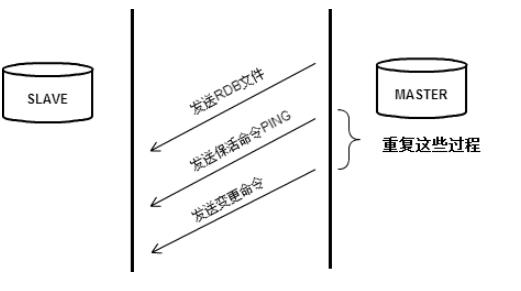

# Redis相关

## 缓存击穿、缓存雪崩

### 缓存击穿（缓存未命中）

缓存穿透的概念很简单，用户想要查询一个数据，发现redis内存数据库没有，也就是缓存没有命中，于是向持久层数据库查询。发现也没有，于是本次查询失败。当用户很多的时候，缓存都没有命中，于是都去请求了持久层数据库。这会给持久层数据库造成很大的压力，这时候就相当于出现了缓存穿透。

### 缓存空对象

当存储层不命中后，即使返回的空对象也将其缓存起来，同时会设置一个过期时间，之后再访问这个数据将会从缓存中获取，保护了后端数据源。


### 缓存雪崩

指缓存层出现错误，缓存大面积失效，导致所有的查询都到达了数据库，加大了数据库查询压力，存储层的调用量会暴增，造成存储层也会挂掉的情况。



### 解决方案

**1.缓存的高可用性**

缓存层设计成高可用，防止缓存大面积故障。即使个别节点、个别机器、甚至是机房宕掉，依然可以提供服务，例如 Redis Sentinel 和 Redis Cluster 都实现了高可用。

**2.缓存降级**

可以利用ehcache等本地缓存(暂时支持)，但主要还是对源服务访问进行限流、资源隔离（熔断）、降级等。

当访问量剧增、服务出现问题仍然需要保证服务还是可用的。系统可以根据一些关键数据进行**自动降级**，也可以配置开关实现**人工降级，**这里会涉及到运维的配合

**3.Redis备份和快速预热**

1)Redis数据备份和恢复

2)快速缓存预热


## Redis设置过期的原理

#### 过期键的判断 

通过查询过期字典，检查下面的条件判断是否过期

1. 检查给定的键是否在过期字典中，如果存在就获取键的过期时间
2. 检查当前 UNIX 时间戳是否大于键的过期时间，是就过期，否则未过期

#### 过期键的删除策略

##### 惰性删除

在取出该键的时候对键进行过期检查，即只对当前处理的键做删除操作，不会在其他过期键上花费 CPU 时间

**缺点：**对内存不友好，如果一但键过期了，但会保存在内存中，如果这个键还不会被访问，那么久会造成内存浪费，甚至造成内存泄露

##### 如何实现？

就是在执行 Redis 的读写命令前（set、LRANGE、SADD、HGET、KEYS）都会调用 expireIfNeeded 方法对键做过期检查

如果键已经过期，expireIfNeeded 方法将其删除

如果键未过期，expireIfNeeded 方法不做处理



我们通常说 Redis 是单线程的，其实 Redis 把处理网络收发和执行命令的操作都放到了主线程，但 Redis 还有其他后台线程在工作，这些后台线程一般从事 IO 较重的工作，比如刷盘等操作。

上面源码中根据是否配置 lazyfree_lazy_expire（4.0版本引进） 来判断是否执行惰性删除，原理是先把过期对象进行逻辑删除，然后在后台进行真正的物理删除，这样就可以避免对象体积过大，造成阻塞


##### 定期删除

定期策略是每隔一段时间执行一次删除过期键的操作，并通过限制删除操作执行的时长和频率来减少删除操作对CPU 时间的影响，同时也减少了内存浪费

Redis 默认会每秒进行 10 次（redis.conf 中通过 hz 配置）过期扫描，扫描并不是遍历过期字典中的所有键，而是采用了如下方法

1. 从过期字典中随机取出 20 个键
2. 删除这 20 个键中过期的键
3. 如果过期键的比例超过 25% ，重复步骤 1 和 2

为了保证扫描不会出现循环过度，导致线程卡死现象，还增加了扫描时间的上限，默认是 25 毫秒（即默认在慢模式下，如果是快模式，扫描上限是 1 毫秒）

**备注**

因为 Redis 在扫描过期键时，一般会循环扫描多次，如果请求进来，且正好服务器正在进行过期键扫描，那么需要等待 25 毫秒，如果客户端设置的超时时间小于 25 毫秒，那就会导致链接因为超时而关闭，就会造成异常，这些现象还不能从慢查询日志（之前分享过慢查询日志的文章 [Redis慢查询日志](https://blog.csdn.net/dam454450872/article/details/100065418)）中查询到，因为慢查询只记录逻辑处理过程，不包括等待时间。

所以我们在设置过期时间时，一定要避免同时大批量键过期的现象，所以如果有这种情况，最好给过期时间加个随机范围，缓解大量键同时过期，造成客户端等待超时的现象

## 集群工作原理

redis 集群模式的工作原理能说一下么？在集群模式下，redis 的 key 是如何寻址的？分布式寻址都有哪些算法？了解一致性 hash 算法吗？

### redis cluster 介绍

- 自动将数据进行分片，每个 master 上放一部分数据
- 提供内置的高可用支持，部分 master 不可用时，还是可以继续工作的

在 redis cluster 架构下，每个 redis 要放开两个端口号，比如一个是 6379，另外一个就是 加1w 的端口号，比如 16379。

16379 端口号是用来进行节点间通信的，也就是 cluster bus 的东西，cluster bus 的通信，用来进行故障检测、配置更新、故障转移授权。cluster bus 用了另外一种二进制的协议，`gossip` 协议，用于节点间进行高效的数据交换，占用更少的网络带宽和处理时间。

**工作原理就是通过集群中不同节点进行通信，交换信息。分为集中式管理节点信息，和gossip协议管理信息**

集中式的好处在于，元数据的读取和更新，时效性非常好，一旦元数据出现了变更，就立即更新到集中式的存储中，其它节点读取的时候就可以感知到；不好在于，所有的元数据的更新压力全部集中在一个地方，可能会导致元数据的存储有压力。

gossip 好处在于，元数据的更新比较分散，不是集中在一个地方，更新请求会陆陆续续打到所有节点上去更新，降低了压力；不好在于，元数据的更新有延时，可能导致集群中的一些操作会有一些滞后。

- 10000 端口：每个节点都有一个专门用于节点间通信的端口，就是自己提供服务的端口号+10000，比如 7001，那么用于节点间通信的就是 17001 端口。每个节点每隔一段时间都会往另外几个节点发送 `ping` 消息，同时其它几个节点接收到 `ping` 之后返回 `pong`。
- 交换的信息：信息包括故障信息，节点的增加和删除，hash slot 信息等等。

- ping：每个节点都会频繁给其它节点发送 ping，其中包含自己的状态还有自己维护的集群元数据，互相通过 ping 交换元数据。
- pong：返回 ping 和 meeet，包含自己的状态和其它信息，也用于信息广播和更新。
- fail：某个节点判断另一个节点 fail 之后，就发送 fail 给其它节点，通知其它节点说，某个节点宕机啦。


#### ping 消息深入

ping 时要携带一些元数据，如果很频繁，可能会加重网络负担。

每个节点每秒会执行 10 次 ping，每次会选择 5 个最久没有通信的其它节点。当然如果发现某个节点通信延时达到了 `cluster_node_timeout / 2`，那么立即发送 ping，避免数据交换延时过长，落后的时间太长了。比如说，两个节点之间都 10 分钟没有交换数据了，那么整个集群处于严重的元数据不一致的情况，就会有问题。所以 `cluster_node_timeout`可以调节，如果调得比较大，那么会降低 ping 的频率。

每次 ping，会带上自己节点的信息，还有就是带上 1/10 其它节点的信息，发送出去，进行交换。至少包含 `3` 个其它节点的信息，最多包含 `总节点数减 2` 个其它节点的信息。


### 分布式寻址算法

- hash 算法（大量缓存重建）（某个节点宕机或加入新节点，所有缓存或进行重新计算取模，导致大量迁移）
- 一致性 hash 算法（自动缓存迁移）+ 虚拟节点（自动[负载均衡](https://cloud.tencent.com/product/clb?from=10680)）
- redis cluster 的 hash slot 算法

**一致性 hash 算法**

一致性 hash 算法将整个 hash 值空间组织成一个虚拟的圆环，整个空间按顺时针方向组织，下一步将各个 master 节点（使用服务器的 ip 或主机名）进行 hash。这样就能确定每个节点在其哈希环上的位置。

来了一个 key，首先计算 hash 值，并确定此数据在环上的位置，从此位置沿环顺时针“行走”，遇到的第一个 master 节点就是 key 所在位置。

在一致性哈希算法中，如果一个节点挂了，受影响的数据仅仅是此节点到环空间前一个节点（沿着逆时针方向行走遇到的第一个节点）之间的数据，其它不受影响。增加一个节点也同理。

燃鹅，一致性哈希算法在节点太少时，容易因为节点分布不均匀而造成缓存热点的问题。为了解决这种热点问题，一致性 hash 算法引入了虚拟节点机制，即对每一个节点计算多个 hash，每个计算结果位置都放置一个虚拟节点。这样就实现了数据的均匀分布，负载均衡



#### 判断节点宕机

如果一个节点认为另外一个节点宕机，那么就是 `pfail`，主观宕机。如果多个节点都认为另外一个节点宕机了，那么就是 `fail`，客观宕机，跟哨兵的原理几乎一样，sdown，odown。

在 `cluster-node-timeout` 内，某个节点一直没有返回 `pong`，那么就被认为 `pfail`。

如果一个节点认为某个节点 `pfail` 了，那么会在 `gossip ping` 消息中，`ping` 给其他节点，如果超过半数的节点都认为 `pfail` 了，那么就会变成 `fail`。

#### 从节点选举

每个从节点，都根据自己对 master 复制数据的 offset，来设置一个选举时间，offset 越大（复制数据越多）的从节点，选举时间越靠前，优先进行选举。

所有的 master node 开始 slave 选举投票，给要进行选举的 slave 进行投票，如果大部分 master node`（N/2 + 1）`都投票给了某个从节点，那么选举通过，那个从节点可以切换成 master。

从节点执行主备切换，从节点切换为主节点。


## 主从复制原理

\1. 如果设置了一个Slave，无论是第一次连接还是重连到Master，它都会发出一个SYNC命令；
\2. 当Master收到SYNC命令之后，会做两件事：
a) Master执行BGSAVE，即在后台保存数据到磁盘（rdb快照文件）；
b) Master同时将新收到的写入和修改数据集的命令存入缓冲区（非查询类）；
\3. 当Master在后台把数据保存到快照文件完成之后，Master会把这个快照文件传送给Slave，而Slave则把内存清空后，加载该文件到内存中；
\4. 而Master也会把此前收集到缓冲区中的命令，通过Reids命令协议形式转发给Slave，Slave执行这些命令，实现和Master的同步；
\5. Master/Slave此后会不断通过异步方式进行命令的同步，达到最终数据的同步一致；
\6. 需要注意的是Master和Slave之间一旦发生重连都会引发全量同步操作。但在2.8之后版本，也可能是部分同步操作。

问题1 如果多个slave发起同步请求，会开启多个线程保存rdb快照吗？

slave同步时有多个状态，等待状态、发送文件状态、发送完毕。如果还在等待发送文件时则不会开启线程，如果其他线程已经开始发送文件了，那么会开启线程去写rdb文件，同步开启缓冲区保存当前这个时候写入的缓存。




## Redis 淘汰策略

当数据存储上升到一定数量时，就会进行数据淘汰。有6种淘汰策略

**volatile-lru**：从已设置过期时间的数据集（server.db[i].expires）中挑选最近最少使用的数据淘汰

**volatile-ttl**：从已设置过期时间的数据集（server.db[i].expires）中挑选将要过期的数据淘汰

**volatile-random**：从已设置过期时间的数据集（server.db[i].expires）中任意选择数据淘汰

**allkeys-lru**：从数据集（server.db[i].dict）中挑选最近最少使用的数据淘汰

**allkeys-random**：从数据集（server.db[i].dict）中任意选择数据淘汰

**no-enviction**（驱逐）：禁止驱逐数据


## Redis大数据插入

使用正常模式的Redis 客户端执行大量数据插入不是一个好主意：因为一个个的插入会有大量的时间浪费在每一个命令往返时间上。使用管道（pipelining）是一种可行的办法，但是在大量插入数据的同时又需要执行其他新命令时，这时读取数据的同时需要确保请可能快的的写入数据。

pipe mode 模式

从Redis 2.6开始`redis-cli`支持一种新的被称之为**pipe mode**的新模式用于执行大量数据插入工作。


## 高级主题-布隆过滤器

### 使用场景

　比如有如下几个需求：

　　①、原本有10亿个号码，现在又来了10万个号码，要快速准确判断这10万个号码是否在10亿个号码库中？

　　解决办法一：将10亿个号码存入数据库中，进行数据库查询，准确性有了，但是速度会比较慢。

　　解决办法二：将10亿号码放入内存中，比如Redis缓存中，这里我们算一下占用内存大小：10亿*8字节=8GB，通过内存查询，准确性和速度都有了，但是大约8gb的内存空间，挺浪费内存空间的。

　　②、接触过爬虫的，应该有这么一个需求，需要爬虫的网站千千万万，对于一个新的网站url，我们如何判断这个url我们是否已经爬过了？

　　解决办法还是上面的两种，很显然，都不太好。

　　③、同理还有垃圾邮箱的过滤。

　　那么对于类似这种，大数据量集合，如何准确快速的判断某个数据是否在大数据量集合中，并且不占用内存，**布隆过滤器**应运而生了。

### 布隆过滤器简介

布隆过滤器：一种数据结构，是由一串很长的二进制向量组成，可以将其看成一个二进制数组。既然是二进制，那么里面存放的不是0，就是1，但是初始默认值都是0。

　　如下所示：

### 添加元素

当要向布隆过滤器中添加一个元素key时，我们通过多个hash函数，算出一个值，然后将这个值所在的方格置为1。

　　比如，下图hash1(key)=1，那么在第2个格子将0变为1（数组是从0开始计数的），hash2(key)=7，那么将第8个格子置位1，依次类推。

### 判断是否存在（只能判断一定不存在，无法判断一定存在）

我们只需要将这个新的数据通过上面自定义的几个哈希函数，分别算出各个值，然后看其对应的地方是否都是1，如果存在一个不是1的情况，那么我们可以说，该新数据一定不存在于这个布隆过滤器中。

但是多个不同的数据通过hash函数算出来的结果是会有重复的，所以会存在某个位置是别的数据通过hash函数置为1，导致无法确定一定存在。

### 布隆过滤器优点

优点：优点很明显，二进制组成的数组，占用内存极少，并且插入和查询速度都足够快。

缺点：随着数据的增加，误判率会增加；还有无法判断数据一定存在；另外还有一个重要缺点，无法删除数据


## 实现方式（已有具体实现，不需要自己去重复造轮子）

### Redis 

使用操作Redis的工具，Redisson，结合Redis bitmap的数据结构。

bitmaps提供了一套命令用来操作类似上面字符串中的每一个位。

如 b  的 ascii 码为 98，表示为二进制为 01100010

可以通过bitmaps的操作命令，操作指定的位。

```shell
#设置指定key 指定位置的值
setbit key offset value  setbit k1 7 1
#获取指定key 指定位置的值
getbit key offset getbit k1 1
```


### Google - guava

```java
public class GuavaBloomFilter {
    public static void main(String[] args) {
        BloomFilter<String> bloomFilter = BloomFilter.create(Funnels.stringFunnel(Charsets.UTF_8),100000,0.01);

        bloomFilter.put("10086");

        System.out.println(bloomFilter.mightContain("123456"));
        System.out.println(bloomFilter.mightContain("10086"));
    }
}
```

